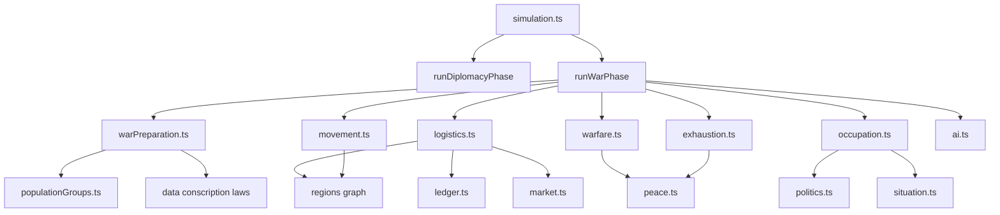
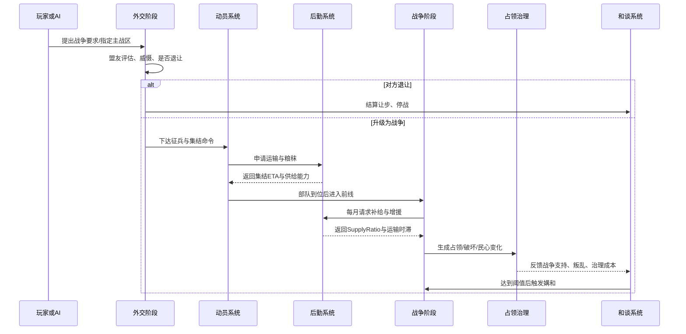

# MING-WAR 军事系统优化改造深度研究报告

## 执行摘要

MING-WAR 当前主干已经不是“完全没有战争系统”的状态，而是一个**已经具备持续战争、外交相邻判断、和谈、战线推进、距离衰减、动员月数、战争支持与账本结算接口**的雏形系统：`simulation.ts` 已拆为独立 phase，并显式调用 `runDiplomacyPhase`、`runWarPhase`、`runSituationPhase`；`warfare.ts` 已实现 `mobilizationMonths`、`distanceFromCapital`、`maxCommitRatio`、`warCommitments`、`homeTurfMult` 等关键字段；`peace.ts` 也已支持割地、赔款、朝贡与停战。与此同时，仓库文档仍保留了“外交缺失、战争仍是单次战斗”的旧判断，说明**当前主干代码与设计文档存在时点差异**，这是后续改造前必须先校准的第一风险。citeturn19view3turn20view0turn22view0turn22view3turn17view2turn23view0turn19view2

基于这一现状，最优路线**不是推翻重写**，而是在现有 `warfare.ts + runWarPhase.ts + diplomacy.ts + peace.ts` 之外，补上一层“**动员—投送—补给—行军—占领—战疲**”的中间系统，把目前“距离惩罚 + 补给值 + 部分战疲”的轻量模型升级为**以人口、粮草、运输能力、季节、地形、基础设施和民心为约束**的历史化战争模型，同时继续保持项目当下的“月度、确定性、可批量测试、性能受控”的核心范式。该方向同时符合用户的约束：不改变大战略核心玩法、开发资源中等、性能预算有限。citeturn7view0turn19view3turn15view0turn22view5

对维多利亚3的借鉴，建议采用“**机制抽象借鉴，不做一比一复刻**”。维多利亚3的价值不在微操，而在于把战争放进经济、外交、政治与后勤闭环：动员与征兵会拉低生产、动员选项会额外消耗商品，海外与远征依赖补给线和运力，战斗由兵力、士气、装备、司令官与地形共同决定，战争支持会受战果、占领、资本与政治压力影响，外交对峙阶段允许在战争爆发前施压、拉盟友或退让。现实军事学与后勤学则进一步提醒：**持续作战能力来自可维持的补给、运输网络与冗余，而不是账面兵力总数**；距离、恶劣地形、低基础设施与“最后一公里”问题，都会显著改变战场结果。citeturn32search2turn46search4turn42search0turn34search1turn35search0turn44view0turn27view2turn35search1turn30search0turn30search2turn30search3turn31search6turn45search2turn45search5

因此，本报告的核心建议是：**短期先把现有 `armyTotal` 模型“加约束”，中期再把它“拆分为形成度更高的部队/补给层”，长期再补完外交对峙、后方占领与更细粒度运输网络**。这样既能迅速改善“纯堆兵力取胜”的问题，又能避免一次性引入过多状态导致数值与性能失控。citeturn17view2turn22view3turn23view0turn7view0

## 当前项目状态与设计边界

仓库显示，MING-WAR 是一个 **React 19 + TypeScript + Vite + Zustand + Vitest** 的月度模拟大战略项目，核心模拟入口是确定性、可复现的 `simulateMonth`；性能与稳定性工作已在 2026-06-30 的 v0.6 稳定化中完成一轮重构，文档记录的单月 p95 约 24.23ms，1080 月三种子全程约 18.35 秒，且已有状态哈希、存档迁移、批量回归与性能脚本。2026-07-02 的 `warfare.ts` 头部注释又显示测试规模已经扩展到 540/540。就工程风格看，项目明显偏向**可测试、可回归、确定性优先**，因此军事改造必须延续这一工程哲学。citeturn7view0turn12view0

但需要特别指出：**仓库文档与当前代码并不同步**。`docs/v2-optimization-spec.md` 仍将战争描述为“无战线、动员、补给，只是单次战斗”，并将外交标记为缺失；而主干代码中，`simulation.ts` 已经引入 `runDiplomacyPhase`、`runWarPhase`、`runSituationPhase`，`diplomacy.ts` 已有 `DiplomaticRelation`、同盟、停战与月度外交推进，`peace.ts` 已有 `computeWarSupport`、`checkPeace` 与 `resolvePeace`。这意味着你在开始军事重构之前，最好先确认**以主干代码为准，还是以旧 SPEC 为准**；如果不做这一步，很容易在“已经实现的功能上再重做一遍”。citeturn19view2turn19view3turn20view0turn22view0turn23view0

当前军事与相关数据结构，已经具备以下基础：`RegionState` 有 `terrain`、`climate`、`fortification`、`grainStock`、`garrison`、`connections`、`distanceFromCapital`；`FactionState` 有 `armyTotal`、`militaryOrganization`、`warExhaustion`、`homeTurfMult`、`maxCommitRatio`、`warCommitments`；`FrontState` 有战争支持、攻守补给、动员月数与当前已投送兵力；`WarState` 则维护目标地区、进度与月数。这使得“在不改核心玩法的前提下”把战争扩展成更真实的持续消耗系统，具备了较好的落点。citeturn17view0turn17view1turn17view2turn16view2turn16view3

不过，当前类型也明显缺少与“现实化战争”直接相关的关键信息：未见**道路等级、河运节点、港口等级、仓储容量、季节状态、运输资源、装备完备度、训练度、兵员补充池、占领民心、后方补给站**等字段；地形类型目前只有 `plain / mountain / steppe / river / coast` 五种，气候也只有 `temperate / cold / dry / humid` 四种，足以做第一阶段修正，但还不足以支撑“行军—补给—季节—占领”的强耦合模型。citeturn16view4turn17view0turn17view1

下表列出我基于仓库所能确认的关键代码/数据位置，以及仍需你补充的信息：

| 代码或数据位置 | 作用 | 当前掌握情况 |
|---|---|---|
| `src/core/warfare.ts` | 战斗、战线推进、战争消耗、同盟参战 | **已找到**；当前已实现距离衰减、动员月数、补给值、主场加成、战疲与持续损耗。citeturn12view0turn15view0 |
| `src/core/simulationPhases/runWarPhase.ts` | 每月战争阶段总调度 | **已找到**；当前已串起 `resolveBattle → advanceWar → computeWarSupport/checkPeace → resolvePeace`。citeturn22view3turn22view5 |
| `src/core/diplomacy.ts` | 条约、停战、同盟、月度外交推进 | **已找到**。citeturn18view0turn18view2turn22view0 |
| `src/core/peace.ts` | 和谈、割地、赔款、停战 | **已找到**。citeturn23view0turn23view1turn23view2turn23view3 |
| `src/core/types.ts` | 军事相关状态结构 | **已找到**；但缺少道路、港口、仓储、运输资源、训练度、装备完备度等字段。citeturn17view0turn17view1turn17view2turn16view4 |
| `src/data/scenarios.ts` | 开局国情、战争外交初始值 | **已找到**；1573 开局已初始化外交关系，并预计算首都距离图。citeturn24view0 |
| `src/data/regions.ts` | 地区模板 | **文件存在**，但我未逐条读取全部模板；其中是否已有更细粒度运输/季节数据，当前**未完整提供**。citeturn10view0turn24view2 |
| `src/data/factions.ts` | 势力模板 | **文件存在**，但我未逐条读取全部模板；若有兵种、编制、后勤偏好细表，当前**未完整提供**。citeturn10view0turn24view1 |
| `src/core/market.ts`、`populationGroups.ts`、`ledger.ts` | 兵员与补给需绑定的人口、市场、财政系统 | **文件存在**；旧 SPEC 指出人口、市场、账本已部分闭环，可作为兵员与军需来源。citeturn9view0turn19view2turn8view1 |
| `src/scripts/diagnoseWars.ts`、性能脚本 | 军事平衡回归、性能验收 | **已找到**。citeturn10view3 |
| `src/tests/warfare.test.ts`、`peace.test.ts`、`diplomacy.test.ts`、`batch-simulation.test.ts` | 军事功能与全局回归测试 | **已找到**。citeturn11view0turn25view0turn25view1turn25view3 |
| 多人同步、锁步或服务器架构 | 单人/多人差异评估 | **未提供/需补充**；仓库当前可见运行时是本地 SimulationService，未见多人框架。citeturn10view1 |
| 战争 UI 面板具体文件、前端战报交互需求 | 玩家可见性与可用性 | **未完整提供/需补充**。 |
| 精细公路/河运/港口/季节地图数据 | 后勤与行军模型的高质量输入 | **未提供/需补充**。 |
| 具体“不得改动”的核心玩法清单 | 方案边界 | 用户仅给出“不改变核心玩法”；其他特定约束**无特定约束**。 |

在目标与约束上，本报告以你的要求为准：**目标**是让战争更具历史/现实依据，并减少“纯靠兵力总量直接碾压”的情况；**约束**是尽量不改大战略核心玩法，其它特定玩法限制未提供，按“无特定约束”处理；**性能与开发资源**按“中等”假设，因此不建议引入日级逐格寻路、实时弹道或完全单位微操。与之相容的路线，是继续沿用现有“月度阶段 + 预计算图 + 聚合战线”的架构。citeturn7view0turn19view3turn20view0

## 维多利亚3与现实军事要素的可借鉴机制

维多利亚3最值得借鉴的，不是某个单一战斗公式，而是它如何把战争嵌入整个国家机器。官方总述和后续日志反复强调：战争不是“点一下开战”，而是**外交对峙、动员、运输、前线指令、战斗、战争支持与和约**串起来的结果。外交要求可以通过 Diplomatic Plays 在战争爆发前施压并拉拢第三方，强势一方甚至能在“不打一枪”的情况下逼迫对手让步；而 1.2 的外交改进又把“主要求”与“次要求”分层，让退让与升级都更像政治博弈，而不是单次按钮。citeturn46search4turn46search0turn46search1

在军事层面，维多利亚3的“前线抽象”有几条非常适合 MING-WAR 继承。第一，**动员不是即时完成**：Wiki 摘要显示，陆军有专门的 mobilization 与 conscription 流程，且 formation 面板本身就围绕 mobilization options 组织；这些选项会以额外商品消耗换取部队增益。第二，**补给线是显式约束**：官方开发日志说明，海外将领必须依赖 Supply Routes，路线成本取决于海节点、所需输送兵力与 trait，低有效性会降低部队供给状态；Wiki 摘要则直接写到“军队要上前线，必须能从 home HQ 画出 supply line”。第三，**战略目标而非战术微操**：1.2 起允许玩家设定 Strategic Objectives，引导将领重点进攻特定州或战区。citeturn42search0turn42search2turn34search1turn44view0turn35search7

战斗结算层面，维多利亚3也并不把兵力视为唯一决定因素。官方 Battle 日志明确说明：战斗由将领、战斗地点、可投入部队数量、battle conditions、攻防属性与士气共同决定；部队在战斗中按回合造成伤亡和士气损失，直到一方被打空或撤退。Wiki 摘要进一步表明：攻击方主要吃 offense，防守方主要吃 defense，morale 代表单位可用兵力比例的一种状态；战斗会在士气或 manpower 用尽时结束。再加上 dev diary #77 与 #69 所讨论的点——将领 traits、 battle selection、front progress、attrition 数值、multiple battles 节奏问题——可以看出官方自己也承认：**战争节奏、将领选择、补给与 attrition 的配比，是系统成败关键**。citeturn27view2turn43search0turn43search1turn35search1turn27view4

对 MING-WAR 最有启发的，是维多利亚3如何处理“**兵力投送与远征成本**”。官方 Shipping Lanes 日志指出，远征的成本不只是出兵本身，还在于 ports、convoys、shipping lanes、supply routes 与 supply network 的维护；若前线不可经陆路或海路有效抵达，则要么供给下降，要么干脆无法派兵。这个逻辑非常适合转换为 MING-WAR 的“**首都—仓城—战区**”投送网络：边地和远征都可以打，但你必须先支付时间、运输和粮秣成本。citeturn44view0

维多利亚3还把**战争的经济与政治后果**放得很重。官方 dev diary 指出，battle 造成的 devastation 会降低基础设施与建筑吞吐、增加死亡与迁出，并在战争之后持续存在；Wiki 摘要则显示 war support 不会无限下探，除非首都或战争目标被占领。结合外交阶段的“退让、主要求、停战”，这意味着 Victory 不是“把对面打到 0 人”，而是让对面在财政、占领、外交与国内支持上扛不住——这正是你希望 MING-WAR 解决“纯兵力决定论”的关键。citeturn33search0turn35search0turn46search3

现实军事与后勤资料为这种设计提供了强支撑。美军训练材料把 logistics 定义为“规划并执行部队 sustainment 的过程”，而大规模作战 sustainment 手册则直接指出：快速部署、储备、内部与外部再补给、装备维护，直接决定作战任务能否完成；Army Pacific 的近年文章又强调“distance 的暴政”会显著限制可信战力。与此同时，山地与低基础设施环境会显著削弱持续保障能力；中国国防和史学资料也反复强调，后勤是战争胜负关键因素，高原边防补给甚至需要专门解决“最后一公里”运输问题。换句话说，把“距离、基础设施、仓储、运输韧性”做成决定战争结果的核心约束，不是为了复杂而复杂，而是现实作战的基本规律。citeturn30search0turn30search2turn30search3turn31search6turn45search2turn45search5turn45search8

基于以上来源，我建议对 MING-WAR 的借鉴原则概括为五条：**保留前线抽象，不引入战术微操；引入动员延迟与征兵成本；让补给线、运输时间、地形季节进入战斗公式；让占领、民心和战疲能迫使停战；让 AI 在开战前先评估“能不能养得起这场仗”**。这与维多利亚3官方多年迭代的方向一致，也与现实军事后勤强调的 sustainment、operational reach、redundancy 和 public support 逻辑一致。citeturn35search5turn35search3turn44view0turn30search0turn30search3turn31search6

## 面向 MING-WAR 的系统设计

建议的总体思路是：**不替换现有 `warfare.ts`，而是在它之前补出“战争准备层”和“后勤投送层”，在它之后补出“占领治理层”**。这样，当前的 `armyTotal + warCommitments + progress + peace` 能继续发挥作用，但其输入不再是“裸兵力”，而是经过动员、训练、装备、补给、地形与季节过滤后的有效兵力与有效战力。这个做法既能复用你已经写好的战线和和谈逻辑，也能控制改造范围。citeturn12view0turn22view3turn23view0

下面这张模块关系图，给出建议的代码落点。它遵循当前仓库已经存在的 `simulationPhases` 分阶段风格，因此迁移成本较低。citeturn20view0turn19view3



在数据结构上，建议采取“**兼容式扩展**”，即短期保留现有 `FactionState.armyTotal` 作为聚合值，新增更细的军事子结构；等中期稳定后，再让 `armyTotal` 变成派生字段。推荐新增以下字段：

```ts
interface FormationState {
  id: string;
  factionId: FactionId;
  homeRegionId: RegionId;
  troopCount: number;          // 已动员总员额
  readyTroops: number;         // 训练/到位后可战兵
  reserveTroops: number;       // 后备补充
  training: number;            // 0..1
  equipmentReadiness: number;  // 0..1
  morale: number;              // 0..1
  supplyStockDays: number;     // 随军口粮/弹药等折算天数
  commanderId?: string;
  posture: MilitaryPosture;
}

interface LogisticsNodeState {
  regionId: RegionId;
  depotLevel: number;          // 仓储/转运等级
  depotStock: number;          // 粮秣库存
  throughput: number;          // 当月最大吞吐
  portLevel?: number;          // 若有海运
  riverPortLevel?: number;     // 若有河运
}

interface RegionMilitaryState {
  infrastructureLevel: number; // 抽象道路/桥梁/转运能力
  seasonalState: "normal" | "mud" | "winter" | "drought" | "flood";
  localSupport: number;        // 0..100
  occupationResistance: number;// 0..100
  forageCapacity: number;      // 就地筹粮能力
  strategicValue: number;      // AI 目标权重
}
```

之所以要这么做，是因为你当前的 `RegionState` 已具备地形、气候、守军、堡垒、首都距离和邻接图，已经足够承载轻量后勤网络；但没有道路、仓储、季节和地方支持度，就无法把“远征失败”“冬季停攻”“占而不稳”等历史现象稳定地投射到游戏里。citeturn17view0turn17view1turn16view4

征兵与动员流程建议改为“**宣战前置准备 + 月度逐步成军**”。维多利亚3的启发在于：mobilization 与 conscription 都不是瞬间完成，而且额外加强需要付出更多物资消耗。MING-WAR 中可以把战争从“当月点目标、当月就满额开打”改为四步：**战争宣告/外交对峙 → 征兵令 → 集结成军 → 前线投送**。若你暂时不做完整外交对峙，也至少应保留 1–3 个“准备月”，使边军、中央禁军与地方征发的节奏差异可见。citeturn42search0turn34search1turn46search4turn46search1

可实现的月度动员伪代码如下：

```ts
function mobilizeFront(state, factionId, targetRegionId, requestedTroops) {
  const faction = state.factions[factionId];
  const region = state.regions[targetRegionId];

  const draftablePop = estimateDraftablePop(state, factionId); // 若缺年龄/性别分层，则走参数化占比
  const levyCap = draftablePop * params.draftableShare * lawConscriptionRate(factionId);
  const alreadyRaised = sumFormationTroops(factionId);
  const remainingPool = Math.max(0, levyCap - alreadyRaised);

  const travelDays = computeRouteDays(faction.capitalRegionId, targetRegionId, state);
  const assemblyDays = params.baseAssemblyDays + adminPenalty(faction) + seasonPenalty(region);
  const monthlyTrainingOutput = barracksTrainingCapacity(faction) * goodsAvailabilityFactor(state, factionId);

  const raiseNow = Math.min(requestedTroops, remainingPool, monthlyTrainingOutput);
  queueMobilizationOrder({
    factionId,
    targetRegionId,
    troops: raiseNow,
    etaDays: assemblyDays + travelDays
  });
}
```

这里最关键的不是“征多少”，而是“**征了多久能到、到了之后成色如何**”。如果你当前的人口结构还没有年龄/性别层，建议短期用 `draftableShare` 做参数占位，并把它与 `popGroups` 规模及生活条件挂钩；中期再引入更精细的人口层。这样做既现实，也不会把现有人口—市场闭环一次性打爆。citeturn19view2turn8view1

补给与粮草模型应成为整套方案的中轴。现实资料与维多利亚3都表明，补给线和运输能力决定持续作战能力；而中国语境下，尤其适合把“粮草、漕运、畜力、最后一公里”做成易读指标。建议把补给拆成三层：**来源端库存、路径吞吐、前线存量**。来源端可以是国家 `grainReserve`、地区 `grainStock`、市场采购与就地筹粮；路径吞吐由地区邻接图、基础设施、季节与安全状态共同决定；前线则维护一个短期 `supplyStockDays`。只要路径断裂或运输太慢，前线并不会立刻归零，而是先消耗随军存量，然后逐步失去战斗力。citeturn44view0turn30search0turn30search3turn45search2turn45search5

建议使用如下轻量供应公式：

- 当月需求  
  `Demand = Troops × GrainPerTroop + CavalryLikeWeight × Fodder + EquipmentClass × AmmoEquivalent`
- 路径吞吐  
  `PathCapacity = min(EdgeCapacity_i × EdgeCondition_i × Security_i)`
- 运输时滞  
  `TravelDelayDays = Σ EdgeTravelDays`
- 实际到达  
  `Delivered(t) = min(SourceAvailable(t - delay), PathCapacity)`
- 补给状态  
  `SupplyRatio = clamp((Delivered + ForwardStockUse + LocalForage) / Demand, 0, 1.2)`

其中 `EdgeCondition` 由地形、基础设施和季节决定；`Security` 则可由敌占、袭扰、海运风险或叛乱影响。若 `SupplyRatio < 0.75`，应触发战力衰减；`< 0.5` 触发额外伤病与逃散；`< 0.25` 则触发战线崩溃概率。这一逻辑本质上是把你当前 `attackerSupply` 从一个递减数字，升级为一个**有来源、有路径、有时滞的供给结果**。citeturn15view0turn16view3turn44view0turn30search2turn31search6

部队部署与行军时间，应当基于你现有 `connections` 图和 `distanceFromCapital` 预计算继续扩展，而不是引入重型逐格寻路。短期建议仍使用 BFS/最短路，但把每条边权重改成：  
`edgeDays = baseDistance × terrainFactor × seasonFactor × infraFactor × baggageFactor`。  
例如山地、严冬、泥泞和低基础设施显著增加行军日数；沿河、沿海道路、已控制腹地则降低日数。这样既能保留当前“距离可感”的设计，又能把“地形与基础设施影响”从单一距离衰减真正落到行军与运输时间上。citeturn17view0turn17view1turn44view0turn31search6

为了减少“纯兵力胜负”，战斗力公式的重点不应是再加更多线性乘数，而是同时引入**前线宽度上限**与**质量/状态权重**。建议用“可交战兵力 `engagedTroops`”代替“投送兵力 `committedTroops`”直接参与火力计算，其中 `engagedTroops = min(committedTroops, frontWidth)`；`frontWidth` 决定于地形、基础设施与司令官组织能力。这样，大军并非无用，而是主要体现在轮换、损耗承受与持久战上，而不是一回合把对面淹没。这个方向与维多利亚3对 battle size、general selection、terrain/conditions、morale/manpower 的处理逻辑高度一致。citeturn27view2turn35search1turn43search1

建议的战斗公式如下：

```text
frontWidth = BaseWidth × terrainWidthMod × infrastructureWidthMod × commanderCoordination
engagedTroops = min(committedTroops, frontWidth)

CombatPower =
  engagedTroops^0.90
  × (0.55 + 0.45 × training)
  × (0.50 + 0.50 × equipmentReadiness)
  × (0.60 + 0.40 × morale)
  × (0.35 + 0.65 × supplyRatio)
  × terrainCombatMod
  × fortificationMod
  × commanderTraitMod
  × postureMod

ProgressDelta =
  k1 × ln(attackPower / defensePower)
  + k2 × warSupportGap
  - k3 × weatherPenalty
  - k4 × routeOverstretchPenalty
```

这里 `engagedTroops^0.90` 与 `ln(attack/defense)` 的组合，目的就是**显著抑制兵力简单倍增带来的指数级优势**。你现有 `advanceWar` 已经有 `progressDelta` 和 `garrisonDrag` 的概念，这个新公式其实是对现有思路的延展，而不是逻辑翻案。citeturn15view0turn14view2

民心与占领管理建议单列为一个模块。当前代码可见的控制逻辑存在于 `region.control`、`garrison`、`stability`、`rebelPressure` 等字段，但还没有“占了之后能否守住”的单独治理系统。建议新增 `localSupport` 与 `occupationResistance`：被占区在粮秣被抽走、税赋上升、补给线受压和文化/合法性不匹配时，抵抗逐月上升；驻军、减税、赈济、地方协力和政策宽和则会降低抵抗。这样，攻城与守土会变成两种不同的问题。维多利亚3里 battle 导致 devastation 并在战后持续存在，现实战争也高度依赖后方社会承受力；因此，把“占领成本”引入模型，是防止地图一推到底的必要条件。citeturn33search0turn45search2turn46search5

后勤单位与运输资源，不建议做成复杂兵种树，而建议做成**抽象资源池**：陆运可抽象为“车马与脚夫容量”，河运可抽象为“漕运/内河能力”，海运可抽象为“船队/港口容量”，并统一折算成 `landTransportCapacity / riverTransportCapacity / seaTransportCapacity`。这样既和晚明题材兼容，也和维多利亚3中“ports-convoys-shipping lanes”相呼应，还能自然区分内陆、滨海、沿河及远征战区。citeturn44view0turn45search5turn45search17

战争宣告与动员延迟，建议按下面的时序执行。即使你暂时不做完整外交玩法，也应保留“最后通牒/备战/开战”的显式时间层，这会明显改善战争的历史感与可预判性。citeturn46search4turn46search1



最后，AI 行为必须同步升级，否则新系统只会削弱玩家体验而不会改善整体战争质量。幸运的是，`AiProfile` 已经有 `aggression`、`riskTolerance`、`defensePriority`、`warEndurance` 等字段，这足以作为第一阶段决策输入。建议让 AI 的开战评估从“能不能打赢”升级为“**能不能投送、能不能补给、能不能撑完冬天、打完会不会起义**”。具体评分可改为：  
`WarDesire = WarGoalValue + BorderSecurity + AllySupport - SupplyOverstretch - WinterPenalty - ExhaustionRisk - TreasuryRisk`。  
这会直接减少 AI 无脑长程远征、低补给开战和明明守不住还继续送兵的问题。citeturn17view0turn46search2turn46search3

下表把“当前模型”和“建议模型”的差异压缩成一张对照表：

| 维度 | 当前 MING-WAR | 建议模型 |
|---|---|---|
| 动员 | 已有 `mobilizationMonths`，但主要由距离触发，尚未与人口、训练、物资消耗显式绑定。citeturn12view0turn16view3 | 动员与 `popGroups`、征兵率、训练产能、装备供应绑定，形成“征到—练好—到前线”的多阶段流程。 |
| 兵力投送 | 已有 `distanceFromCapital`、`maxCommitRatio`、`warCommitments`，能限制全兵力瞬投。citeturn17view0turn17view2 | 保留现机制，但加入运输容量、路径时滞与季节惩罚。 |
| 补给 | 已有 `attackerSupply/defenderSupply`，但更像前线状态值，来源与路径未显式建模。citeturn16view3turn15view0 | 建立库存—路径—前线三级供给模型，支持补给断裂、缓冲库存与“最后一公里”。 |
| 行军 | 当前主要体现为首都距离衰减。citeturn12view0turn17view0 | 使用地区图边权，显式计算道路、山地、河运、冬季、泥泞对集结和增援的影响。 |
| 战斗 | 已考虑姿态、组织度、主场、地形、守军、堡垒、战疲。citeturn15view0turn12view0 | 再加入前线宽度、训练度、装备完整度、补给状态、轮换与司令协调。 |
| 占领 | 当前主要通过 `controllerFactionId/control/garrison` 等字段间接体现。citeturn17view0 | 新增民心、抵抗、掠夺与赈济效果，区分“攻下”与“守住”。 |
| 和平 | 已有 war support、割地、赔款、朝贡、停战。citeturn23view0turn23view1turn23view2 | 保留，并把占领治理、财政崩溃、民心与战疲更强地反馈到 war support。 |
| AI | 已有战斗/外交/和谈相关逻辑，但仍偏结果导向。citeturn22view3turn22view0turn46search3 | 改为“可持续作战可行性”导向，优先评估补给、季节与可控战区。 |

## 参数建议、测试方案与实现里程碑

由于你希望“更历史/更现实”，但又不改变核心玩法，我建议把参数设计成**可调区间**而不是“真值常数”。这是维多利亚3和现实军事研究都反复证明的一点：战争系统是多个子系统联动后的结果，参数必须围绕测试指标调，而不是靠直觉一次定死。citeturn27view4turn35search3turn30search3

| 参数名 | 含义 | 推荐初始值区间 | 设计理由 |
|---|---|---:|---|
| `draftableShare` | 可征兵人口占比 | 0.16–0.22 | 当前未见年龄/性别层，用参数占位最稳妥。citeturn17view1turn19view2 |
| `baseAssemblyDays` | 基础集结天数 | 10–25 天 | 避免“点兵即战”，体现建制化调集。citeturn12view0turn42search0 |
| `trainingOutputMonthly` | 月训练成军率 | 8%–18% | 征兵≠即战力，应有训练磨合。citeturn34search1turn30search3 |
| `frontWidthBase` | 平原前线基准宽度 | 25k–40k | 通过前线宽度抑制纯堆兵。citeturn27view2turn35search1 |
| `mountainWidthMod` | 山地前线宽度修正 | 0.45–0.65 | 山地天然限制展开面与运输。citeturn31search6turn31search3 |
| `supplyRangeLandHops` | 陆上最佳补给跳数 | 2–4 跳 | 限制无节点远推。citeturn44view0turn30search2 |
| `depotBufferDays` | 前线缓冲库存 | 20–45 天 | 路线断裂后不应瞬间崩盘。citeturn30search3turn45search17 |
| `grainNeedPer1000` | 千人月粮折算 | 25–45 单位 | 粮草应成为持续战争成本中心。citeturn45search2turn31search16 |
| `unsuppliedAttrition` | 低补给额外损耗 | 1.5%–6%/月 | 体现“断粮不只是战力下降，还会减员”。citeturn27view4turn30search3 |
| `unsuppliedMoraleLoss` | 低补给士气损失 | 5–20 点/月 | 士气和兵员都应是败因。citeturn43search1turn34search0 |
| `occupationResistanceGain` | 占领抵抗月增 | 2–8 点 | 避免“攻下即永久稳定”。citeturn33search0turn46search5 |
| `warSupportBaseDecay` | 战争支持基础衰减 | 0.5–2.0/月 | 战争拖久本身应有政治成本。citeturn35search0turn23view0 |
| `winterPenalty` | 冬季机动/补给惩罚 | 10%–40% | 季节必须可感，但不能硬锁死玩法。citeturn31search3turn31search6 |

平衡测试指标建议分为四类。其一是**军事真实性指标**：强国远征胜率不应只由总兵力决定，而应明显受距离、季节与补给影响；其二是**系统联动指标**：战争应能推高粮价、拖累财政、降低地区稳定并提高叛乱风险；其三是**玩家可读性指标**：战败原因必须能被解释为“补给不足/冬季阻滞/占领抵抗/训练不足”，而不是随机黑箱；其四是**工程指标**：同种子同输入必须保持确定性，新增战争层后单月 p95 最好控制在现有基线的 110%–125% 内。当前仓库已有批量模拟、状态哈希和性能脚本，这正好可以直接复用。citeturn7view0turn10view3turn11view0

里程碑建议如下：

| 阶段 | 时间尺度 | 主要改动 | 核心测试用例 | 验收标准 |
|---|---|---|---|---|
| 短期 | 数天 | 在现有 `warfare.ts` 上增加 `training/equipment/supplyRatio/frontWidth`；把 `mobilizationMonths` 改为“距离 + 集结 + 季节”；在 UI/战报中显示“到位率、粮秣天数、冬季惩罚”。 | 近邻战区 vs 远征战区同兵力对比；冬季出兵与夏季出兵对比；断粮 2 月对比。 | 同种子结果确定；大国远征速度明显下降；单月 p95 不高于基线约 30ms 左右。citeturn7view0turn12view0 |
| 中期 | 数周 | 新增 `logistics.ts / movement.ts / occupation.ts`；建立库存—路径—前线补给；引入占领民心与后备补充；AI 加入“补给可行性”评估。 | 辽东远征、山地推进、占领后叛乱、盟友参战后补给分流。 | 批量模拟中“纯堆兵碾压”发生率显著下降；和谈更多由财政/战疲/占领压力触发，而不只是进度条。citeturn22view3turn23view0turn44view0 |
| 长期 | 数月 | 将 `armyTotal` 逐步过渡到 Formation 模型；加入更细地区运输数据、河海运、前线仓站、战争准备阶段 UI 与 modding surface。 | 多战区同时作战、海运/河运投送、长期占领成本、灾年战争。 | 战争能稳定进入“准备—投送—推进—占领—媾和”完整周期，且 20×120 或更长批量回归无发散。citeturn8view0turn7view0 |

测试用例方面，我建议你至少固定以下五类回归：**同兵不同训、同兵不同补给、同补给不同地形、同战果不同占领策略、同兵力不同季节**。每个用例都要同时检查四个输出：边境推进速度、兵力净损失、国库/粮储变化、叛乱/稳定变化。这样才能保证战争系统真的接入了经济与社会闭环，而不是只是把一堆乘数塞进战斗函数。citeturn19view2turn22view3turn23view0

## 风险、兼容性与主要参考来源

最大的兼容性风险，不在“能不能写出来”，而在**是否破坏当前已经建立的确定性与回归体系**。当前 MING-WAR 的稳定性底座包括 `SimulationService` 抽象、存档校验与迁移、状态哈希、批量脚本、性能回归和大量测试；军事系统又刚在 2026-07-02 做过一次带 `DETERMINISM-CHANGE` 的调整。如果你现在把战争状态直接改成大量浮点、日级随机或生成式对象，很容易造成状态哈希飘移、存档迁移复杂化，甚至使当前所有性能与 determinism 基线失去参考意义。citeturn7view0turn10view1turn12view0

因此我建议采用三条兼容策略。第一，**新增字段优先、替换旧字段延后**：保留 `armyTotal`、`warCommitments`、`progress`，先让它们变成新系统的聚合输出。第二，**所有新计算都走 phase 化与账本化**：补给、动员、赔款、运输损耗尽量都写成 phase 中间结果或 ledger entry，不要在各处散点修改。第三，**图与路径预计算**：季节表、边权、补给路由只在控制权/季节/基础设施变化时重算，而不是每月全量重算。这样才能与现有性能设计保持一致。citeturn20view0turn22view0turn23view3turn7view0

另一个现实风险是**设计文档滞后于代码**。当前旧 SPEC 仍把外交标为缺失，但主干已经有外交与和谈；如果团队内部还在按旧 SPEC 讨论，后续开发会出现“你说缺、代码其实有；你说要新增、测试却已覆盖”的沟通错位。解决办法很简单：先写一份新的 `military-refactor-spec.md`，开头第一段就明确“以 2026-07-02 main 分支代码为基线，不以 v2 SPEC 的战争章节为基线”。这是管理问题，但不解决它，技术方案会持续返工。citeturn19view2turn19view3turn20view0

关于单人/多人模式差异，当前仓库可见信息只支持我确认**单机本地模拟闭环**；多人模式架构、网络同步策略、hot-join 或服务器权威模式均未提供，因此只能标注为“未提供/需补充”。如果未来要做多人，那么本报告推荐的“月度聚合 + 确定性 phase + 少量可重算图缓存”恰好是适合 lockstep 的；反之，如果引入大量实时局部随机与异步事件，多人同步成本会陡增。citeturn10view1turn7view0

综合来看，这套方案最适合 MING-WAR 的原因，不是它“更复杂”，而是它恰好命中项目当前最大短板：你已经有了战线、和谈、外交与经济雏形，但战争仍缺少真正的**动员成本、持续补给、占领负担与季节/基础设施约束**。只要把这几个约束补齐，战争的历史感会明显提升，而“兵多=必胜”的单轴逻辑会自然被打散。并且，这一改造完全可以沿着你当前的工程底座循序推进，不必重建玩法内核。citeturn17view0turn17view2turn22view3turn23view0turn7view0

主要参考来源如下：

- MING-WAR 仓库主页面、`PROGRESS.md`、`v2-optimization-spec.md`、`v2-implementation-plan.md`、`src/core/types.ts`、`src/core/warfare.ts`、`src/core/simulation.ts`、`src/core/diplomacy.ts`、`src/core/peace.ts`、`src/core/simulationPhases/*`、`src/data/scenarios.ts`、`src/tests/*`。citeturn3view0turn7view0turn8view0turn8view1turn17view0turn17view2turn15view0turn19view3turn18view2turn23view0turn20view0turn24view0turn11view0
- Victoria 3 官方开发日志：**Dev Diary #39 - Shipping Lanes**、**Dev Diary #44 - Battles**、**Dev Diary #57 - The Journey So Far**、**Dev Diary #75 - Diplomatic Improvements in 1.2**、**Dev Diary #77 - Military Improvements**、**Dev Diary #79 - What’s next after 1.2?**。citeturn44view0turn27view2turn32search2turn46search1turn35search1turn33search6
- Victoria 3 Wiki 条目与摘要：**Warfare overview**、**Land warfare**、**Diplomatic play**、相关 Patch/Wiki 摘要。citeturn34search0turn34search1turn35search0turn46search0turn42search0turn42search2
- 现实军事后勤与持续作战资料：U.S. Army **Chapter 14: Logistics**、**Sustainment in Large-Scale Combat Operations**、Army Pacific 的 **Resilient Logistics**、Army University Press 关于山地/寒区后勤的文章。citeturn30search0turn30search3turn30search2turn31search6turn31search3
- 中文参考资料：国防部关于偏远边防补给“最后一公里”的报道，中国社科/党史资料中有关战争后勤与粮秣管理的研究。citeturn45search5turn45search2turn31search16turn45search15