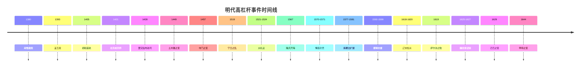
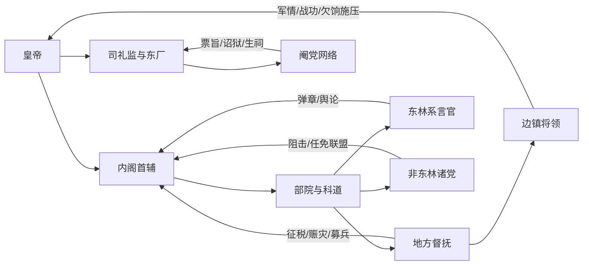

# 基于明实录的 MING-WAR 历史事件与参数化研究报告

## 执行摘要

你的项目已经把“人口、商品价格、产业、税收、生活水平、激进度、政治集团、历史事件”等都设计成可视、可追踪、可叠加修正的月度模拟对象，并计划把“事件、政治集团、历史局势”逐步迁移到 JSON/YAML 内容层；同时，现有 `Modifier` 结构已经天然适合承载“全国 / 地区 / 派系 / 战区”四种历史效应。这意味着，最适合《明实录》化改造的不是“零散弹窗事件”，而是“年表事件 + 长时段局势 + 区域性灾荒 + 派系链条”四层并行的史实驱动系统。citeturn21view1turn21view2

从史料层面看，《明实录》是明代官修编年体的第一优先原始材料，适合用来确定发生时间、朝廷措置、诏令措辞与事件节奏；但它也有典型局限：一是明显的朝廷视角，二是修纂时的政治筛选，三是目前公开电子文本常带 OCR 误差。因此，生产环境最稳妥的做法应是：用《明实录》定“事件框架与触发逻辑”，以《明史》补“制度总结与后果归纳”，再用地方志数据库与现代定量研究补“人口、税负、粮价、灾害强度”等数值层。citeturn22search2turn4search16turn18search5turn19search0turn32search12

从社会经济层面，适合做成游戏基础参数的，不是单一“明朝 GDP”，而是四个更稳定的指标组：人口规模与增长斜率、国家汲取能力、粮食供给与价格波动、灾荒与疫病压力。现有研究大体支持：明初实际人口至少超过 6500 万，较高估计可达 7000 万到 8000 万；到 1600 年前后，学界常给出 1.2 亿到 2 亿之间的较宽区间，说明后期人口显著上升但统计不确定性很大。与此同时，明代长期呈现“总量增长、但人均改善有限”的格局；一项基于《明实录》《明史·食货志》《万历会计录》等材料的估算认为，1402—1626 年总体经济增长并不快，人均收入基本维持在 8 公石小麦左右，国家税收占经济比重约为 3%—10%。citeturn13search2turn13search6turn16search1turn32search0

就可玩性而言，最值得优先深化的时期不是全期平均铺开，而是“嘉靖—崇祯”这一长十七世纪前夜的危机弧线：礼制冲突、财政改革、海贸开放、援朝战争、辽饷加派、东林—阉党斗争、后金崛起、边饷亏空、灾荒疫病与民变叠加，几乎构成了一个天然的历史事件树。你的项目若以 1573—1662 为核心 playable era，再补前朝“制度前史”作为长期修正与存档初始化，会比把 1368—1644 逐年等权处理更贴合史料密度与游戏收益。这个判断与项目现有的“历史事件—政治集团—全国 / 地区修正”结构高度一致。citeturn21view1turn21view2turn33search9turn18search1turn31search5turn7search3

## 史料方法与项目适配

你的 SPEC 已经把中央地图层定义为“人口、商品价格、产业、税收、生活水平、激进度、政治集团、外交关系”等，并明确历史事件需要进入数据驱动层，同时要求所有配置通过 Schema 校验。这意味着历史包最合理的落地方式，不是把《明实录》逐字塞进前端文本，而是把每条史实拆成五个域：`史源`、`触发条件`、`作用域`、`持续时间`、`可叠加数值效应`。citeturn21view1turn21view2

建议采用如下史料优先序。第一层是《明实录》原文，用来定日期、诏令、朝议与事件节点；第二层是《明史》本纪与《食货志》，用来定制度和后果；第三层是地方志与灾荒数据库，用来定受灾区域、灾害频率和地方差异；第四层是现代学术估算，用来给人口、财政、粮价、耕地与军费提供参数区间，而不是伪装成“精确值”。这样做的好处是：既保留《明实录》叙事的“朝廷手感”，又不让游戏被官修文本的单一视角绑死。citeturn18search5turn18search1turn19search0turn19search3turn13search2turn14search7turn16search1

还要特别提醒一点：CTP 自身就提示部分《明实录》文本是由影印本 OCR 建立，字符会有误；所以在你真正制作事件包时，推荐流程应是“CTP 检索定位 → 中研院汉籍 / 影印本复核 → 项目 YAML 入库”。开发阶段可接受少量文字误差，正式发布版则应把卷次、年月、关键人名全部二次核对。citeturn22search2turn4search16turn38search3

下面的事件集采用“按在位期与危机段落分组”的方式，而不是把 276 年逐年穷举。这不是因为逐年不可做，而是因为从已经掌握的史料密度看，真正值得纳入月度模拟的，是那些能改写财政、军制、派系、边防、灾害传播与社会心态的高杠杆节点。其余相对平稳的年份，更适合由“朝代局势修正”覆盖。citeturn21view2turn16search1

## 分期历史事件集

下列事件集优先服务于“可游戏化改造”，所以每条事件都尽量给出：发生年、史源、简短译解、事件类型，以及可参数化字段。表中“概率”分为三类：**定发**适合固定历史剧本；**条件发**适合沙盒但要求满足史实阈值；**随机窗**适合灾荒、疫病、边患这类高频扰动事件。



上图所列年代与下表相互对应，优先选取的是在《明实录》、制度史和财政史上都能留下明显“前后状态差”的关键节点。citeturn39search0turn24search1turn37search0turn29search3turn18search1turn31search6

**洪武—宣德阶段**

| 年份 | 事件 | 史源与原文要点 | 类型 | 可参数化字段与建议 |
|---|---|---|---|---|
| 1380 | 胡惟庸案与中书省体制终结 | 故宫总说概括：洪武十三年正月，御史中丞涂节等告胡惟庸谋反，胡惟庸、陈宁、涂节等被诛，随后株连长期扩大。此案与相权废除直接相关。citeturn22search6 | 政治 / 刑狱 | `scope=global`；`duration=120-240月`；`trigger=皇权集中度>0.7`；`effects={centralization:+0.25, minister_autonomy:-0.35, purge_risk:+0.2, admin_flexibility:-0.1}`；**定发**。 |
| 1381—1384 | 黄册、里甲、赋役整顿 | 《明史·食货志》载：洪武十四年“编赋役黄册”，一百十户为一里，十年一周；黄册与鱼鳞图册共同构成赋役与土地产权基础。citeturn18search5turn18search8 | 内政 / 经济 | `scope=region/global`；`duration=120月`；`effects={tax_registration:+0.2, corvee_capacity:+0.15, peasant_burden:+0.08, hidden_population:-0.1}`；**定发**。 |
| 1393 | 蓝玉案 | 《太祖实录》目录可确认为“卷二百二十五，洪武二十六年二月”；相关人物条概述为：蒋瓛告蓝玉谋反，蓝玉被诛，株连约一万五千人。citeturn36search2turn36search9turn35search1 | 政治 / 刑狱 / 军事 | `scope=global`；`duration=180月`；`effects={merit_generals:-0.3, clan_security:-0.2, court_fear:+0.35, rebellion_from_princes:+0.05}`；**定发**。 |
| 1405 | 郑和首航 | 《太宗实录》卷四十三永乐三年六月己卯条：“遣中官郑和等赍敕往谕西洋诸国，并赐诸国王金织文绮彩绢各有差。”citeturn39search0 | 外交 / 军事 / 经济 | `scope=coast/global`；`duration=24-48月`；`trigger=treasury>阈值 && naval_capacity>阈值`；`effects={prestige:+0.2, maritime_trade:+0.1, treasury:-0.08, tribute_network:+0.15}`；**条件发**。 |
| 1407 | 郑和返朝与陈祖义伏诛 | 《太宗实录》卷七十一永乐五年九月壬子条载郑和还朝，“械至海贼陈祖义等”，并叙斩陈祖义。citeturn23search1 | 外交 / 军事 | `scope=coast/sea_route`；`duration=12月`；`effects={piracy:-0.25, prestige:+0.1, maritime_route_security:+0.2}`；**条件发**。 |
| 1421 | 北京成为京师 | 北京市文博研究文献引《明太宗实录》卷二二九、永乐十八年九月丁亥条，指出永乐十八年后北京正式定为京师，中央权力重心北移。citeturn24search1 | 政治 / 内政 / 军事 | `scope=capital/global`；`duration=永久`；`effects={north_frontier_response:+0.15, grain_transport_cost:+0.12, southern_autonomy:+0.05, court_efficiency:+0.08}`；**定发**。 |
| 1428 | 罢交趾布政司 | 学术综述直接引《明宣宗实录》卷十一：“交趾僻在遐荒……今从所请，罢交趾布政司，以全一方之民。”citeturn39search2turn39search5 | 外交 / 军事 / 内政 | `scope=frontier`；`duration=永久`；`effects={imperial_overstretch:-0.2, prestige:-0.08, military_cost:-0.12, southern_frontier_risk:+0.05}`；**定发**。 |

**正统—正德阶段**

| 年份 | 事件 | 史源与原文要点 | 类型 | 可参数化字段与建议 |
|---|---|---|---|---|
| 1449 | 土木堡之变 | 《英宗实录》卷一百八十一清楚记有撤军与改道：王振“始欲邀驾幸其第，既而又恐损其乡土禾稼，复转从宣府行”，随后导致英宗被俘的危局。citeturn11search3turn10search5 | 军事 / 政治 | `scope=frontier/global`；`duration=60月`；`trigger=emperor_leads_campaign && command_quality<阈值`；`effects={army_morale:-0.35, border_security:-0.3, court_legitimacy:-0.2, emergency_mobilization:+0.15}`；**条件发**。 |
| 1457 | 夺门之变 | 《英宗实录》卷二百七十四：天顺元年正月壬午，“上复即皇帝位”，是复辟事件的核心记录。citeturn37search0turn37search9 | 政治 / 宫廷政变 | `scope=capital/global`；`duration=24月`；`trigger=emperor_captive_returned && reigning_emperor_health<阈值 && court_faction_split>阈值`；`effects={dynastic_stability:-0.15, guard_politics:+0.2, purge_risk:+0.15}`；**条件发**。 |
| 1519 | 宁王之乱 | 《武宗实录》卷一百七十四已见宁王宸濠活动升级；卷一百九十四载“宸濠反叛”“天驾亲征”后的余波，说明这是典型的宗藩叛乱与政治危机。citeturn26search3turn26search0turn26search4 | 军事 / 政治 / 宗藩 | `scope=jiangxi/jiangnan`；`duration=6-18月`；`trigger=princely_power>阈值 && central_monitoring<阈值`；`effects={regional_devastation:+0.15, princely_power:-0.4, local_military_prestige:+0.1}`；**条件发**。 |
| 1519—1520 | 王守仁平叛与地方军政能力上升 | 《宁王之乱》相关史源显示，王守仁以地方督抚和府州县军事组织快速平乱，反映出中后期“地方军政整合”在危机中的重要性。citeturn26search2turn26search5 | 军事 / 内政 | `scope=region`；`duration=36月`；`effects={local_mobilization:+0.15, scholar_official_prestige:+0.08, central_dependence_on_local_forces:+0.1}`；**条件发**。 |

**嘉靖—隆庆阶段**

| 年份 | 事件 | 史源与原文要点 | 类型 | 可参数化字段与建议 |
|---|---|---|---|---|
| 1521—1524 | 大礼议 | 《世宗实录》卷一即见毛澄等围绕“本生父母”名号与庙统问题力争；近年研究普遍认为，大礼议是嘉靖朝“皇权重塑”的起点。citeturn27search8turn8search1turn8search8turn8search5 | 政治 / 礼制 / 派系 | `scope=capital/global`；`duration=36-96月`；`trigger=succession_dispute=true`；`effects={imperial_authority:+0.2, ministerial_resistance:+0.2, ritual_order_reform:+0.3, court_cohesion:-0.15}`；**定发**。 |
| 1550 | 庚戌之变 | 通行研究一致指出：嘉靖二十九年俺答兵临北京，严嵩集团主导下战备废弛、边贸诉求以战争方式爆发，次年互市政策调整。citeturn27search7turn28search13 | 军事 / 外交 / 边贸 | `scope=north_frontier/capital`；`duration=12-24月`；`trigger=border_trade_closed && steppe_pressure>阈值`；`effects={capital_panic:+0.2, border_trade_reform_pressure:+0.25, prestige:-0.12}`；**条件发**。 |
| 1567 | 隆庆开海 | 人民论坛与相关史述均指出，隆庆元年朝廷开放漳州月港，允许部分合法海外贸易，标志晚明海贸政策转折。citeturn38search1turn39search3turn39search6 | 经济 / 外交 / 海贸 | `scope=coast/fujian`；`duration=永久`；`effects={legal_maritime_trade:+0.25, smuggling:-0.1, customs_revenue:+0.12, piracy:-0.05}`；**定发或条件发**。 |
| 1570—1571 | 俺答封贡与互市恢复 | 《穆宗实录》卷五十五记“议北虏封贡事宜”，提出封俺答王号、限定贡期、规定互市场景，是边贸外交的制度化节点。citeturn28search2turn28search5 | 外交 / 外贸 / 军事 | `scope=north_frontier`；`duration=永久`；`effects={border_raids:-0.2, frontier_trade:+0.2, cavalry_supply:+0.08, hardliner_faction:+0.05}`；**条件发**。 |

**万历—崇祯阶段**

| 年份 | 事件 | 史源与原文要点 | 类型 | 可参数化字段与建议 |
|---|---|---|---|---|
| 1577 | 条鞭法争议进入中央议程 | 《神宗实录》卷六十九记户部覆言，既承认“条鞭之善”，又强调“前旨听从民便，原未欲一概通行”，说明此时仍在地方试行与中央观望之间。citeturn29search0 | 经济 / 内政 | `scope=province`；`duration=24-60月`；`trigger=local_fiscal_stress>阈值`；`effects={tax_efficiency:+0.08~0.15, labor_levy_visibility:-0.1, silverization:+0.1}`；**随机窗 / 条件发**。 |
| 1581 | 一条鞭法全国化 | 《明史·食货志》总结说：“嘉、隆后，行一条鞭法……至万历九年乃尽行之。”同时又指出后期规制很快变乱。citeturn18search1turn18search2 | 经济 / 内政 | `scope=global`；`duration=永久`；`effects={tax_efficiency:+0.15, silver_dependence:+0.2, hidden_corvee:-0.1, anti_local_resistance:+0.05}`；**定发**。 |
| 1592—1599 | 援朝抗倭 | 《神宗实录》万历二十七年闰四月平倭诏明确称朝鲜为“东方肩臂之藩”，日本为“门庭之寇”，反映其被朝廷定义为藩屏保卫战。战后诏旨又特别强调“因东征加派钱粮，一切尽令除豁”。citeturn29search3turn29search6turn30search7 | 军事 / 外交 / 财政 | `scope=liaodong/korea/global`；`duration=48-96月`；`trigger=tributary_state_invaded=true`；`effects={treasury:-0.2, army_experience:+0.1, military_fatigue:+0.2, prestige:+0.08}`；**定发或条件发**。 |
| 1618—1620 | 辽饷加派 | 《明史·食货志》记：万历四十六年“骤增辽饷三百万”，随后又连续加派，合计“通前后九厘，增赋五百二十万，遂为岁额”。citeturn18search1turn18search4 | 经济 / 军事 / 内政 | `scope=global`；`duration=永久或至危机缓解`；`effects={treasury:+0.12, peasant_burden:+0.18, tax_evasion:+0.1, rebellion_risk:+0.08}`；**条件发**。 |
| 1619 | 萨尔浒之败 | 《神宗实录》卷五百八十记录经略杨镐改期进兵与战事胜败急报；后金史实与明方人物条共同确认萨尔浒为战略性大败。citeturn30search1turn30search0turn29search9 | 军事 / 外交 | `scope=liaodong/global`；`duration=60月`；`trigger=frontier_campaign=true && coordination<阈值`；`effects={border_security:-0.3, elite_troops:-0.2, treasury:-0.08, hardline_debate:+0.15}`；**条件发**。 |
| 1625—1627 | 魏忠贤与东林迫害 | 故宫词条指出魏忠贤“结成阉党”，并制造乙丑、丙寅诏狱，大肆迫害东林党人；《熹宗实录》卷八十又见“削夺……以久系邪党”，表明党锢已制度化。citeturn33search5turn31search0 | 政治 / 刑狱 / 派系 | `scope=capital/global`；`duration=24-48月`；`trigger=eunuch_power>阈值 && emperor_engagement<阈值`；`effects={factional_conflict:+0.3, censorship:+0.15, administrative_quality:-0.12, court_fear:+0.2}`；**条件发**。 |
| 1629 | 己巳之变 | 崇祯二年后金绕道入塞直逼北京，构成从边防到京师的系统性冲击；相关史料普遍视其为“第一次清兵入塞”对明廷心理与对辽战略的重大打击。citeturn31search5turn31search1 | 军事 / 首都危机 | `scope=capital/north_frontier`；`duration=18-36月`；`effects={capital_panic:+0.25, trust_in_frontier_command:-0.2, military_spending:+0.12}`；**定发或条件发**。 |
| 1629—1630 | 陕西荒旱、欠饷与民变升级 | 《崇祯长编》载南居益奏：“去岁阖省荒旱……边方斗米贵至四钱……军民交困……大盗蜂起”；这是灾荒—欠饷—军民失序—流寇化的极典型链条。citeturn20search2turn20search5 | 灾害 / 经济 / 叛乱 | `scope=shaanxi/frontier`；`duration=12-60月`；`trigger=drought>阈值 && arrears>阈值`；`effects={grain_price:+0.3, desertion:+0.15, rebellion_risk:+0.25, tax_collection:-0.12}`；**随机窗 / 条件发**。 |
| 1644 | 甲申之变 | 李自成条说明确给出：1644 年大顺军东征，连克宁武、宣府，最终入京，崇祯自缢，明朝灭亡。citeturn31search6turn31search2 | 军事 / 政治 / 王朝终局 | `scope=global/capital`；`duration=剧本终局`；`trigger=capital_defense<阈值 && rebellion_control<阈值`；`effects={dynasty_end=true}`；**条件发或终局定发**。 |

## 社会经济与灾害模型

把明代社会经济做成游戏参数时，最重要的不是追求“唯一正确数字”，而是把**区间、不确定性、地区差异**和**趋势拐点**做出来。围绕人口、财政、粮价和灾害，现有材料支持如下可用框架。citeturn13search2turn14search7turn16search1turn19search0

| 指标 | 早明建议区间 | 中明建议区间 | 晚明建议区间 | 说明 |
|---|---|---|---|---|
| 实际人口总量 | 1393 年约 6500 万—8000 万 citeturn13search2turn13search6 | 15—16 世纪持续增长，但增长速度并不等于登记数增长 citeturn13search6turn16search1 | 1600 年前后约 1.2 亿—2 亿；1640 年代战争、饥荒、疫病使部分区域出现明显回落 citeturn13search6turn7search3 | 建议做成“真实人口 / 在籍人口”双轨。 |
| 国家税收能力 | 黄册、里甲确立征派框架，但征收依赖地方组织 citeturn18search5 | 条鞭法提高银征效率；中央现金收支逐渐集中 citeturn18search1turn14search7 | 中叶后太仓岁入大体在 367.6 万—400 万两银上下，军费常占 70%—80%；若按更宽口径估，明末全国财政总收入可达约 3700 万两，但与太仓口径不同，不应混用 citeturn14search7turn14search8turn14search2 | 游戏中应分“中央现金库”“地方实物税”“专项加派”。 |
| 粮价 | 常态米价宜设为 0.5—1.0 两/石的宽区间；北边长期均值约 0.94 两/石 citeturn15search1turn15search13 | 嘉靖、万历后江南物价波动增大；如万历十六年荒疫，粳米可到 2 两/石，仓米 1.5—1.6 两/石 citeturn17search1 | 崇祯十四年前后南京糙米可至 2.2 两/石，冬粟米 2.5 两/石，更高估计可见 3.6 两/石；边区与战区还会更高 citeturn17search0turn16search10turn15search9 | 粮价必须分区，不建议全国统一价。 |
| 粮食供给 | 亩产与播种面积估算存在较大方法差异，但基于 GDP 研究的总判断是：1402—1626 年总量上升、人均改善有限，人均口粮折麦长期约 8 公石级别 citeturn16search1turn32search0turn32search5 | 同左 | 同左 | 游戏里更适合用“人均供粮压力”而不是伪精确全国总产量。 |
| 灾荒强度 | 有区域性水旱、风潮和赈济事件，但国家吸收能力较强 citeturn25search2turn36search6 | 中后期水旱蝗并发更频繁 citeturn19search11turn7search12 | 基于方志的灾荒等级数据库覆盖 1368—1643；江苏个案研究整理出 1034 条饥荒记录，平均每年影响 3.73 个县；1551—1644 的瘟疫记录达 78 次，几近年年可见 citeturn19search0turn19search3turn7search4turn7search3 | 晚明必须把灾害做成“常态压迫”而非偶发彩蛋。 |

如果把这些研究转译到你的项目，我建议把人口和财政全部拆成**基础值、登记值、可征值、可动员值**四层。因为《明史》与《明实录》反复呈现的是：问题常不在“总人口是否存在”，而在“田土是否在册、差役是否可征、军粮是否能发、银差是否能催”。这也是明代中后期制度失灵的真正游戏化接口。citeturn18search1turn18search5turn20search2

从价格机制看，最不应该采用的是“每年固定粮价”。更符合史实的做法是“平年缓慢波动 + 战争和灾年的尖峰跳涨”。你的项目既然已经把商品价格与趋势图列入地图层，就很适合让粮价同时受以下因素影响：本地收成、跨区运输通断、军队驻扎规模、河运安全、边饷拖欠、白银流动性。晚明很多动乱并不是因为粮食绝对消失，而是因为**粮价升得过快、工资和饷银跟不上、征收反而加重**。citeturn21view1turn15search0turn20search2turn14search8

## 派系与官僚网络

明代派系不能简单做成“好人党 / 坏人党”。从游戏设计上，至少应分成四种机制完全不同的政治网络：**皇权中心、礼制 / 言路官僚、首辅改革集团、宦官与内廷联盟**。嘉靖朝的大礼议本质上就是“皇统合法性—礼制解释权—内阁权威”的三角斗争；张居正时期则转入“改革执行网络—地方督抚网—皇帝监护机制”的组合；天启朝之后，东林—非东林—阉党再叠加辽东军政集团，形成了典型的多中心竞争。citeturn8search1turn8search8turn33search2turn33search5turn12search0turn12search13

张居正改革群体的研究尤其适合直接转成“人脉网络”玩法。中国社科网对相关专著的综述指出，张居正改革群体约 70 人，核心成员 65 人、边缘成员 5 人，其成员来源包括同年、同乡、朋友、姻亲、师生、同僚、下属等，且“楚人为重、南人为主”。这说明张居正改革不是抽象政策，而是一张真正可被建模的人际执行网。citeturn33search2

晚明党争则更适合做成“言路—任免—厂卫—舆论”四线互相牵动的系统。学界与通行史述普遍把东林视为晚明士大夫政治集团，而浙党、齐党、楚党、昆党、宣党等则构成其主要反对者；魏忠贤依托司礼监与东厂扩张势力，结成阉党，并通过乙丑、丙寅诏狱打击东林。这里最关键的不是“某派+10 忠诚”，而是三种资源互相交换：**言官弹章、内廷票旨、地方与部院任命**。citeturn8search2turn8search4turn12search0turn12search13turn33search5turn33search11



上图适合被翻译成“政治影响力流向图”：东林和非东林争的是言路与任命，首辅争的是制度执行，司礼监 / 东厂争的是皇帝近侍与票旨入口，督抚与边镇将领争的是财政和军事优先级。citeturn33search2turn12search0turn33search5turn14search8

为方便你直接落地，我建议把派系影响拆成下面这套机制表：

| 派系 / 网络 | 主要人物或群体 | 核心资源 | 常见触发 | 游戏效果建议 |
|---|---|---|---|---|
| 皇权重塑网络 | 嘉靖帝、礼官、杨廷和对立面 | 诏令、礼制解释权 | 继统危机、皇嗣问题 | 增皇权、降廷议凝聚。citeturn8search1turn8search8 |
| 首辅改革网络 | 张居正及其改革群体 | 考成法、督抚网络、财政整编 | 皇帝幼冲、财政吃紧 | 提高征收与执行力，但增加政敌怨恨。citeturn33search1turn33search2turn33search9 |
| 东林与言路网络 | 顾宪成系、杨涟、左光斗等 | 弹章、清议、士绅舆论 | 怠政、厂卫扩张、国本争 | 提高监督与官声，降低内廷兼容度。citeturn8search2turn12search0turn12search4 |
| 阉党网络 | 魏忠贤、客氏、东厂 | 近侍、厂卫、诏狱、票旨入口 | 皇帝低参与、朝局分裂 | 提高短期控制，恶化长期行政质量与派系冲突。citeturn33search5turn33search11 |
| 边镇军政网络 | 王崇古、辽镇、经略督师等 | 饷银、战功、军纪、边贸 | 边患升级、军费加派 | 提高边防效能，但极易反噬财政与中央信任。citeturn28search2turn14search8turn31search5 |

## 游戏事件模板与参数表

你的 `Modifier` 已经定义了 `sourceType`、`scope`、`targetId`、`remainingMonths`、`effects` 和叠加方式，因此一条历史事件最稳妥的最低结构，应当在现有基础上再补三类字段：**史源字段、触发字段、AI 选择字段**。这样既能把《明实录》原文保留下来，又能直接用于模拟。citeturn21view2

下面给出一个适合你项目的事件模板建议：

```yaml
id: ming_event_wanli_liaoxiang_1618
title: 辽饷加派
date_window: [1618-01, 1620-12]
source_refs:
  - text: "《明史》卷七十八《食货志二》：万历四十六年，骤增辽饷三百万。"
  - text: "《明史》卷七十八：通前后九厘，增赋五百二十万，遂为岁额。"
trigger:
  all:
    - frontier_threat.liaodong >= 0.7
    - treasury.cash_months < 6
    - reform.single_whip == true
scope: global
duration_months: 120
ai_weight:
  base: 1.0
  modify:
    - if: emperor_style == "fiscal_conservative"
      add: 0.2
effects:
  tax_burden_peasant: 0.18
  treasury_income_cash: 0.12
  tax_evasion: 0.10
  unrest_rural: 0.08
  military_supply_liaodong: 0.15
stacking: add
options:
  - id: full_surcharge
    effects:
      tax_burden_peasant: 0.25
      treasury_income_cash: 0.18
      unrest_rural: 0.12
  - id: partial_surcharge
    effects:
      tax_burden_peasant: 0.12
      treasury_income_cash: 0.08
      military_supply_liaodong: 0.08
  - id: palace_drawdown
    trigger:
      imperial_privy_funds > 0.2
    effects:
      imperial_privy_funds: -0.15
      treasury_income_cash: 0.05
      court_support: -0.08
```

上面的模板并不是随意发挥，而是直接顺着你当前项目的修改器与内容配置方向往下延伸：史料文本进入 `source_refs`，逻辑进入 `trigger`，持续冲击进入 `duration_months + effects`，沙盒分歧进入 `options`。这套结构对朝鲜援兵、辽饷、条鞭、诏狱、旱灾、漕运中断、互市开放都通用。citeturn21view2turn21view1

建议你在数值层至少建立一张“全局基准表”。下面给出一套适合 1573—1644 剧本的初始建议，这些数值是**设计转换值**，不是直接搬运史学数字；它们的区间依据见右栏。citeturn16search1turn14search8turn15search1turn7search3

| 参数 | 建议基准 | 危机修正 | 转换依据 |
|---|---|---|---|
| 年人口增长率 | 华北 `+0.1%~+0.3%`；江南 `+0.2%~+0.5%` | 战争 / 大疫 / 大荒年可到 `-0.5%~-2.0%` | 依据明初到 1600 人口上升，但晚明局部急剧回落的趋势，而非单一全国均值。citeturn13search2turn13search6turn7search3 |
| 中央现金岁入 | `370万~400万两` 作为太仓口径 | 战事极盛时可透支未来收入；若做广义全国财政，可另设 `3000万~4000万两` 口径 | 太仓与全国财政口径必须分离。citeturn14search7turn14search8turn14search2 |
| 军费占中央现金支出 | 平时 `55%~70%` | 辽事后 `70%~85%` | 晚明军费与财政高度耦合。citeturn14search8 |
| 平年米价 | 京畿 / 北边 `0.8~1.0两/石`；江南 `0.5~0.8两/石` | 荒年 `1.3~2.0两/石`；1640s 极端危机 `2.2~3.6两/石` | 需要地区化，不能全国同价。citeturn15search1turn15search0turn17search1turn17search0 |
| 基础叛乱概率 | 平年省级 `0.5%~2%/月` | 荒旱 + 欠饷 + 米贵 + 裁驿叠加后可升至 `5%~12%/月` | 源于崇祯陕西材料所见“灾荒—欠饷—盗起”的链式机制。citeturn20search2turn31search2 |
| 派系冲突强度 | 平年 `0.1~0.3` | 东林—阉党高峰 `0.6~0.9` | 天启朝后显著恶化。citeturn12search0turn33search5 |
| 税收征解效率 | 条鞭前 `0.45~0.65` | 条鞭后提升至 `0.6~0.8`，但战争与加派会反向侵蚀 | 制度优化与执行退化必须同时建模。citeturn18search1turn29search0 |

最后给你三个最适合直接上游戏的连锁事件树示例。

**大礼议链**

武宗无嗣 → 新君即位合法性争议 → 礼官与内阁争持 → 左顺门廷争 → 嘉靖强化皇权与礼制重编。这个链条适合做成“皇权 + 0.2 / 廷臣忠诚 - 0.1 / 派系冲突 + 0.2”的中长期转折线。citeturn27search8turn8search1turn8search8

**条鞭—辽饷—流民链**

地方试行条鞭 → 全国化提高税收可见性 → 战争爆发后以银额加派辽饷 → 地方实征压力上升、逃税与拖欠扩大 → 边饷不继、驿站裁撤、流民与兵变耦合。这个链条特别适合与你现有的“人口、税收、商品价格、激进度、战争疲劳”系统耦合。citeturn29search0turn18search1turn20search2turn21view1

**辽东危机链**

后金崛起 → 萨尔浒兵败 → 辽饷常态化 → 东林—阉党争夺军政解释权 → 己巳之变冲击京师 → 军心涣散与饷道断裂 → 叛乱与王朝终局。这个链条的优点，是能把“边患、财政、派系、首都防御、民变”几个原本分离的系统串成一个真正的晚明总危机。citeturn30search1turn18search1turn33search5turn31search5turn31search6

## 来源优先级与不确定性

本报告建议你把最终史料库分成三层目录。`primary/` 存《明实录》卷次、年月、原文短引与白话摘要；`institutional/` 存《明史》本纪与《食货志》、必要的《明史纪事本末》制度总结；`quant/` 存人口、耕地、粮价、灾荒、财政等现代估算，并为每个数值附上“口径说明”和“不确定性等级”。这种结构最适合将来自动生成 YAML 事件文件。citeturn18search1turn18search5turn13search2turn14search7turn19search0

需要特别标注不确定性的地方有四类。第一，人口：明代真实人口远高于官方登记，但不同学者区间很宽，因此更适合做“下限—上限—推荐值”三栏。第二，财政：太仓岁入、全国财政、宫廷财政、地方实物税根本不是同一口径，绝不能合并成一个“国库银两”。第三，粮价：区域差异非常大，运输线、军镇与江南市场不能混成单一全国米价。第四，《明实录》电子文本：可用于检索与事件定位，但正式入库前应复核卷次与关键字。citeturn13search6turn14search7turn14search2turn15search1turn17search0turn22search2turn4search16

如果按实施优先级排序，我建议你的第一批内容包先做这五类：**条鞭 / 辽饷财政包、辽东边患包、东林—阉党包、灾荒—疫病包、都城政变与继统包**。因为它们既有最强史料支持，也最能调用你项目已有的“税收、价格、人口、派系、历史事件、全国 / 地区修正”框架。等第一批稳定后，再向洪武至宣德扩写“制度前史包”，用来影响长期开局属性。这个推进顺序，比一次性把全明 276 年全部文本化，更符合你项目现阶段的工程结构。citeturn21view1turn21view2turn18search1turn33search5turn19search0