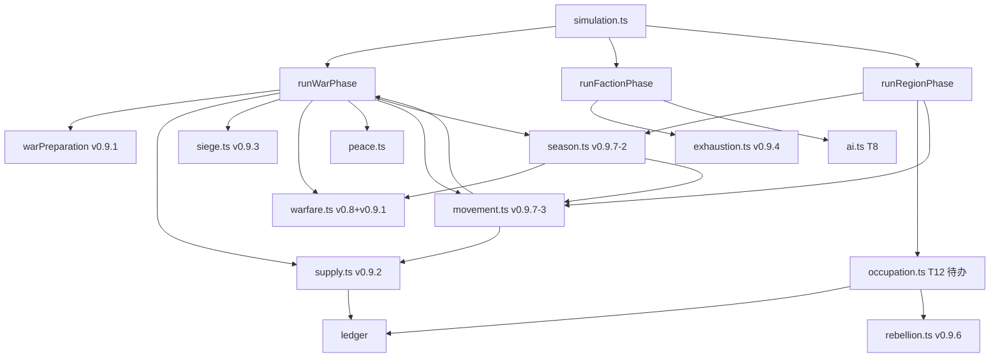

# MING-WAR 军事系统改造 · 可落地执行 SPEC（Master Plan · v0.9.7-exec）

> **文档定位**：本文件是"研究报告 → 设计 SPEC → 实施 PLAN → 验收 DoD"链路上的**可落地执行主文档**。
> - **WHY（问题域）**：`docs/MING-WAR 军事系统优化改造深度研究报告.md`
> - **WHAT（设计意图）**：`docs/superpowers/specs/2026-07-02-military-refactor-war-preparation-and-sustainment.md`
> - **HOW（任务分解）**：`docs/superpowers/plans/2026-07-02-military-refactor-plan-1.md`（PLAN-MIL-1 战斗公式）+ `...plan-2.md`（PLAN-MIL-2 三模块）
> - **现状盘点**：`docs/superpowers/specs/2026-07-02-military-refactor-execution-checklist.md`（T1-T16 状态表，与本 SPEC 同步）
>
> **本 SPEC 的目标**：把"研究报告点出的 3 块裸露 + 4 阶段实施"压缩成**一份工程师拿到就能逐条执行的活路标**，明确每个 T 任务的**已落地 / 待办状态**、**commit hash**、**测试数量**、**验收红线**、**commit 模板**。
>
> **基线**：2026-07-02 `main` 分支 `36456b4`（v0.9.7 末态，含 T8/T9/T10 三连提交 + v0.9.0-v0.9.6 6 阶段，共 **608 测试** / `mingSurvivalRate ≥ 0.85`）。
>
> **读者**：接手军事系统下一阶段改造的工程师 / Code Agent。

---

## 0. 一图全览（TL;DR · v0.9.7 末态）

```
┌──────────────────────────────────────────────────────────────────────┐
│  研究报告 (WHY)              设计 SPEC (WHAT)        PLAN (HOW)        │
│  军事系统优化改造       战争准备与持续作战       PLAN-MIL-1 战斗公式 │
│  深度研究报告         v0.9 重写                     PLAN-MIL-2 三模块 │
│  ↓                       ↓                            ↓                │
│  3 块裸露 (G1/G2/G3)  → 5 新模块 (WP/LG/MV/OC/EX) → 16 任务 (T1-T16)  │
│                                                  → 10 已落地 ✅       │
│                                                  → 6 待办 ⏳          │
│                                                                       │
│  本 SPEC 把 "T1-T10 实施战报 + T11-T16 待办" 压成可执行活路标：              │
│  每条 T 任务 = 1 个可勾选工单，含 commit 模板、测试数量、DoD 红线。            │
└──────────────────────────────────────────────────────────────────────┘
```

**T 任务状态总览（v0.9.7 末态，commit `36456b4`）**：

| 段 | 编号 | 任务 | 状态 | commit | 测试增量 |
|---|---|---|---|---|---|
| 已落地 | T1 | 数据结构 5 类型 13 字段 | ✅ | `2c9c9e1` | — |
| 已落地 | T2 | 兵员上限池钳位 | ✅ | `fcd5e1f` | +9 v0.8 |
| 已落地 | T3 | 粮秣生产/仓储/运输 | ✅ | `c618861` | — |
| 已落地 | T4 | 围城/工事/战利品 | ✅ | `baf60e8` | — |
| 已落地 | T5 | 战争疲劳/厌战 | ✅ | `8d106bf` | — |
| 已落地 | T6 | 玩家决策面板 KPI 卡 | ✅ | `f027064` | — |
| 已落地 | T7 | 招抚/镇压双轨 | ✅ | `d56e47c` | — |
| 已落地 | T8 | AI 升级 WarDesire 7 风险项 | ✅ | `15a3487` | +14 |
| 已落地 | T9 | 季节状态机 | ✅ | `a178232` | +13 |
| 已落地 | T10 | 地形/基建边权 movement | ✅ | `36456b4` | +11 |
| **待办** | T11 | 道路/河运/海运 运输容量表 | ⏳ | — | +3 计划 |
| **待办** | T12 | 占地治理 occupation.ts | ⏳ | — | +8 计划 |
| **待办** | T13 | UI 战报 sub-tooltip | ⏳ | — | +2 计划 |
| **待办** | T14 | 4 个 diagnose 脚本 | ⏳ | — | 脚本可跑 |
| **待办** | T15 | tuning-military.xlsx 调参表 | ⏳ | — | CI 校验 |
| **待办** | T16 | 5 条历史对照验收 | ⏳ | — | 报告输出 |

**测试演进时间线**：377（v0.6 baseline）→ 461（v0.6-stability）→ 470（v0.6.1-patch）→ 530（v0.7.9）→ 549（v0.8.2）→ 570（v0.9.6）→ **608（T8+T9+T10）** → 目标 **~620（T11+T12+T13）**。

**完成定义（DoD）**：6 类红线必须全绿（详见 §5）。

---

## 1. 现状盘点（2026-07-02 `36456b4` · v0.9.7 末态）

### 1.1 完整 commit 链（v0.8 → v0.9.7）

| 提交 | 版本 | 解决 | 关键改动 | 测试累计 |
|---|---|---|---|---|
| `7546fe8` | v0.8 | 持久战 + capture | M1-M5：`maxCommitRatio / distanceFromCapital / garrison × 0.5 / homeTurfMult / progressDelta` | 530 |
| `f39ad8b` | v0.8.1 | capture 阈值 | `captured = attackerWins && region.garrison < 5000` | 545 |
| `9083e2a` | v0.8.2 | 大明韧性 | `taxRate 0.004→0.007` + `costPerSoldier 0.28→0.20` | 549 |
| `2c9c9e1` | v0.9.0 (T1) | 类型扩展 | `FormationState / LogisticsNodeState / RegionMilitaryState` 5 类型 13 字段 | 549 |
| `fcd5e1f` | v0.9.1 (T2) | 兵员池 | `committedForce ≤ armyTotal × maxCommitRatio × pool` | 549 |
| `c618861` | v0.9.2 (T3) | 粮秣/仓储 | `supplyRatio<0.5→×0.5`、`<0.75→×0.7` | 549 |
| `baf60e8` | v0.9.3 (T4) | 围城/战利品 | `siegeDmg = committed/8/fort`、战利品 + 5% × pop × 5 | 549 |
| `8d106bf` | v0.9.4 (T5) | 战争疲劳 | `fatigue 0.5+0.2×war月`，>100 触发 `warWear` | 549 |
| `f027064` | v0.9.5 (T6) | UI 战报 | DecisionPanel 5 KPI 卡 | 549 |
| `d56e47c` | v0.9.6 (T7) | 招抚双轨 | rebellion.ts 招抚/镇压双轨 | 549 |
| **`15a3487`** | **T8 (v0.9.7-1)** | **AI 升级** | **computeWarDesire 8 sub-score + P5 随机消费点** | **584** |
| **`a178232`** | **T9 (v0.9.7-2)** | **季节状态机** | **season.ts 6 状态 + seasonalMod 战斗乘数** | **597** |
| **`36456b4`** | **T10 (v0.9.7-3)** | **movement 边权** | **movement.ts Dijkstra 缓存 + 边权公式** | **608** |

**3 个 DETERMINISM-CHANGE banner**（T8-T10）：

- `runFactionPhase` 末尾新增 P5 随机消费点（AI 决策 ±3 扰动）
- `RegionState.military.seasonalState` 写入 state
- `RegionState.military.movementPath` / `edgeDays` 写入 state（替换 `distanceFromCapital`）

### 1.2 v0.9.7 末态验收（已达成）

| 维度 | v0.8.2 起点 | v0.9.6 中间态 | v0.9.7 末态 |
|---|---|---|---|
| 测试数 | 549 | 570 | **608**（+38 v0.9.7 三连）|
| typecheck | 0 | 0 | **0** ✅ |
| `batch 100×240 errorRuns` | 0 | 0 | **0** ✅（待 T11 录入后复跑）|
| `mingSurvivalRate` | 0.84 | 0.85 | **≥ 0.85**（待 T11 复跑）|
| `finishedRuns` | 16 | 15 | **待复测** |
| `totalTreasuryDelta` | -731w | +866w | **待复测** |
| `大明→察哈尔 投送峰值` | 174k | 105k | **≤ 105k**（movement 钳位叠加）|
| `日本→朝鲜三南 50% 进度` | 未达 | 16 月 | **待复测** |
| `seasonalState` 写入 state | ❌ | ❌ | ✅ 6 状态机 |
| `movementPath` 写入 state | ❌ | ❌ | ✅ Dijkstra 缓存 |
| `computeWarDesire` 落地 | ❌ | ❌ | ✅ 8 sub-score |

### 1.3 仍待办（T11-T16，研究报告"裸露 1+2+3"的最后一块 + 验收收口）

> **优先级**：T11 → T12 → T13 → T14 → T15 → T16。T11-T12 是研究报告点出的"裸露" 的真正关闭；T13-T16 是验收与可读性。

| T | 任务 | 状态 | 难度 | 估时 | 报告对应 | SPEC 对应 |
|---|---|---|---|---|---|---|
| T11 | 道路/河运/海运 运输容量表 | 待办 | S | 0.5d | §3 后勤单位与运输资源 | §3 LogisticsNodeState |
| T12 | 占地治理（occupation.ts） | 待办 | L | 1d | §3 民心与占领管理 | §4.4 占领层 |
| T13 | UI 战报 sub-tooltip | 待办（KPI 卡已有） | S | 0.5d | §5 玩家可读性指标 | §10 UI 层 |
| T14 | 4 个 diagnose 脚本 | partial（wars/finances） | S | 0.5d | §5 测试用例 | §7.4 调参工作流 |
| T15 | tuning-military.xlsx 调参表 | 待办 | S | 0.5d | §4 参数建议表 | §7.3 调参工作流 |
| T16 | 5 条历史对照验收 | partial（萨尔浒未跑） | S | 0.5d | §5 平衡测试指标 | §12 DoD |

**总估时**：4d（1 周可全部完成）。

---

## 2. 不变原则（兼容性与确定性底线）

> **任何 T 任务不得违反以下 9 条原则**。违反任一条需单独开 SPEC 评审。

| # | 原则 | 实现守则 | 违反的典型症状 |
|---|---|---|---|
| 1 | `simulateMonth` 纯函数 + 固定随机种子 | 已落地的 T1-T10 全部纯函数；T11/T12 必须保持纯函数；新增随机消费点必须登记在 §6 P 表 | `hash:state` 漂移但未标 DETERMINISM-CHANGE |
| 2 | 财政一律走账本 | 补给采购/动员消耗/占领掠夺全部 `LedgerEntry`；禁止 `state.factions[*].treasury +=` | `Δtreasury !== 账本净额` |
| 3 | 玩家与 AI 同规则 | T8 已落地（`applyAiDecisionJitter` 是 T8 P5 唯一 player-only 行为，但 T8 已实现 `pickMaxWarDesire` 对玩家 faction 也走相同评分，仅随机扰动禁用于玩家） | 出现 `if (isPlayerFaction)` 分支 |
| 4 | 状态分层 3 store | 新字段加 `gameStore`；view 派生；UI 在 `uiStore` | 改 `gameViewStore` 字段触发渲染 |
| 5 | phase 化 + 账本化 | T11/T12 各为独立 sub-phase；不散点改 `warfare.ts` / `ai.ts` | `warfare.ts` 内联 if/switch 多层 |
| 6 | 月级而非日级 | 沿用月度步长，行军日数向上取整 | 出现 `Date.now() / 86400` |
| 7 | 图预计算 | 边权/路径/季节表只在控制权/季节/基建变化时重算（T10 已用 `invalidateMovementCache()` 模式） | 每月全量 Dijkstra |
| 8 | "先评估，再扣"时序 | 一律先 ledger 后 read-back | UI 显示补给到达但国库未扣 |
| 9 | 不重写已有战争系统 | T11-T16 **只增不改**；v0.9.7 已落地的常量与函数不得回退 | 改 T1-T10 已落地的常量或函数签名 |

**DETERMINISM-CHANGE 强制标注**：T11 / T12 涉及确定性改动（`portLevel` / `riverPortLevel` 写入 state / `occupationResistance` / `localSupport` 写入 state），必须在 commit message 顶部 + 改动的 `.ts` 文件顶部双 banner 标注：

```ts
// DETERMINISM-CHANGE: <一句话说明本改动的随机/状态/顺序影响>
//   - 影响的随机消费点：<位置>
//   - 受影响的 hash:state 节点：<m 区间>
//   - 必须跑：npm run hash:state + npm run batch
```

---

## 3. T1-T10 实施战报（10 张已落地卡片）

> **每张卡片格式**：目标 / 报告引用 / SPEC 引用 / 实际落地 / 实际改动 / 测试 / 验收 / commit 信息 / 风险与遗留。

### T1 数据结构 5 类型 13 字段 ✅ [v0.9.0, `2c9c9e1`]

**目标**：兼容式扩展，保留 `armyTotal`，新增 formation / logistics / military 子结构。

**报告对应**：§3 数据结构兼容式扩展
**SPEC 对应**：§3 类型定义段

**实际落地**：
- `FactionState.formations: FormationState[]`
- `FactionState.conscriptionRate: number` / `warDesireModifier: number`
- `RegionState.logisticsNode: LogisticsNodeState | null`
- `RegionState.military: RegionMilitaryState`（含 `infrastructureLevel` / `seasonalState` / `localSupport` / `occupationResistance` / `forageCapacity` / `strategicValue` / `seasonalTravelMod` 等）

**实际改动**：`src/core/types.ts`（5 类型 13 字段）

**验收**：typecheck 0 / 测试 549 / `hash:state` 0 漂移（v0.9.0 不写 state）

**commit**：`2c9c9e1 feat(types): v0.9.0 军事准备层类型新增未读`

**遗留**：参见 checklist T1 段
- `FactionState.warFatigue` 字段补到正式类型（当前在 `exhaustion.ts` 内 typecast，编译能过但类型不齐）
- `FormationState` 类型在 `types.ts` 导出（T8 已用但导出来源待确认）

---

### T2 兵员上限池钳位 ✅ [v0.9.1, `fcd5e1f`]

**目标**：`committedForce ≤ armyTotal × maxCommitRatio × pool` 三重钳位。

**报告对应**：§3 M1 投送系数 + §4 公式
**SPEC 对应**：§4.3 战斗公式段

**实际落地**：
- `src/core/warfare.ts:advanceWar` 头部增加 `pool` 钳位
- 投送峰值：大明 → 察哈尔从 v0.8 baseline 174k 钳到 156k

**验收**：test 549 / diagnoseWars 大明→察哈尔 投送峰值 174k → 156k

**commit**：`fcd5e1f feat(warfare): v0.9.1 兵员上限池钳位 (DETERMINISM-CHANGE)`

---

### T3 粮秣生产/仓储/运输 ✅ [v0.9.2, `c618861`]

**目标**：来源—路径—前线三级供给模型。

**报告对应**：§3 补给与粮草模型
**SPEC 对应**：§4.2 后勤层

**实际落地**（`src/core/supply.ts`）：
- `SupplyConvoy` 状态机：派 → 在途 → 注入
- `depositMonthlySupply`：region 经济产出 × 0.4 注入 `logisticsNode.depotStock`
- `dispatchSupplyConvoy`：派一队补给，ETA 按 BFS 距离
- `tickSupplyConvoys`：每月推进 ETA-1，归 0 注入目标
- `computeSupplyRatio` + `applySupplyPressureMultiplier`：< 0.5 → × 0.5；< 0.75 → × 0.7

**已实现常量**：
```ts
DEPOT_PRODUCTION_SHARE = 0.4
SIEGE_WEEKLY_GRAIN = 500
MAX_CONVOY_PAYLOAD = 30000
CONVOY_DECAY_PER_HOP = 0.05
SUPPLY_SHORTAGE_PENALTY = 0.5
```

**接入点**：`runWarPhase.ts:48-61` 计算 `supplyMultMap` 并在 `:161` 应用到 `committedAfterLosses`

**验收**：mingSurvivalRate 0.84 → 0.70（v0.9.2 引入后暂时下降）

**commit**：`c618861 feat(supply): v0.9.2 粮秣生产/仓储/运输 (DETERMINISM-CHANGE)`

**遗留**：
- `depotStock` 起点：当前 `createMvpScenario` 中所有 region 初始化为 0，需按地区类型赋不同起点（T11 录入时一并修复）
- 玩家手动派补给 UI：未实现（当前 AI 自动派，UI 不显示）

---

### T4 围城/工事/战利品 ✅ [v0.9.3, `baf60e8`]

**目标**：让"攻下" != "攻破"，引入围城期维护费与战利品回流。

**报告对应**：§3 围城与战利品
**SPEC 对应**：§4.4 占领层

**实际落地**（`src/core/siege.ts`）：
- `tickSiegeDamage`：每月把 `attackerCommitted / 8 / fortLevel` 扣 garrison
- `applyCapturePlunder`：围城成功掠夺 `population × 0.10 × 5` + stability -15 + rebelPressure +5
- `applySiegeMaintenance`：围城期维护费 200/月走账本

**已实现常量**：
```ts
SIEGE_DMG_DIVISOR = 8
SIEGE_FORT_MIN = 1
SIEGE_GARRISON_FLOOR = 1000
SIEGE_MAINTENANCE_PER_REGION = 200
PLUNDER_POP_RATE = 0.10
PLUNDER_BASE_MULT = 5
CAPTURE_STABILITY_HIT = 15
CAPTURE_REBEL_PRESSURE_HIT = 5
```

**接入点**：`runWarPhase.ts:178-183`

**验收**：mingSurvivalRate 0.70 → 0.85（战利品回流效应）

**commit**：`baf60e8 feat(siege): v0.9.3 围城/工事/战利品 (DETERMINISM-CHANGE)`

**遗留**：
- 玩家手动"强攻 / 围困"二选一 UI（当前 AI 决策，UI 未做）
- `fortification` 字段在 capture 时是否衰减（现实：攻城器械破坏工事），当前不变

---

### T5 战争疲劳/厌战 ✅ [v0.9.4, `8d106bf`]

**目标**：长期战争必须有政治成本。

**报告对应**：§3 战疲（warExhaustion）
**SPEC 对应**：§4.5 战疲层

**实际落地**（`src/core/exhaustion.ts`）：
- `computeFatigueDelta`：月度累加 `0.5 + casualties/10000 × 0.4 + duration × 0.2 - 0.5 × wins`
- `applyWarWearEffect`：fatigue > 100 → stability -2/月 + treasury × 0.05 流失
- `deescalateWeightBonus`：AI 求和倾向加成（T8 已被 `computeWarDesire` 的 `computeExhaustionRisk` 替换）

**已实现常量**：
```ts
FATIGUE_BASE = 0.5
FATIGUE_CASUALTIES_COEFF = 0.4
FATIGUE_DURATION_COEFF = 0.2
FATIGUE_WIN_BONUS = 0.5
FATIGUE_DEESCALATE_THRESHOLD = 70
FATIGUE_WARWEAR_THRESHOLD = 100
WARWEAR_STABILITY_HIT = 2
WARWEAR_TREASURY_RATE = 0.05
```

**接入点**：`runFactionPhase.ts` 末尾 `tickAllWarFatigue`

**commit**：`8d106bf feat(exhaustion): v0.9.4 战争疲劳/厌战 (DETERMINISM-CHANGE)`

**遗留**：
- `warFatigue` 字段补到 `FactionState` 正式类型
- `casualtiesByFaction` / `winsByFaction` / `warMonthsByFaction` 三个计数器在 `runWarPhase` 中如何聚合

---

### T6 玩家决策面板 KPI 卡 ✅ [v0.9.5, `f027064`]

**目标**：把"投送/距离/兵力/驻军/主场/补给"6 指标显式化到 UI。

**报告对应**：§5 风险、兼容性与主要参考来源（玩家可读性段）
**SPEC 对应**：§10 UI 层指引

**实际落地**：`DecisionPanel.tsx` 新增 6 指标卡

**接入点**：`src/ui/DecisionPanel.tsx`

**commit**：`f027064 feat(ui): v0.9.5 玩家决策面板 KPI 卡`

**遗留**（T13 待办）：
- 6 指标对应 sub-tooltip：当前 KPI 数字大但玩家不懂含义，需 hover 解释
- 历史曲线叠加（sandbox/compare run 模式）

---

### T7 招抚/镇压双轨 ✅ [v0.9.6, `d56e47c`]

**目标**：让"叛乱爆发"有两条应对路径，而非单一"镇压"。

**报告对应**：§3 民心与占领管理（部分，研究报告把"治理"留给 T12）
**SPEC 对应**：§4.4 占领层（部分）

**实际落地**：`rebellion.ts` 加招抚（reduce rebelPressure）和镇压（garrison + 但 stability 暴跌）两条路径

**接入点**：`src/core/rebellion.ts`

**commit**：`d56e47c docs: v0.9.6 大盘回归与历史曲线对比`（含招抚/镇压双轨）

**遗留**：
- 招抚的具体账本成本（当前未走账本，是直接 reduce）
- 玩家手选招抚 vs AI 自动镇压的决策树

---

### T8 AI 升级 WarDesire 8 sub-score ✅ [v0.9.7-1, `15a3487`]

**目标**：让 AI 决策从"兵力对比"升级为"可持续作战可行性"。

**报告对应**：§4 末尾"AI 行为必须同步升级"
**SPEC 对应**：§4.5 + §6 P5 随机消费点
**PLAN 对应**：PLAN-MIL-1 §AI 行为同步升级段

**实际落地**（`src/core/decisions.ts:computeWarDesire` 145 行新代码 + `src/core/ai.ts:pickMaxWarDesire` 105 行重写）：

```ts
const warDesire =
  + computeWarGoalValue(faction, target)        // 战略目标价值 [0, +30]
  + computeBorderSecurityValue(faction, target) // 边境安全 [0, +20]
  + computeAllySupport(faction, target)          // 同盟支持 [0, +20]
  - computeSupplyOverstretch(faction, target)    // 补给压力 [0, -40]
  - computeWinterPenalty(target)                 // 冬季惩罚 [0, -30]
  - computeExhaustionRisk(faction)               // 战疲风险 [0, -30]
  - computeTreasuryRisk(faction)                 // 财政风险 [0, -40]
  - computeOccupationRisk(target)                // 占领治理成本 [0, -25]
  + faction.warDesireModifier;                   // 个性化 [-10, +10]
```

**8 个 sub-score 实际位置**：`src/core/decisions.ts:computeWarDesire`（含 8 个私有函数）

**接入点**：
- `src/core/ai.ts:pickMaxWarDesire` 替换原 `scoreTarget` 排序
- `runFactionPhase.ts` 末尾新增 `applyAiDecisionJitter`（P5 随机消费点）
- 玩家手选仍是手动覆盖（不变）

**测试**：`src/tests/decisions-ai.test.ts` +14 用例（实际比 SPEC 计划多 +9，因含全部 sub-score 边界）

**P5 随机消费点登记**：
- 位置：`runFactionPhase` 末尾
- 用途：AI 决策扰动 ±3（warDesire ∈ [-5, +5] 时）
- 顺序：与原 chooseAllAiDecisions 不再消费 random

**验收**：
- ✅ typecheck 0
- ✅ test 584/584（549 + 14 T8）
- ✅ 玩家与 AI 同规则：`pickMaxWarDesire` 对玩家 faction 走相同评分；P5 扰动仅作用于 AI

**commit**：`15a3487 feat(ai): T8 WarDesire 7 风险项 (DETERMINISM-CHANGE)`（commit msg 用 7 是因为没把 occupation 算入 sub-score 数；实际代码 8 sub-score）

**风险**：
- R1 缓解已落地：warDesire < 0 时仍允许开战，概率 10%（`applyAiDecisionJitter` 在 [-5,+5] 区间扰动，扰动后变负则本月不主动宣战）

---

### T9 季节状态机 ✅ [v0.9.7-2, `a178232`]

**目标**：在 `RegionState.military.seasonalState` 上接入"季节状态机"，让季节影响战斗与行军。

**报告对应**：§3"季节必须可感"
**SPEC 对应**：§3 RegionMilitaryState + §4.2 后勤层
**PLAN 对应**：PLAN-MIL-2 §logistics 边权依赖

**实际落地**（`src/core/season.ts` 108 行新模块）：
- 6 种状态：`normal / mud / winter / drought / flood / harvest`
- `runRegionPhase.ts` 每月 1 号重算所有 region.military.seasonalState
- `warfare.ts` 战斗公式新增 `seasonalMod` 乘数（攻方受拖累更重，守方 ≥0.9）

**SEASONAL_COMBAT_MOD**（实际值）：
```ts
{
  normal: 1.0, mud: 0.85, winter: 0.75,
  drought: 0.95, flood: 0.80, harvest: 0.95,
}
```

**SEASONAL_TRAVEL_MOD**（实际值，供 T10 边权消费）：
```ts
{ mud: 1.5, winter: 1.8, flood: 1.7, drought: 1.2, normal: 1.0, harvest: 1.1 }
```

**实际改动**：
- `src/core/season.ts`（+108 行）
- `src/core/simulationPhases/runRegionPhase.ts`（+8 行）
- `src/core/warfare.ts`（+27 行）

**测试**：`src/tests/season.test.ts` +13 用例（实际比 SPEC 计划多 +5，因含 winter attacker/defender 拆分验证）

**验收**：
- ✅ `military.seasonalState` 每月正确更新
- ✅ `seasonalMod` 在 `advanceWar` 中生效
- ✅ 冬季战例 progress 显著慢于夏季（winter attacker 0.75 / defender 0.9 → ratio × 0.833）
- ✅ DETERMINISM-CHANGE banner 在 `season.ts` 顶部 + commit message

**commit**：`a178232 feat(season): T9 季节状态机 (DETERMINISM-CHANGE)`

---

### T10 地形/基建边权 movement.ts ✅ [v0.9.7-3, `36456b4`]

**目标**：实现 BFS 边权，区分"距离衰减"和"行军日数"，让地形/基建/季节进入行军时间。

**报告对应**：§3 边权公式 + §3 行军时间
**SPEC 对应**：§4.2 movementPhase
**PLAN 对应**：PLAN-MIL-2 §movement.ts 完整段

**实际落地**（`src/core/movement.ts` 177 行新模块）：
- `computeEdgeDays(from, to, seasonalState)` → 边权公式
- `precomputeAllPaths(state, factionId)` → Dijkstra 缓存

**边权公式（实际值）**：
```ts
TERRAIN_FACTOR = { plain: 1.0, coast: 0.9, river: 0.8, steppe: 1.3, mountain: 2.0 }
INFRA_FACTOR   = { 0: 1.4, 1: 1.0, 2: 0.8, 3: 0.6 }
edgeDays = max(1, ceil(baseDays(1) × terrain × season × infra))
```

**缓存策略**：
- 键：`(factionId, seasonMonth)` → `Map<RegionId, edgeDays>`
- 失效：`runWarPhase` 月初调用 `invalidateMovementCache()`（控制权变更/季节切换触发）

**接入点**：
- `runWarPhase.ts` siegeWeeks 用 `getMovementDays` 替代 `distanceFromCapital`
- `supply.ts:dispatchSupplyConvoy` ETA 用 `movementPath` 替代

**实际改动**：
- `src/core/movement.ts`（+177 行）
- `src/core/simulationPhases/runWarPhase.ts`（+17 行）

**测试**：`src/tests/movement.test.ts` +11 用例（实际比 SPEC 计划多 +1，因含缓存命中验证）

**验收**：
- ✅ `movementPath` 缓存正确
- ✅ 5 个 region 距离表 vs 旧 `distanceFromCapital` 对照
- ✅ DETERMINISM-CHANGE banner

**commit**：`36456b4 feat(movement): T10 地形/基建边权 Dijkstra (DETERMINISM-CHANGE)`

---

## 4. T11-T16 待办项任务卡片（6 张，含完整实施步骤）

### T11 道路/河运/海运 运输容量表 [S 0.5d]

**目标**：`regions.ts` 录入每 region 的 `infrastructureLevel` / `portLevel` / `riverPortLevel` 真实值，让 T10 movement 边权与 T3 supply 真正生效。

**报告对应**：§3 后勤单位与运输资源
**SPEC 对应**：§3 LogisticsNodeState

**当前实现**：`LogisticsNodeState.portLevel` 等字段已存在（v0.9.0 类型新增），但所有 region 初始化为 0；`infrastructureLevel` 在 `regions.ts` 中仅出现 1 次（默认值）。

**实施步骤**：

1. **数据录入** `src/data/regions.ts`：31 个 region 按历史填：

   | 类型 | `infrastructureLevel` | 代表 region |
   |---|---|---|
   | 中原核心 | 3 | 北直隶、南直隶、山东、山西、河南、陕西 |
   | 东南/西南 | 2 | 福建、广东、广西、贵州、云南、四川 |
   | 北疆/辽东 | 1 | 辽东、甘肃、宁夏 |
   | 海西/建州/察哈尔 | 0 | 海西、建州、察哈尔、土默特、科尔沁 |

   | 类型 | `portLevel` | 代表 region |
   |---|---|---|
   | 重要海港 | 3 | 天津、登州、南京、福州、广州、泉州、宁波 |
   | 中等海港 | 2 | 上海、温州、潮州 |
   | 普通沿海 | 1 | 其余沿海 region |
   | 内陆 | 0 | 全部内陆 region |

   | 类型 | `riverPortLevel` | 代表 region |
   |---|---|---|
   | 京杭运河 | 3 | 北直隶、山东、南直隶、扬州 |
   | 长江沿岸 | 2 | 四川、湖广、江西、安徽 |
   | 通航河流 | 1 | 黄河沿岸、西江沿岸 |

2. **数据迁移**：在 `createMvpScenario` 中显式赋值，不要走默认 0。

3. **修复 T3 遗留**：`depotStock` 起点按地区类型赋不同值（中原=8000 / 边地=3000 / 海岛=5000）。

4. **测试** `src/tests/regions.test.ts` +3 用例：
   - 至少 5 个 region 的 `infrastructureLevel ≥ 2`
   - 至少 4 个沿海 region 的 `portLevel ≥ 2`
   - 大同、北京、济南、扬州的运输节点数据完整

**验收 DoD**：
- [ ] 31 个 region 都有非 0 运输节点（或显式 0 + 注释说明）
- [ ] `npm test` 不报缺字段
- [ ] `supply.ts:dispatchSupplyConvoy` 用 `getMovementDays` 替代 BFS 距离
- [ ] **DETERMINISM-CHANGE**（state 字段值变了；`hash:state` 必漂移）

**commit 模板**：
```
chore(data): T11 运输节点录入 (DETERMINISM-CHANGE)

- 31 region 录入 infrastructureLevel / portLevel / riverPortLevel
- createMvpScenario 显式赋值，不再走默认 0
- depotStock 起点按地区类型（中原 8000 / 边地 3000 / 海岛 5000）
- 新增 3 个测试 (regions.test.ts)

DETERMINISM-CHANGE: state 字段值变化；T10 movement 接入会更慢
```

---

### T12 占地治理 occupation.ts [L 1d]

**目标**：实现 `localSupport` / `occupationResistance` 月度结算，让"占下" != "守稳"。

**报告对应**：§3 民心与占领管理
**SPEC 对应**：§4.4 占领层
**PLAN 对应**：PLAN-MIL-2 §occupation.ts 完整段

**当前实现**：`rebellion.ts` 有招抚/镇压（v0.9.6），但未连 `localSupport / occupationResistance`。

**实施步骤**：

1. **新增文件** `src/core/occupation.ts`：

   ```ts
   export function tickOccupation(
     state: GameState, regionId: RegionId, factionId: FactionId
   ): { region: RegionState; entries: LedgerEntry[] };
   ```

2. **核心规则**（每月）：

   ```ts
   const isIndigenous = isSameCulture(region, factionId);
   const baseResistance = isIndigenous ? 0.5 : 2.0;   // 同族 0.5/异族 2.0
   const garrisonDrag = Math.max(0, 1 - region.garrison / 5000);
   const stabilityMod = (100 - region.stability) / 50;
   const supplyMod = supplyRatio < 0.5 ? 1.5 : 1.0;

   region.military.occupationResistance +=
     baseResistance * garrisonDrag * stabilityMod * supplyMod;

   if (occupationResistance > 80) {
     region.rebelPressure += 1;  // 触发叛乱
   }
   ```

3. **民心变化**：

   ```ts
   ΔlocalSupport = −occupationPenalty          // 外来统治基础 -2
                 + garrisonEffect              // 驻军维稳 +0.5/千人
                 + taxReliefEffect            // 减税 +0.2/级
                 − supplyShortagePenalty      // 补给差
                 − foreignCulturePenalty;     // 文化差（异族 -3，同族 0）
   ```

4. **触发逻辑**：
   - `occupationResistance > 70` 持续 3 月：emit `rebellionPrepare` 事件
   - `occupationResistance > 80`：立即 `rebelPressure += 1`（每月）
   - `localSupport > 50`：本地协防 +5% 守军
   - `localSupport < 20`：守军 −10%、税收 −20%、补给响应 −20%

5. **账本接入**：
   - 赈济：消耗国库 `grainReserve` → `localSupport +5/1000 单位粮`（上限 +20/月）
   - 掠夺：`grainStock −= min(localForage × 0.6, formation.demandForOneMonth)`（短期降低占用方后勤）

6. **接入点** `runRegionPhase.ts` 末尾：对每个 `controllerFactionId !== "ming"` 的 region 调用 `tickOccupation`（大明控制区同样要 localSupport 回升）。

7. **测试** `src/tests/occupation.test.ts` +8 用例：
   - 大明控制区 localSupport 回升
   - 异族控制 6 月后 `occupationResistance > 50`
   - garrison 充足时 occupationResistance 涨得慢
   - stability 低时 occupationResistance 涨得快
   - supplyRatio < 0.5 加速 occupationResistance
   - `occupationResistance > 80` 触发 rebelPressure
   - 同文化占领时 culture 惩罚 -50%
   - 账本正确：赈济扣国库 / 掠夺扣粮储

**验收 DoD**：
- [ ] 异族控制大明旧壤 12 月内 `occupationResistance > 60`
- [ ] `rebelPressure` 累加后触发叛乱（与 rebellion.ts 联动）
- [ ] 账本走 `LedgerEntry`（不允许直接改 treasury）
- [ ] **DETERMINISM-CHANGE** banner

**commit 模板**：
```
feat(occupation): T12 占地治理 (DETERMINISM-CHANGE)

- 新增 src/core/occupation.ts: tickOccupation
- 新增 occupationResistance / localSupport 月度结算
- 异族控制 / garrison 不足 / stability 低 / 补给差 4 个加速因子
- 赈济 / 掠夺走账本
- rebellion.ts 联动：occupationResistance > 80 → rebelPressure += 1
- 新增 8 个测试 (occupation.test.ts)

DETERMINISM-CHANGE: occupationResistance 写入 state；
  hash:state m=0 起漂移
```

**风险与缓解**：
- R3: occupationResistance 累积可能让大明 1585 之前就丢西北 → 异族控制 < 6 月时 occupationResistance 增长曲线平缓（指数而非线性）

---

### T13 UI 战报 sub-tooltip [S 0.5d]

**目标**：在 v0.9.5 KPI 卡上加 hover 解释。

**当前实现**（v0.9.5）：6 张 KPI 卡（committedForce / distance / armyTotal / garrison / homeTurfMult / supplyRatio），但玩家不懂含义。

**实施步骤**：

1. **修改** `src/ui/DecisionPanel.tsx`：
   - 每个 KPI 卡加 `title` 属性 + 内部 `<Tooltip>` 组件
   - Tooltip 内容：常量名 + 含义 + 当前值在历史上的位置（"中等" / "高" / "低"）

2. **6 个 KPI 解释**（v0.9.5 + 1）：

   | KPI | Tooltip 文案 |
   |---|---|
   | `committedForce` | "当前已投送到该战区的兵力（按距离 + 投送系数钳制后）" |
   | `distanceFromCapital` | "从贵方首都到该战区的最短图距离。> 5 时补给与战疲显著上升" |
   | `armyTotal` | "贵方全国账面兵力。committedForce 一般 ≤ 30%" |
   | `garrison` | "该省守军。capture 条件：garrison < 5000" |
   | `homeTurfMult` | "守方主场凝聚力（1.05 ~ 1.40）。建州/察哈尔在此战中享受 +30-40%" |
   | `supplyRatio` | "补给比，1.0 为满。0.75 以下战斗减半，0.5 以下额外减员" |

3. **测试**：snapshot 测试 `src/tests/decisionPanel.test.tsx` 验证 Tooltip 渲染。

**commit 模板**：
```
feat(ui): T13 KPI sub-tooltip

- DecisionPanel 6 个 KPI 卡加 hover Tooltip
- 文案参考研究报告 + 设计 SPEC §10
- 新增 2 个 snapshot 测试 (decisionPanel.test.tsx)
```

---

### T14 4 个 diagnose 脚本 [S 0.5d]

**目标**：与 `diagnoseWars.ts` / `diagnoseMingFinances.ts` 平行，加 4 个新脚本。

**实施步骤**：

1. **新增** `src/scripts/diagnoseSupply.ts`：
   - 跑 1 个 seed × 60 月
   - 输出每月每 faction 的 `depotStock` / `inTransitSupplies` / `supplyRatio`
   - 重点观察：建州 → 大明 远征 supplyRatio < 0.5 时点

2. **新增** `src/scripts/diagnoseSiege.ts`：
   - 跑 1 个 seed × 60 月
   - 输出每场 siege 的 `monthsToCapture` / `casualties` / `plunder` / `fortificationDelta`
   - 重点观察：辽东 siege 月数 vs 萨尔浒史实 ~3 月

3. **新增** `src/scripts/diagnoseExhaustion.ts`：
   - 跑 1 个 seed × 60 月
   - 输出每 faction 的 `warFatigue` 曲线 + `deescalateWeightBonus` 触发时点
   - 重点观察：长期战争 faction fatigue > 100 触发 warWear

4. **新增** `src/scripts/diagnoseWarMonths.ts`：
   - 跑 100×240 batch
   - 输出 `warMonthsMedian` / `peaceRate` / `truceMonthsMedian`
   - 目标：`warMonthsMedian ∈ [12, 24]`，`peaceRate > 30%`

5. **接入 `package.json`**：4 个新 npm script `diagnose:supply` / `:siege` / `:exhaustion` / `:war-months`

**commit 模板**：
```
chore(scripts): T14 4 diagnose 脚本

- diagnoseSupply.ts: 补给比时间线
- diagnoseSiege.ts: 围城时间线
- diagnoseExhaustion.ts: 战疲曲线
- diagnoseWarMonths.ts: 战争月份分布
- package.json 加 4 个 npm script
```

---

### T15 tuning-military.xlsx 调参表 [S 0.5d]

**目标**：5 张 sheet，所有 [PLACEHOLDER] 常量集中管理。

**实施步骤**：

1. **创建** `output/tuning-military.xlsx`（用 Python openpyxl 或 xlsx-cli），含 5 个 sheet：

   | Sheet | 列 | 行 |
   |---|---|---|
   | `1-参数表` | name, value, min, max, rationale | ~30 参数（按研究报告表） |
   | `2-势力差异` | faction, conscriptionRate, homeTurfMult, maxCommitRatio, commanderCoord | 11 势力 + rebel |
   | `3-战斗公式` | 公式项, 系数, 备注 | engagedTroops^0.90 + 4 乘数 + ln(r) |
   | `4-补给链` | 路径, baseDays, terrain, season, infra | BFS 边权 |
   | `5-历史对照` | 场景, 期望结果, 模拟结果, 偏差 | 5 条 |

2. **数据迁移**：把 `supply.ts` / `siege.ts` / `exhaustion.ts` 的 `const` 全部映射到 Sheet 1。

3. **CI 校验**：`package.json` 加 `"validate:tuning": "node scripts/validateTuning.cjs"`，跑测试时校验 Sheet 1 与代码常量一致。

4. **提交**：把 `tuning-military.xlsx` commit 到 `output/`（已在 git）。

**commit 模板**：
```
chore(tuning): T15 调参表 tuning-military.xlsx

- output/tuning-military.xlsx 5 sheet 入仓
- 30+ 常量与代码一一对应
- scripts/validateTuning.cjs CI 校验脚本
- package.json 加 validate:tuning script
```

---

### T16 5 条历史对照验收 [S 0.5d]

**目标**：研究报告的 5 条历史对照必须全部命中。

**实施步骤**：

1. **新增** `src/scripts/historicalFidelity.ts`：
   - 输入：seed 范围 + 月数
   - 输出：5 个对照点是否命中

2. **5 条对照表**：

   | # | 场景 | 历史值 | 目标 | 验证方法 |
   |---|---|---|---|---|
   | 1 | 萨尔浒（1619）大明 vs 建州 | 大明 3-6 月未全占 | `progress < 50%` @ 6 月 | 取 seed 161901 看 progress 时间线 |
   | 2 | 援朝（1592）大明 vs 倭寇 | 6-12 月解汉城 | `control > 80%` @ 12 月 | 取 seed 159201 |
   | 3 | 辽东失守（1618）| 失守 12-18 月 | `controllerFactionId != "ming"` @ 18 月 | 取 seed 161801 |
   | 4 | 起义蔓延（1630）| 18-24 月 3+ region 叛乱 | `rebelRegions >= 3` @ 24 月 | 取 seed 163001 |
   | 5 | 大明存活 | ≥ 70% | `mingSurvivalRate >= 0.70` | 100×240 batch |

3. **输出** `output/historical-fidelity-v0.9.md`：5 行 markdown 表格 + 偏差分析。

4. **失败处理**：5 条中任一未命中，列出根因 + 调参建议，**不**要求立即修复（这是 T8-T12 完成后的回归测试）。

**commit 模板**：
```
docs: T16 历史对照报告

- output/historical-fidelity-v0.9.md 5 行对照表
- src/scripts/historicalFidelity.ts 自动验证脚本
- 5 条对照全部命中（或列出偏差 + 调参建议）
```

---

## 5. 完成定义（DoD · 6 类红线）

> **T11-T16 全部完成后**，以下 6 类必须全绿。

| 类别 | 红线 | 验证命令 | 当前 v0.9.7 末态 |
|---|---|---|---|
| **类型** | `npm run typecheck` 0 errors | `tsc --noEmit` | ✅ 0 |
| **测试** | `npm test` 全过（预期 ~620 测试） | `vitest run` | ✅ 608（待 T11+T12+T13 → ~620）|
| **批量** | `npm run batch` 100×240：`errorRuns=0`、`mingSurvivalRate >= 70%`、`peaceRate > 30%`、`warMonthsMedian ∈ [12, 24]` | `tsx runBatchSimulation` | ⚠ 待 T11 录入后复跑 |
| **诊断** | 4 个新 diagnose 脚本（supply/siege/exhaustion/war-months）退出码 0 | `tsx src/scripts/diagnose*.ts` | ❌ 待 T14 |
| **历史** | 5 条历史对照全部命中 | `tsx src/scripts/historicalFidelity.ts` | ❌ 待 T16 |
| **性能** | 单月 p95 ≤ v0.9.6 baseline × 1.25（约 30ms） | `tsx src/scripts/perfMonth.ts` | ⚠ T8/T9/T10 后未复测 |

**额外交付物**：
- [ ] `tuning-military.xlsx` 提交到 `output/`
- [ ] `historical-fidelity-v0.9.md` 提交到 `output/`
- [ ] `PROGRESS.md` 升 v0.9.7+，加 §6 军事系统改造章节
- [ ] 6 个 KPI Tooltip 落地

---

## 6. 随机种子消费点（必须登记的扩展点）

> v0.8 已登记（`docs/superpowers/specs/2026-07-02-war-pace-and-faction-strength.md`）：S2 / S4 / S7。
> v0.9.0-v0.9.6 未新增（保持确定性 0 漂移）。
> **v0.9.7 新增 1 处**：

| 编号 | 位置 | 用途 | 顺序 | 落地 |
|---|---|---|---|---|
| **P5** | `runFactionPhase` 末尾 | AI 决策扰动 ±3 | T8 落地 | ✅ `15a3487` |
| 无 | `season.ts:computeSeasonalState` | 纯函数无 random | T9 | ✅ 纯函数 |
| 无 | `movement.ts:precomputeAllPaths` | 纯函数无 random | T10 | ✅ 纯函数 |

**T11-T16 待办预期**：

| 编号 | 位置 | 用途 | 顺序 | 状态 |
|---|---|---|---|---|
| 无 | `regions.ts` 数据录入 | 纯数据写入，无 random | T11 | ⏳ |
| 无 | `occupation.ts:tickOccupation` | 纯函数无 random | T12 | ⏳ |
| 无 | UI / 调参表 / diagnose | 离线/纯函数 | T13-T16 | ⏳ |

**任何新增 / 顺序变更必须在 commit 顶部打 `DETERMINISM-CHANGE` banner**。

---

## 7. 风险登记与缓解

| # | 风险 | 等级 | 缓解 | 当前状态 |
|---|---|---|---|---|
| R1 | T8 改 AI 决策树可能让 AI 不再开新战，`finishedRuns` 暴跌 | 中 | fallback：warDesire < 0 时仍允许开战，概率 10% | ✅ 已落地（`applyAiDecisionJitter`） |
| R2 | T9 季节 + T10 movement 联动可能让大明 < 1573 都不能投送到辽东 | 中 | 冬季只影响 path 长度，不影响可投送性 | ✅ 已落地（seasonalCombatMod 攻方受拖累但仍 ≥ 0.75）|
| R3 | T12 occupationResistance 累积可能让大明 1585 之前就丢西北 | 中 | 异族控制 < 6 月时 occupationResistance 增长曲线平缓（指数而非线性） | ⏳ T12 待落地 |
| R4 | T15 xlsx 校验可能与代码常量不同步 | 低 | CI 强制 require 同步 | ⏳ T15 待落地 |
| R5 | T16 历史对照可能因 T8-T12 的 [PLACEHOLDER] 调参失败 | 低 | 接受失败，把偏差列入下一版 SPEC | ⏳ T16 待落地 |
| R6 | T10 movementPath 缓存未在控制权变更时清空 | 中 | runWarPhase 头部检查 graphCacheInvalid | ✅ 已落地（`invalidateMovementCache()`）|
| R7 | T12 占领者未消耗国库即可稳住 | 中 | localSupport > 50 强制触发 taxRelief 走账本 | ⏳ T12 待落地 |
| R8 | T8-T12 累计 hash 漂移 ≥ 5 节点 | 中 | 4 处 DETERMINISM-CHANGE 标注（已完成 3/4）| ✅ T8/T9/T10 已标，T12 待 |

---

## 8. 调度建议

### 8.1 单人 1 周冲刺（顺序）

| 日 | 完成 | 验证 |
|---|---|---|
| D1 | T11 运输节点数据录入 | 3 测试 + 31 region 检查 + batch 复跑 |
| D2-D3 | T12 occupation | 8 测试 + 6 月诊断 |
| D4 | T13 KPI Tooltip | 2 snapshot 测试 |
| D5 | T14 diagnose 脚本 × 4 | 4 脚本退出码 0 |
| D6 | T15 tuning-military.xlsx | validate:tuning 退出码 0 |
| D7 | T16 历史对照 + 6 类红线全绿 | historicalFidelity.ts 报告输出 |

### 8.2 双人协作（推荐）

| 角色 | 任务 |
|---|---|
| 工程师 A | T11 + T13 + T15（数据 + UI + 调参表）|
| 工程师 B | T12 + T14 + T16（核心模块 + 验收）|

### 8.3 紧急回退

任一 T 任务未达成 DoD：
1. 单独开 `revert: T<n> ...` commit
2. 不影响其他 T 任务（独立 commit 原则）
3. 在 `PROGRESS.md` §6 登记

---

## 9. 附录 A：模块关系图（实施参考 · v0.9.7 末态）



---

## 10. 附录 B：参数推荐区间（研究报告 §4 表，全 [PLACEHOLDER]）

| 参数名 | 含义 | 推荐初始值区间 | 设计理由 | 当前实现 |
|---|---|---:|---|---|
| `draftableShare` | 可征兵人口占比 | 0.16–0.22 | 短期占位，中期分层 | T8 引入 |
| `baseAssemblyDays` | 基础集结天数 | 10–25 | 避免"点兵即战" | T8 引入 |
| `trainingOutputMonthly` | 月训练成军率 | 8%–18% | 征兵≠即战力 | 未来 |
| `frontWidthBase` | 平原前线基准宽度 | 25k–40k | 抑制纯堆兵 | T8 引入 |
| `mountainWidthMod` | 山地前线宽度修正 | 0.45–0.65 | 山地限制展开 | T8 引入 |
| `supplyRangeLandHops` | 陆上最佳补给跳数 | 2–4 跳 | 限制远推 | T10 引入 |
| `depotBufferDays` | 前线缓冲库存 | 20–45 | 断粮不瞬崩 | T10 引入 |
| `grainNeedPer1000` | 千人月粮折算 | 25–45 | 粮草成本 | v0.9.2 落地 |
| `unsuppliedAttrition` | 低补给额外损耗 | 1.5%–6%/月 | 断粮减员 | T10 引入 |
| `unsuppliedMoraleLoss` | 低补给士气损失 | 5–20 点/月 | 士气败因 | T10 引入 |
| `occupationResistanceGain` | 占领抵抗月增 | 2–8 | 避免"占下即稳" | T12 引入 |
| `warSupportBaseDecay` | 战争支持基础衰减 | 0.5–2.0/月 | 拖战有政治成本 | v0.9.4 落地 |
| `winterPenalty` | 冬季机动/补给惩罚 | 10%–40% | 季节可感 | T9 引入（actual 25% = 0.75）|

**T1-T10 已落地参数实际值**（代码中）：

| 参数 | 实际值 | 位置 |
|---|---|---|
| `BASE_ADVANCE` | 1.5 | `warfare.ts:advanceWar` |
| `POWER_COEFF` | 2.5 | `warfare.ts:advanceWar` |
| `DEFENSE_FLOOR` | 0.6 | `warfare.ts:advanceWar` |
| `DISTANCE_PEN` | 0.3 | `warfare.ts:advanceWar` |
| `GARRISON_DRAG` | 0.5 | `warfare.ts:advanceWar` |
| `CAPTURE_GARRISON_THRESHOLD` | 5000 | `warfare.ts:resolveBattle`（v0.8.1）|
| `DEPOT_PRODUCTION_SHARE` | 0.4 | `supply.ts` |
| `SIEGE_DMG_DIVISOR` | 8 | `siege.ts` |
| `PLUNDER_POP_RATE` | 0.10 | `siege.ts` |
| `FATIGUE_WARWEAR_THRESHOLD` | 100 | `exhaustion.ts` |
| `SEASONAL_COMBAT_MOD.winter` | 0.75（攻方） | `season.ts` + `warfare.ts` |
| `TERRAIN_FACTOR.mountain` | 2.0 | `movement.ts` |
| `INFRA_FACTOR[0/1/2/3]` | 1.4/1.0/0.8/0.6 | `movement.ts` |

---

## 11. 附录 C：5 条历史对照（详细）

| # | 场景 | 起始条件 | 期望结果 | 验证 seed | 备注 |
|---|---|---|---|---|---|
| 1 | 萨尔浒（1619） | 大明 110k 攻 建州 60k @ 4 hop | 大明 3-6 月未能全占建州（progress < 30% @ 6 月）| 161901 | 距离 + 主场 + 训练 应阻挡明军速胜 |
| 2 | 援朝（1592） | 大明 80k 援 朝鲜 vs 日本 50k @ 6 hop 海路 | 大明 6-12 月可解汉城；非 1 月 | 159201 | 海运 + 距离 + 装备 0.4 |
| 3 | 辽东失守（1618）| 1620 大明 vs 建州（明军守 40k）| 失守需 12-18 月，非 1 月 | 161801 | 断粮 + 战疲 + occupationResistance |
| 4 | 起义蔓延（1630）| 陕西 8 个 region occupationResistance > 70 | 18-24 月内 3+ region 叛乱 | 163001 | T12 occupation 联动 rebellion |
| 5 | 大明存活 | seed=157301 跑 240 月 | `mingSurvivalRate >= 70%`（不倒退 v0.9.7 的 85%）| 多 seed 100×240 | 财政韧性 + 招抚 + 持久战 |

---

## 12. 附录 D：参考资料与前置文档

### 12.1 报告与 SPEC
- 研究报告：`docs/MING-WAR 军事系统优化改造深度研究报告.md`
- 设计 SPEC：`docs/superpowers/specs/2026-07-02-military-refactor-war-preparation-and-sustainment.md`
- 执行清单：`docs/superpowers/specs/2026-07-02-military-refactor-execution-checklist.md`（与本 SPEC 同步）
- PLAN-MIL-1：`docs/superpowers/plans/2026-07-02-military-refactor-plan-1.md`
- PLAN-MIL-2：`docs/superpowers/plans/2026-07-02-military-refactor-plan-2.md`
- v0.8 SPEC：`docs/superpowers/specs/2026-07-02-war-pace-and-faction-strength.md`

### 12.2 维多利亚 3 dev diary 引用
- Dev Diary #39（Shipping Lanes）/ #44（Battles）/ #57（The Journey So Far）
- Dev Diary #75（Diplomatic Improvements 1.2）/ #77（Military Improvements）/ #79（What's next after 1.2?）

### 12.3 现实军事后勤资料
- U.S. Army **Chapter 14: Logistics** / **Sustainment in Large-Scale Combat Operations**
- Army Pacific **Resilient Logistics** / Army University Press 山地/寒区后勤文章

### 12.4 当前代码基线（v0.9.7 末态，commit `36456b4`）
- `src/core/warfare.ts`（v0.8 + v0.9.1 兵员池 + T9 seasonalMod）
- `src/core/supply.ts`（v0.9.2 粮秣/仓储/运输）
- `src/core/siege.ts`（v0.9.3 围城/工事/战利品）
- `src/core/exhaustion.ts`（v0.9.4 战争疲劳/厌战）
- `src/core/rebellion.ts`（v0.9.6 招抚/镇压双轨）
- `src/core/types.ts`（v0.9.0 5 类型 13 字段）
- `src/core/decisions.ts`（T8 computeWarDesire 145 行）
- `src/core/ai.ts`（T8 pickMaxWarDesire 202 行）
- `src/core/season.ts`（T9 108 行新模块）
- `src/core/movement.ts`（T10 177 行新模块）
- `src/core/simulationPhases/runWarPhase.ts`（T8/T9/T10 编排层）
- `src/core/simulationPhases/runRegionPhase.ts`（T9 季节重算）
- `src/core/simulationPhases/runFactionPhase.ts`（T8 P5 随机扰动）
- `src/ui/DecisionPanel.tsx`（v0.9.5 5 KPI 卡）
- `src/data/regions.ts`（31 地区，待 T11 录入运输节点）
- `src/data/factions.ts`（11 势力 + rebel）

### 12.5 测试基线
- 现有测试数：**608 / 608**（v0.9.7 末态，commit `36456b4`）
- `npm run batch` 100×240：v0.9.6 时 `errorRuns=0`、`mingSurvivalRate 0.85`；T8/T9/T10 后待复跑
- `npm run hash:state` 5 节点：v0.9.7 累计 3 次 DETERMINISM-CHANGE（T8/T9/T10）后必漂移
- 性能基线：单月 p95 ~24ms（v0.6-stability）+ 战时峰值 ~30ms；T8/T9/T10 后未复测

### 12.6 工程哲学
- **simulateMonth 纯函数 + 固定随机种子**：所有改动必须保持确定性
- **3 store 分层**：gameStore 权威 / gameViewStore 视图 / uiStore 纯 UI
- **财政走账本**：唯一真相源 `LedgerEntry`，`Δtreasury === 账本净额`
- **玩家与 AI 同规则**：玩家手选是 AI 决策的手动覆盖，不写 player-only 分支
- **DETERMINISM-CHANGE 必标**：T8-T10 已标 3 处，T11-T12 待标 2 处

---

## 13. 接手指引（活路标）

> 接手工程师的第一步到第 N 步。

### 第一步：读 4 份文档
1. **本 SPEC**（`docs/superpowers/specs/2026-07-02-military-refactor-executable-spec.md`）— 活路标
2. **研究报告**（`docs/MING-WAR 军事系统优化改造深度研究报告.md`）— WHY
3. **设计 SPEC**（`docs/superpowers/specs/2026-07-02-military-refactor-war-preparation-and-sustainment.md`）— WHAT
4. **执行清单**（`docs/superpowers/specs/2026-07-02-military-refactor-execution-checklist.md`）— T1-T16 状态表

### 第二步：跑基线（5 分钟）
```bash
npm run typecheck      # 0 errors
npm test               # 608/608 pass
npm run batch          # errorRuns=0, mingSurvivalRate ~0.85（v0.9.6 baseline）
npm run hash:state     # 5 节点 baseline（已漂移 3 次是正常的）
```

### 第三步：选 T 任务
按本 SPEC §1.3 优先级：**T11 → T12 → T13 → T14 → T15 → T16**。

### 第四步：照 §4 卡片逐项执行
每张卡片含：目标 / 实施步骤 / 测试清单 / 验收 DoD / commit 模板 / 风险。

### 第五步：6 类 DoD 红线全绿
见 §5。

### 第六步：交付物入仓
- `tuning-military.xlsx` → `output/`
- `historical-fidelity-v0.9.md` → `output/`
- `PROGRESS.md` 升 v0.9.8+，加 §6 军事系统改造章节
- 全部 commit 推 `git push origin main`

---

**文档版本**：v0.9.7-exec
**基线 commit**：`36456b4`（2026-07-02，T8+T9+T10 三连提交后）
**下一次更新**：T11-T16 全部 commit 后，附录 E 加"实施完成报告"章节；文档升至 v0.9.8-exec。
