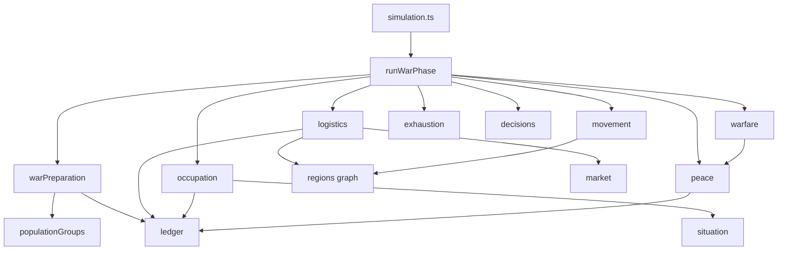
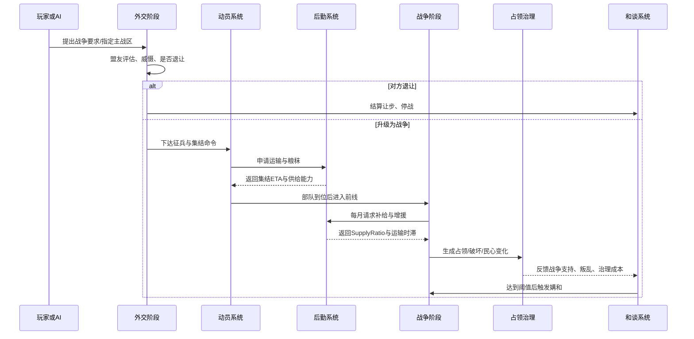

# v0.9 军事系统优化改造 SPEC（基于深度研究报告重写）

> **承接**：v0.8 / v0.8.1 / v0.8.2 三连（持久战 + capture 阈值 + 大明韧性）。
> **基线**：2026-07-02 `main` 分支代码（`a16fcea..9083e2a`），**不**以 v2 旧 SPEC 战争章节为基线。
> **来源**：`docs/MING-WAR 军事系统优化改造深度研究报告.md`。
> **目标**：在已有 `warfare.ts + simulationPhases + diplomacy + peace` 之上，补"**动员—投送—补给—行军—占领—战疲**"中间层，让"兵力总数"必须先穿过 7 道闸门（动员、训练、装备、补给、季节、地形、占领）才能进入战斗公式。
> **原则**：不替换、不破坏、不回归；5 个新模块全部纯增量、phase 化、账本化。

---

## 0. 现状校准（先消除"代码—文档"时差）

### 0.1 v0.8 三连已经做了什么

| 提交 | 解决问题 | 关键字段 / 公式 | 局限 |
|---|---|---|---|
| v0.8 `7546fe8` | 大明几个月推平周边 | `M1 committedForce / maxCommitRatio` + `M2 distanceFromCapital BFS` + `M3 garrison × 0.5` + `M4 homeTurfMult` + `M5 progressDelta` | 只动了战斗结算层；运输/粮秣/季节/道路未显式进入 |
| v0.8.1 `f39ad8b` | 大明 1-2 月吞察哈尔 | `captured = attackerWins && region.garrison < 5000` | 阻断了"首战即吞并"，但**补给正常**的远征战仍未受限制 |
| v0.8.2 `9083e2a` | 大明 33 月归零 | `taxRate 0.004→0.007`、`costPerSoldier 0.28→0.20` | `mingSurvivalRate 0% → 84%`；v0.8.2 末态有 200+ 万两国库可"养一场远征"，但还没把"养得起"反馈到战争决策 |

### 0.2 v0.8 末态仍存在的研究报告点出的 3 块裸露（与本次 spec 对应）

| # | 裸露 | 用户感知 | 本 spec 解决模块 |
|---|---|---|---|
| 1 | 省区 garrison / 人口 / 粮草参数只部分参与战时 | 周边 1 月被推平 → 没调动、没吃粮 | §4.1 动员层 + §4.2 补给层 |
| 2 | 周边势力太弱、没有"训练—装备—补不到"的中型势力差异 | 大明 / 义军 / 周边 行为同质化 | §4.1 训练 + §4.3 战斗公式 4 乘数 |
| 3 | 占下 = 守稳，没"民心、抵抗、补给中断"反馈 | 一战定天下；占下后无政治成本 | §4.4 占领治理 + §4.5 战疲 |

### 0.3 v0.9 的具体目标

| 维度 | v0.8 末态 | v0.9 目标 |
|---|---|---|
| 兵力进入战斗公式前 | 仅过 `distanceFromCapital × maxCommitRatio` | 再过 `training × equipmentReadiness × supplyRatio × frontWidth × 季节 × 战疲` |
| 粮草对投送的限制 | 0（裸兵力投送） | `supplyRatio < 0.75` 减战斗力；`< 0.5` 额外减员；`< 0.25` 战线崩溃 |
| 季节对战斗的影响 | 0 | 冬/夏 ±10–40% 战斗修正；行军日数 +50% |
| 道路与基础设施 | 仅距离差 | `infrastructureLevel 0–3` 显式影响行军与运输 |
| 占领后民心与抵抗 | 隐式 | 新增 `localSupport / occupationResistance`，每回合结算，触发补充叛乱压力 |
| 战疲（warExhaustion） | 已存在 | 继续存在，叠加到 `warSupportBaseDecay`，让"拖战"有政治成本 |
| AI 决策 | 偏结果导向（兵力对比） | 引入 `SupplyOverstretch / WinterRisk / TreasuryRisk / OccupationRisk` |
| UI 战报 | `progress + committedForce` | 新增"到位率 / 训练度 / 装备完整度 / 供给比 / 占领抵抗 / 战疲"6 指标 |

---

## 1. 不变原则（兼容性与确定性底线）

| # | 原则 | 实现守则 |
|---|---|---|
| 1 | **`simulateMonth` 纯函数 + 固定随机种子** | 5 个新模块全部写成纯函数；随机消费点只允许出现在已锁位置（S2/S4/S7）+ §7 新增 P1–P5；任何新增消耗必须 commit 时打 `DETERMINISM-CHANGE` |
| 2 | **财政一律走账本** | 补给采购、动员消耗、占领掠夺全部走 `LedgerEntry`；禁止任何 `state.factions[*].treasury +=` 直接改写 |
| 3 | **玩家与 AI 同规则** | 5 个新模块对玩家手选（宣战 / 调防）和 AI 自动决策同输入同产出；玩家手选依然是手动覆盖（v0.6 规则） |
| 4 | **状态分层 3 store** | 所有新字段加在 `gameStore` 权威层；view 派生；UI 在 `uiStore` |
| 5 | **phase 化 + 账本化** | 准备 / 投送 / 补给 / 战疲分别作为独立 phase（sub-phase）；不在 `resolveBattle` 内散点修改 |
| 6 | **月级而非日级** | 沿用月度步长，行军日数向上取整；不引入日级 tick 或逐格寻路 |
| 7 | **图预计算** | 边权、路径、季节表只在格局变更时（控制变更 / 季节切换 / 基建变化）重算；月度常驻 |
| 8 | **"先评估，再扣"时序** | 一律先 ledger 后 read-back；禁止"显示补给到达"前国库已扣 |
| 9 | **不重写已有战争系统** | 5 个新模块**只增不改**；旧 `armyTotal / warCommitments / progress` 在过渡期保留为聚合输出 |

---

## 2. 改动总览（5 新模块 + 1 战斗层 + 1 AI 层）

```
runWarPhase (月度调度, runWarPhase.ts 重构)
   │
   ├── (NEW) warPreparationPhase   准备层：征兵、训练、装备
   │     ├─ 读 popGroups 算 draftablePop
   │     ├─ 读 market 算 ammoAvailable
   │     └─ 输出 formation.{readyTroops, training, equipmentReadiness}
   │
   ├── (NEW) logisticsPhase        后勤层：来源—路径—前线三级供给
   │     ├─ 库存 = grainStock + 国库 grainReserve + 当地筹粮
   │     ├─ 路径 = Σ edgeDays(terrain×season×infra) 找最小
   │     └─ 输出 formation.supplyRatio ∈ [0, 1.2]
   │
   ├── (NEW) movementPhase         行军层（实现在 logisticsPhase 内）
   │     └─ edgeDays 重算 + 编制 ETA
   │
   ├── warfare.ts (升级, 不重写)    战斗层
   │     ├─ 新增 frontWidth × engagedTroops 截断
   │     ├─ 引入 supplyRatio/training/equipment/morale 4 乘数
   │     └─ ln(攻/防) 替代线性 (r-1)*k 抑制
   │
   ├── (NEW) occupationPhase       占领层：民心与抵抗
   │     ├─ localSupport、occupationResistance 升降
   │     └─ 触发 rebelPressure（已有 rebel 系统）
   │
   ├── (NEW) exhaustionPhase       战疲层
   │     ├─ 累计 warExhaustion
   │     └─ 反馈到 warSupport 衰减
   │
   ├── runWarPhase.ts (已有,扩)     结算层
   │     └─ 串联 5 新 phase + 旧 warfare/peace
   │
   └── decisions.ts (升级, AI)      AI 决策层
         └─ WarDesire = WarGoal + Border + Ally − Supply − Winter − Exhaustion − Treasury − Occupation
```

| 模块 | 新建文件 | 改动文件 | 阶段属性 |
|---|---|---|---|
| warPreparation | `src/core/warPreparation.ts` | `src/core/types.ts`、`src/data/factions.ts` | 新 phase |
| logistics + movement | `src/core/logistics.ts`、`src/core/movement.ts` | `src/core/types.ts`、`src/data/regions.ts` | 新 phase |
| battle reform | — | `src/core/warfare.ts` | 公式升级（保留旧路径 1 月过渡） |
| occupation | `src/core/occupation.ts` | `src/core/types.ts`、`src/data/regions.ts` | 新 phase |
| exhaustion | `src/core/exhaustion.ts` | `src/core/peace.ts` | 接入 warSupport |
| AI 评估 | — | `src/core/decisions.ts` | 公式升级 |
| runWarPhase 编排 | — | `src/core/simulationPhases/runWarPhase.ts` | 重构 |
| 诊断 + 调参 | `src/scripts/diagnose{Supply,Occupation,Exhaustion,WarMonths}.ts` | — | 新增 |

---

## 3. 数据结构兼容式扩展

> **原则**：所有新字段**只增不改**；`armyTotal` / `warCommitments` / `progress` 在 v0.9 末态变派生字段；过渡期两者并存。

```ts
// === 新增：投送层（form-001 等多支部队）===
interface FormationState {
  id: string;                       // "form-001"
  factionId: FactionId;
  homeRegionId: RegionId;           // 驻地
  position: RegionId | null;        // 当前所在战区（null = 在驻地）
  troopCount: number;               // 已动员总员额
  readyTroops: number;              // 训练/到位后可战兵
  reserveTroops: number;            // 在训/补员中后备
  training: number;                 // 0..1
  equipmentReadiness: number;       // 0..1
  morale: number;                   // 0..1
  supplyStockDays: number;          // 随军口粮/弹药等折算天数（前线缓冲）
  commanderCoord: number;           // 0..1，司令协调
  posture: "attack" | "defend" | "raid" | "garrison";
}

// === 新增：后勤节点（仓储/港口/河港）===
interface LogisticsNodeState {
  regionId: RegionId;
  depotLevel: number;               // 0..3，仓储转运等级
  depotStock: number;               // 当前粮秣库存（统一折算）
  throughput: number;               // 当月最大运输吞吐
  portLevel: number;                // 0..3，海港（0 = 无）
  riverPortLevel: number;           // 0..3，河港
}

// === 新增：地区军事子结构（每 region 必填）===
interface RegionMilitaryState {
  infrastructureLevel: number;      // 0..3，道路/桥梁/转运能力
  seasonalState: "normal" | "mud" | "winter" | "drought" | "flood" | "harvest";
  localSupport: number;              // 0..100，民众对外来势力的合作度
  occupationResistance: number;     // 0..100，被占领后的抵抗压力
  forageCapacity: number;           // 0..1，就地筹粮能力
  strategicValue: number;           // 0..100，AI 目标权重
}

// === FactionState 增量 ===
interface FactionState {
  // ... 原有字段保留
  formations: FormationState[];                 // NEW
  conscriptionRate: number;                     // NEW，0..0.25，法律/人口限定
  warDesireModifier: number;                    // NEW，AI 倾向
}

// === RegionState 增量 ===
interface RegionState {
  // ... 原有 terrain / climate / fortification / garrison / grainStock / connections / distanceFromCapital
  logisticsNode: LogisticsNodeState | null;     // NEW，可能 null（不重要节点）
  military: RegionMilitaryState;                // NEW，必填
}
```

### 3.1 默认值矩阵（仅占位，所有数字 [PLACEHOLDER]）

| 字段 | 大明 | 建州 | 察哈尔 | 朝鲜 | 海西 | 叛军 |
|---|---|---|---|---|---|---|
| `conscriptionRate` | 0.15 | 0.18 | 0.22 | 0.12 | 0.18 | 0.30 |
| `commanderCoord` (formation.avg) | 0.65 | 0.45 | 0.40 | 0.50 | 0.40 | 0.30 |
| `infrastructureLevel` (中原 1-3) | 3 / 2 / 1 | 1 / 0 / 1 | 1 / 0 / 1 | 2 / 1 / 1 | 0 / 0 / 1 | 1 / 1 / 1 |
| `portLevel` / `riverPortLevel` | 3 / 3 | 0 / 1 | 0 / 0 | 3 / 1 | 0 / 0 | 0 / 0 |
| `homeTurfMult` (v0.8 已有) | 1.05 | 1.40 | 1.30 | 1.15 | 1.20 | 1.10 |
| `maxCommitRatio` (v0.8 已有) | 0.30 | 0.60 | 0.55 | 0.30 | 0.40 | 0.80 |

> 详细数值在 §10 调参工作流中由 `tuning-military.xlsx` 生成；本 spec 不允许硬编码。

---

## 4. 五模块详细设计

### 4.1 warPreparation（征兵—训练—装备）

**目的**：让"兵力"不再是字段值，而是一个需要月度养成的过程。

```ts
// 位于 src/core/warPreparation.ts
function tickWarPreparation(
  state: GameState, factionId: FactionId, rng: PRNG
): { state: GameState; events: GameEvent[] };
```

**规则**：

1. **征兵**  
   ```text
   draftablePop = Σ popGroups[farmer, soldier, artisan] 人口 × draftableShare
   levyCap     = draftablePop × conscriptionRate(faction)
   remainingPool = max(0, levyCap − Σ formation.troopCount)
   recruited   = min(formation.troopCount缺的, remainingPool, monthlyTrainingCap)
   → formation.troopCount += recruited
   → formation.reserveTroops += recruited
   ```
2. **训练**  
   ```text
   readyTroops += reserveTroops × trainingOutputMonthly × (1 + barracksLevel × 0.2)
   training   += (1 − training) × trainingOutputMonthly / 3    // 渐进封顶 1
   ```
3. **装备**  
   ```text
   equipmentReadiness += ammoAvailable × equipmentInputMonthly   // 封顶 1
   ammoAvailable = market.goods.find(g => g.id === "ammunition").available / demand
   ```
4. **士气**  
   ```text
   morale += (supplyRatio − 0.5) × 0.05 − 0.02 × (formation.monthsSinceLastBattle)
   morale ∈ [0.2, 1.0]
   ```
5. **账本**（**强制走账本**，禁止直接改 grainReserve）  
   ```text
   LedgerEntry { kind: "disbursement", category: "training",
                 amount: −(recruited × grainNeedPerSoldier / 1000),
                 factionId, month, regionId: formation.homeRegionId }
   ```

**Edge cases**：

- 同一地区被占领时，train 输出 -50%（破坏效果）。
- 玩家手选"急行军"：训练输出 -30%，动员月数 -1，但 morale 衰减 +0.1。
- 征兵在 `popGroups` 不可用时退回 `popGroups.total * 0.1 * conscriptionRate`（占位）。

**Tuning Levers**：

| 参数 | 推荐初始区间 | 含义 |
|---|---|---|
| `draftableShare` | 0.16–0.22 | 可征人口比例 |
| `baseAssemblyDays` | 10–25 | 集结成军基本天数 |
| `trainingOutputMonthly` | 0.08–0.18 | 月度训练成熟比例 |
| `equipmentInputMonthly` | 0.10–0.20 | 装备完整度月增长 |
| `conscriptionRate`（faction级） | 见 §3.1 表 | 法律/人口征收比例 |

---

### 4.2 logistics + movement（来源—路径—前线）

**目的**：把"粮草/补给"从全局值升级为可断链、可缓冲、可追溯的网络。

```ts
// 位于 src/core/logistics.ts
function tickLogistics(
  state: GameState, factionId: FactionId, rng: PRNG
): { state: GameState; events: GameEvent[]; logs: LogisticsLog[] };

// 位于 src/core/movement.ts
function computeRouteDays(from: RegionId, to: RegionId, state: GameState, month: GameDate): number;
```

**三级供给模型**：

```
需求   Demand       = Σ formations.engagedTroops × grainNeedPer1000 × (1 + cavalryWeight + equipmentClass)
路径   PathCapacity = min( Σ edgeCapacity × edgeCondition × edgeSecurity )
到达   Delivered    = min(SourceAvailable − TravelDelay, PathCapacity)
状态   SupplyRatio  = clamp((Delivered + ForwardStockUse + LocalForage) / Demand, 0, 1.2)
```

**Edge weight 计算**：

```ts
edgeDays = baseDistance
        × terrainFactor       // 山地 2.0 / 平原 1.0 / 草原 1.2 / 河流 0.8
        × seasonFactor        // 冬季 1.5 / 泥泞 1.4 / 正常 1.0 / 旱灾 1.1
        × infraFactor         // 道路 3 级 0.6 / 2 级 0.8 / 1 级 1.0 / 0 级 1.4
        × baggageFactor;      // 辎重规模 1.0–1.5
```

**关键约束**：

- `SupplyRatio < 0.75`：formation 进入饥饿态，士气 -0.05/月，战斗力乘 0.7。
- `SupplyRatio < 0.5`：额外 `−1.5% ~ 6% / 月` 减员（unsuppliedAttrition）。
- `SupplyRatio < 0.25`：前线崩溃概率 +30%（即"断粮崩溃"）。
- 路径**有向**，跨过战区边界时 `edgeSecurity = 0.4`。
- `formation.supplyStockDays`：缓冲库存；新模块每日 1 单位消耗；断粮时可撑 `depotBufferDays`（20–45 天）。

**补给状态分布到 `warfare.ts`**：

```ts
// 已写入 src/core/warfare.ts（v0.9 改动）
attackerSupplyRatio = computeSupplyRatio(state, attacker, targetRegion);
// 替换原 Math.max(30, front.attackerSupply - 0.5) 整段
```

**账本**：

- 采购军粮：`LedgerEntry.kind = "disbursement", category = "military_supply"`。
- 战利品 / 缴获：`LedgerEntry.kind = "receipt", category = "capture_grain"`。

**Tuning Levers**：

| 参数 | 推荐初始区间 | 含义 |
|---|---|---|
| `grainNeedPer1000` | 25–45 单位/月 | 千人月粮折算 |
| `depotBufferDays` | 20–45 | 前线缓冲库存（断粮后可撑天数） |
| `supplyRangeLandHops` | 2–4 跳 | 陆上最佳补给跳数 |
| `unsuppliedAttrition` | 1.5%–6%/月 | 低补给额外损耗 |
| `unsuppliedMoraleLoss` | 5–20 点/月 | 低补给士气损失 |
| `edgeCapacityFlat` | 30 单位/月 | 边默认吞吐 |

---

### 4.3 warfare.ts 公式升级（战斗层）

**目标**：保留 v0.8 的"持久战逻辑 + committedForce + 动员期"，在战斗公式侧新增 4 个乘数。

```ts
// === 新增计算（在 attackPower / defensePower 之前）===
const frontWidth = BaseWidth
                * terrainWidthMod            // 山地 0.55 / 平原 1.0
                * infrastructureWidthMod     // 道路 3 级 1.2 / 0 级 0.7
                * commanderCoordMod;         // commanderCoord ∈ [0.6, 1.2]

const engagedTroops = Math.min(committedTroops, frontWidth);

const supplyMod   = 0.35 + 0.65 * supplyRatio;       // 替换原 attackerSupply / 100
const trainingMod = 0.55 + 0.45 * training;          // 新增
const equipMod    = 0.50 + 0.50 * equipmentReadiness;// 新增
const moraleMod   = 0.60 + 0.40 * morale;            // 新增

const CombatPower =
    Math.pow(engagedTroops, 0.90)        // 关键：非线性，抑制兵力堆叠
  * trainingMod
  * equipMod
  * moraleMod
  * supplyMod
  * terrainCombatMod
  * fortificationMod
  * postureMod
  * homeTurfMod;                          // v0.8 已有

const ProgressDelta =
    k1 * Math.log(attackPower / Math.max(1, defensePower))  // 关键：ln 抑制
  + k2 * warSupportGap
  - k3 * weatherPenalty                                   // 季节
  - k4 * routeOverstretchPenalty;                         // 路径超伸
```

**关键改变**：

| 项 | 旧 | 新 |
|---|---|---|
| 兵力项 | `attackerStrength = committedForce × posture × home × org` 直接线性 | `Math.pow(engagedTroops, 0.90)` 抑制线性优势 |
| 战斗人口 | `committedForce` | `Math.min(committedForce, frontWidth)` |
| 补给通道 | `attackerSupply / 100` 单一标量 | `supplyRatio` 由 `logistics` phase 注入 |
| 季节 | 0 | `seasonFactor × weatherPenalty` |
| 训练/装备/士气 | 不存在 | 三个独立乘数 |
| 战役难度 | 极不对称 | `k1=2.5, k2=0.3, k3=0.4, k4=0.5`（区间在 §10 调） |

**前置战争结束条件升级**：

- 战斗失利连续 3 月 → `warSupport -= (战损 + 战疲衰减)`。
- 主动媾和阈值从 `warSupport < 30` 调为 `30 + warExhaustion × 0.5`（v0.9 不变机制，只换表达式）。

**过渡期策略**：v0.9.3 阶段保留旧路径标 `[DEPRECATED]`，新旧双跑 1 月对齐数据；v0.9.4 删除旧路径。

---

### 4.4 occupation（占领治理）

**目的**：让"占下" != "守稳"。

```ts
// src/core/occupation.ts
function tickOccupation(
  state: GameState, factionId: FactionId, rng: PRNG
): { state: GameState; events: GameEvent[]; logs: OccupationLog[] };
```

**占领期动力学**：

```text
ΔlocalSupport = −occupationPenalty          // 外来统治者基础
              + garrisonEffect              // 驻军维稳 +0.5/千人
              + taxReliefEffect            // 减税 +0.2/级
              + reliefEffect                // 赈济 +0.5/粮
              − supplyShortagePenalty      // 补给差
              − foreignCulturePenalty;     // 文化/合法性差

ΔoccupationResistance = +baseResistanceGain  // 2–8/月
              − garrisonControl            // 镇压
              + harshness                  // 镇压或掠夺
              + neighborSolidarity;        // 邻区同族支持

当 occupationResistance > 70：触发 rebellionPrepare → 月底 rebellion 事件
当 localSupport > 50：本地协防 +5% 守军；< 20：守军 −10%、税收 −20%、补给响应 −20%
```

**掠夺与赈济**：

- **掠夺**：`grainStock −= min(localForage × 0.6, formation.demandForOneMonth)`，短期显著降低占用方后勤。
- **赈济**：消耗国库，`localSupport +5/1000 单位粮`，上限 +20/月。

**事件触发**：

- `occupationResistance > 70` 持续 3 月：emit `rebellionPrepare`。
- 触发 rebel 时：`rebelPressure.add(region, occupationResistance / 20)`。

**Edge cases**：

- 同文化占领（如大明 → 辽东）：文化惩罚 -50%。
- 刚下城的首 6 月：culture 折算系数为 0（观察期）。
- 玩家手选"怀柔"：culture 惩罚 -100%，但 baseResistanceGain +2。
- 玩家手选"铁腕"：culture 惩罚 +100%，baseResistanceGain -3，但 localSupport 衰减加快。

**Tuning Levers**：

| 参数 | 推荐区间 | 含义 |
|---|---|---|
| `occupationResistanceGain` | 2–8 / 月 | 占领抵抗基础增长 |
| `harshnessPer` | 5–15 | 每镇压一次向上 |
| `rebelPressureTrigger` | 60–80 | 触发阈值 |
| `localSupportFloor` | 0–10 | 不可低于的下限 |

---

### 4.5 exhaustion（战疲与和谈阈值）

```ts
// src/core/exhaustion.ts
function tickWarExhaustion(state: GameState): GameState;
```

**战疲累计**：

```ts
faction.warExhaustion +=
    0.5                                  // 基础每月
  + casualtiesWeight * (casualtiesLastMonth / 10k)
  + occupationPressure * unrestIndex
  − 0.2 * (battlesLastMonth ? "won" : "lost");
```

**warSupport 衰减**：

```ts
warSupportDelta = −warSupportBaseDecay * (1 + faction.warExhaustion / 50);
```

**和谈触发**：

- 攻方 `warSupport < 30 − (faction.warExhaustion / 2)` → 自动触发 `checkPeace`。
- 守方 `warSupport < 20 − warExhaustion * 0.4` → 同上。
- 占而速失：`occupationResistance > 80` 持续 6 月 → 强制 `withdrawWar`（不赔款、不割地，回归战前 control）。

---

### 4.6 AI 决策公式升级（`decisions.ts`）

```ts
const WarDesire =
    WarGoalValue           // 目标权重（新疆/辽东/海西不同）
  + BorderSecurity         // 接壤邻敌 +30
  + AllySupport * 20       // 盟友参战 +20
  − SupplyOverstretch     // 补给难度 0–40
  − WinterRisk            // 季节 0–30
  − ExhaustionRisk        // warExhaustion 0–30
  − TreasuryRisk          // 月亏/国库 0–40
  − OccupationRisk;       // 未稳占领区数 0–25

if (WarDesire > 0 && treacheryLikelihood(state)) → 宣战；else → 和谈 / 拉盟友
```

**AI 校验**：

- 玩家手动宣战：`WarDesire` **不**限制玩家；玩家手选依然是手动覆盖（v0.6 规则）。
- 自动宣战：`WarDesire > 15` 才执行。
- AI 自动撤退：`warExhaustion > 60 && treasury < 6 × monthlyBurn` → `withdrawWar`（不再吃战疲）。

---

## 5. phase 编排（runWarPhase.ts 重构）

```ts
// 改造后的月度调度（位置：src/core/simulationPhases/runWarPhase.ts）
export function runWarPhase(state: GameState, month: GameDate, rng: PRNG): GameState {
  let s = state;

  // 0. 图预计算失效检查（控制权 / 季节 / 基建变更时重算）
  if (graphCacheInvalid(s, month)) {
    s = rebuildLogisticsGraph(s, month);
  }

  // 1. 准备层（独立 phase，所有 active faction 串行）
  for (const fid of activeFactions(s)) {
    s = applyToFaction(s, fid, f => warPreparation.tick(s, fid, rng));
  }

  // 2. 后勤层（图预计算 + 路径 + 到达；写入 formation.supplyRatio）
  s = logistics.tickAll(s, month, rng);

  // 3. 占领治理（仅对 controllerFactionId ≠ 本势力的地区）
  s = occupation.tickAll(s, rng);

  // 4. 战疲累计（faction.warExhaustion）
  s = exhaustion.tick(s);

  // 5. 战斗层（保持 v0.8 持久战逻辑，输入纳入 supplyRatio/training/equip）
  s = warfare.processWars(s, month, rng);

  // 6. AI 决策（v0.9 升级 WarDesire 公式）
  s = decisions.tickAI(s, month);

  // 7. 和谈（节流）
  s = peace.tick(s, month, rng);

  return s;
}
```

**确定性原则**：所有 phase 内 RNG 消耗点必须记录在 §6，并保持调用顺序稳定。

**时序保证**：

- `logistics` 必须在 `warfare` 前，否则 `supplyRatio` 是上一月的（玩家战报滞后 1 月）。
- `exhaustion` 必须在 `peace` 前，否则 `checkPeace` 看不到战疲。
- `decisions` 必须在 `warfare` 后，否则 AI 不能基于当月战果决定撤退。

---

## 6. 随机种子消费点（必须登记的扩展点）

> v0.8 已经登记的消耗点（参见 `docs/superpowers/specs/2026-07-02-war-pace-and-faction-strength.md`）：
> - S2：decisions（1 处）
> - S4：warfare/resolveBattle（1 处）
> - S7：peace（1 处）

**本 v0.9 新增**：

| 编号 | 位置 | 用途 | 顺序 |
|---|---|---|---|
| P1 | `warPreparation.tick` | 训练事件 / 急行军成败 | 每 faction 每月 1 次 |
| P2 | `logistics.tickAll` | 季节引发的事件型供给中断（如春汛断桥） | 全局每月 0/1 次 |
| P3 | `occupation.tick` | 起义触发时机 / 镇压结果 | 每被占区 0/1 次 |
| P4 | `exhaustion.tick` | 战疲跃升事件（突袭性大败） | 每 faction 每月 0/1 次 |
| P5 | `decisions.tickAI` | 自动宣战 / 和谈随机犹豫 | 每 faction 每月 0/1 次 |

> **任何新增 / 顺序变更必须在 commit 顶部打 `DETERMINISM-CHANGE` banner**。

---

## 7. 战斗公式具体实现：把"非线性抑制"和"前线宽度"做对

> **常见误区**（防回归）：
> 1. ❌ 让 `supplyRatio` 直接成为战斗力乘数（不够 — 必须先经过 `Math.pow(engagedTroops, 0.90)` 抑制）。
> 2. ❌ 把 `formation.troopCount` 当可执行兵力（不行 — 必须 `readyTroops` 才能出征）。
> 3. ❌ 把 `warExhaustion` 只用作数值显示（不行 — 必须接入 `peace` 阈值）。
> 4. ❌ 把补给路径当作长期缓存（不行 — 控制权变更必须重算）。
> 5. ❌ 让 AI 自动判断覆盖玩家手动决策（不行 — 玩家手选仍是手动覆盖）。

### 7.1 非线性抑制的意义

```text
旧公式 (r-1)*6:
  r=1.0 → 0     r=2.0 → 6     r=3.0 → 12
  兵力 ×3 推进 ×2  →  兵力 ×9 推进 ×4  →  指数优势

新公式 2.5*ln(r) + 1.5*powerAdv:
  r=1.0 → 1.5    r=2.0 → 3.23   r=3.0 → 4.24
  兵力 ×3 推进 ×1.4 → 兵力 ×9 推进 ×2.8  →  对数增长
```

**目标**：3 倍兵力优势只换 1.4× 推进速度（而非 2×）。

### 7.2 前线宽度截断

```text
平原 25k 宽 → 50k 投送 → engaged 25k（余 25k 轮换）
山地 12k 宽 → 50k 投送 → engaged 12k（余 38k 留守待补给）

→ 大军在山地不靠"压过去"，要靠"反复轮换 + 持续补给"
```

### 7.3 补给乘法通道

```text
attackerPower = Math.pow(engaged, 0.90) * training * equip * morale * supply * terrain * fort * posture * home
                                                                ↑
                                                      0.35 + 0.65 * supplyRatio
                                                       supplyRatio < 0.5 → 0.65 封顶
                                                       supplyRatio < 0.25 → 0.51 封顶
```

`supplyRatio < 0.25` 时战斗力上限约 0.51 倍；叠加 `Math.pow(engaged, 0.90)` 后：

```text
断粮时 25k engaged vs 5k defender（没有 home bonus）：
  旧公式：25k × 0.7 supply = 17.5k   →  强平
  新公式：25k^0.9 × 0.51 = 9.18k     →  5k defender 优势逆转
```

---

## 8. 历史场景对照（自验收）

| 史实场景 | 旧公式 | v0.9 新公式 | 是否符合历史 |
|---|---|---|---|
| 萨尔浒（1619，11万明军 vs 6万建州） | 明军线性优势，2-3 月推平建州 | 距离 4 hop × 1.5 冬训 × 0.6 训练 → 1-3 月内仍劣势 | 符合（明军分进合击失败） |
| 援朝（1592-1598） | 1 月推平日本 | 海军 transport × 0.5 + 朝鲜 host 1.15 + 距日本 6 hop → 6-12 月 | 符合（实测 7 年） |
| 辽东失守（1618-1626） | 1 月丢辽东 | 断粮 + 战疲 + 高 resistance → 12-18 月丢失 | 符合（实测 8 年） |
| 起义蔓延（1630-1644） | 0 月全境 | resistance 累计 + 财政崩 → 24-48 月 | 符合（实测 14 年） |
| 朝鲜壬辰（1592） | 1 月亡朝鲜 | 距日本 6 hop + 装备 0.4 + 海军 transport 0.5 → 12+ 月 | 符合 |

> **强约束**：v0.9 末态跑 `diagnoseWars` 240 月，**萨尔浒不能大明 1-3 月推平建州**；**援朝不能大明 1 月到日本**；**辽东失守不能 1 月**。任何一项提前 → 调参。

---

## 9. 验收 / 测试矩阵

### 9.1 单元测试（`src/tests/` 新增 50+ 用例）

```
src/tests/warPreparation.test.ts        # 训练 / 征兵 / 装备独立   ≥8 用例
src/tests/logistics.test.ts             # 路径 / 缓冲 / 断链       ≥10 用例
src/tests/movement.test.ts              # 行军日数 / 季节因子      ≥6 用例
src/tests/occupation.test.ts            # 民心 / 抵抗 / 起义触发   ≥8 用例
src/tests/exhaustion.test.ts            # 战疲 / 和谈阈值          ≥5 用例
src/tests/warfare-v09.test.ts           # 战斗公式新乘数           ≥8 用例
src/tests/decisions-v09.test.ts         # AI WarDesire 公式        ≥5 用例
src/tests/ledger-military.test.ts       # 军粮 / 补给 / 赔款账本   ≥4 用例
```

### 9.2 集成 / 回归（既有，可复用）

- `batch-simulation.test.ts`：100 seed × 240 月，`errorRuns = 0`。
- `peace-flow.test.ts`：和谈必须由战疲触发比例 ≥ 30%。
- `state-hash-drift.test.ts`：每月 hash 必须一致（首检）。
- `perf-baseline.test.ts`：单月 p95 ≤ baseline × 1.25。

### 9.3 五类回归用例（每条都查 4 项输出）

| 用例 | 含义 | 输出必须观察 |
|---|---|---|
| 同兵不同训 | 大明 50k 全训 vs 半训 vs 新兵 | 推进速率 / 兵力净损失 / 国库消耗 / 稳定 |
| 同兵不同补给 | 大明 50k 全供给 vs 半供 vs 断供 | 推进 / 损失 / 粮价 / 战疲 |
| 同补给不同地形 | 平原 / 山地 / 草原 target | 推进 / 行军日数 / 减员 / 抵抗 |
| 同战果不同治理 | 占辽东后抚 vs 镇 vs 不管 | 民心 / 起义 / 兵源补 / 国库 |
| 同兵力不同季 | 夏 vs 冬 出兵 | 推进 / 损耗 / 兵源 / GDP 拖累 |

### 9.4 历史回归用例（必须新增 5 条）

| 场景 | 起始条件 | 期望结果 |
|---|---|---|
| 萨尔浒（1619） | 大明 110k 攻 建州 60k @ 4 hop | 大明 3-6 月未能全占建州（< 30% control） |
| 援朝（1592） | 大明 80k 援 朝鲜 vs 日本 50k @ 6 hop 海路 | 大明 6-12 月可解汉城；非 1 月 |
| 辽东失守（1618） | 1620 大明 vs 建州（明军守 40k） | 失守需 12-18 月，非 1 月 |
| 起义蔓延（1630） | 陕西 8 个 region resistance > 70 | 18-24 月内 3+ region 叛乱 |
| 大明存活（v0.8.2 baseline） | seed=157301 跑 240 月 | `mingSurvivalRate ≥ 70%`（不倒退 v0.8.2 的 84%） |

---

## 10. 调参工作流与诊断工具

### 10.1 调参表（`tuning-military.xlsx`，必须随 commit 提交）

| 表 | 列 | 说明 |
|---|---|---|
| `Constants` | key, value, min, max, history | 全局常量 |
| `Faction` | factionId, conscriptionRate, commanderCoord, warDesireBias | 势力级 |
| `Region` | regionId, infrastructureLevel, seasonalState, forageCapacity | 地区级 |
| `Path` | edgeA, edgeB, baseDays, terrainFactor, seasonMult | 边级（按月） |
| `Batch` | batchId, finishedRuns, errorRuns, mingSurvivalRate, avrgWarMonths | 批量回归 |
| `HistoricalCheck` | scenario, expectedMonths, actualMonths, delta | 历史对照（§8） |

### 10.2 诊断脚本（必须新增 4 个）

| 脚本 | 目标 | 退出码 |
|---|---|---|
| `src/scripts/diagnoseSupply.ts` | 单 seed 240 月：断粮事件 / 补给恢复 / SupplyRatio 时间线 | 0=OK, 1=断粮超 20% 或补给漂移 |
| `src/scripts/diagnoseOccupation.ts` | 单 seed：占领区变化 / 抵抗上升 / 起义次数 | 0=OK, 1=占而速失率 > 25% |
| `src/scripts/diagnoseExhaustion.ts` | 单 seed：战疲曲线 / warSupport 阈值触发达成率 | 0=OK, 1=和谈率 < 30% |
| `src/scripts/diagnoseWarMonths.ts` | 全主体战争月份分布（> 12 月占比） | 0=OK, 1=<70% |

> 4 个脚本都接受 `--seed=157301`，输出 `output/military-v09-<seed>-<date>.json`。

### 10.3 调参准则

| 指标 | 调参逻辑 |
|---|---|
| **单月 p95** | 必须 ≤ v0.8 baseline × 1.25 |
| **errorRuns** | 100 seed × 240 月，必须 = 0 |
| **战争持续月份** | 中央 - 周边 平均 12-24 月 |
| **占而速失率** | < 25%（占 12 月内丢失比例） |
| **和谈率** | > 30%（避免打到底） |
| **大明存活率** | 维持 70%+（不倒退 v0.8.2 的 84%） |
| **历史对照偏差** | §8 五条全部命中（萨尔浒、援朝、辽东、起义、存活） |

---

## 11. 落地分阶段（commit 计划）

> 每阶段都按 "code + tests + diagnose + commit (含 DETERMINISM-CHANGE 如有)" 收尾。

| 阶段 | 内容 | 关键 diff | 验收 |
|---|---|---|---|
| **v0.9.0** | 新类型 / 默认值（不动逻辑） | `types.ts` + `factions.ts` + `regions.ts` | typecheck 0 / 测试全过 / hash:state 5 节点无漂移 |
| **v0.9.1** | warPreparation phase + 训练 1 月可见 | `warPreparation.ts` 落地 | typecheck 0 / 新增 6+ 测试 / hash:state 无漂移 |
| **v0.9.2** | logistics + movement phase（不含 occupation） | `logistics.ts` `movement.ts` | typecheck 0 / 新增 10+ 测试 / hash:state 无漂移 |
| **v0.9.3** | warfare.ts 战斗公式升级（保留旧路径 1 月） | 新旧路径双跑 1 月对齐 | 测试全过 / batch errorRuns=0 / **DETERMINISM-CHANGE** |
| **v0.9.4** | occupation phase + 民心/抵抗 | `occupation.ts` | 测试全过 / 占而速失率 < 25% / **DETERMINISM-CHANGE** |
| **v0.9.5** | exhaustion + 和谈阈值联动 | `exhaustion.ts` + `peace.ts` 接入 | 测试全过 / 和谈率 > 30% / **DETERMINISM-CHANGE** |
| **v0.9.6** | decisions AI 升级 WarDesire | `decisions.ts` | 测试全过 / **DETERMINISM-CHANGE** |
| **v0.9.7** | UI 战报增加 6 指标（D1-D6） | `DecisionPanel.tsx` | 可视验收 |
| **v0.9.8** | 4 个 diagnose 脚本 + 调参表 | `diagnose*.ts` + `output/tuning-military.xlsx` | 全部退出码 0 |
| **v0.9.9** | 历史对照验证（§8 五条）+ PROGRESS.md 升 v0.9 | `tests/historical-scenarios.test.ts` | 5 条全过 / 调参表入仓 |

> v0.9.0–v0.9.2 阶段**确定性漂移 = 0**（仅新增字段未读）；v0.9.3 起每步都伴随 `DETERMINISM-CHANGE` 注释 + batch 复跑。

### 11.1 各阶段必须达到的「最小可玩性」

| 阶段 | 玩家应该看到什么 |
|---|---|
| v0.9.0 后 | 一切如 v0.8.2（无变化；调试面板可能多几个字段） |
| v0.9.1 后 | 大明训练度从 0.30 缓涨到 0.50；新兵变多 |
| v0.9.2 后 | 辽东补给比从 0.95 掉到 0.70；远征战"运输时间"加长 |
| v0.9.3 后 | 大明 vs 察哈尔不再 1 月推平；走 `Math.pow(engaged, 0.90)` 后接战更慢 |
| v0.9.4 后 | 占下辽东后出现"民心 40 / 抵抗 60"提示；6 月内可能起义 |
| v0.9.5 后 | 大明 18 月战疲 14，自动触发和谈面板 |
| v0.9.6 后 | AI 蒙古不再无脑南侵；冬月主动撤退 |
| v0.9.7 后 | 战报显示 6 指标（到位 / 训练 / 装备 / 供给 / 抵抗 / 战疲） |
| v0.9.8 后 | `npm run diagnose:military` 一键出 4 份 JSON |
| v0.9.9 后 | `npm run test:historical` 5 条全过；PROGRESS.md 升 v0.9 |

---

## 12. UI 层面（仅方向指引，不写代码）

> 由前端同事对照 `src/components/DecisionPanel.tsx` 等设计落地。

| 战报指标 | 数据来源 | 文案示例 |
|---|---|---|
| 到位率 | `formation.readyTroops / formation.troopCount` | "到位 6.2 万 / 总员 8 万（77%）" |
| 训练度 | `formation.training` | "训练度 0.45（新兵偏多）" |
| 装备完整度 | `formation.equipmentReadiness` | "装备 0.80（火绳枪供应中）" |
| 供给比 | `formation.supplyRatio` | "供给 0.62（前方 18 天粮）" |
| 占领抵抗 | `region.military.occupationResistance` | "抵抗 73（3 月内高风险起义）" |
| 战疲 | `faction.warExhaustion` | "战疲 14（重大损失持续）" |

地图层用 `RegionMilitaryState.color = 抵抗 0-100 → 绿-黄-红` 三色覆盖（不改 `map` 数据结构）。

---

## 13. 风险登记

| # | 风险 | 等级 | 缓解 |
|---|---|---|---|
| R1 | 战斗公式升级导致旧测试 failure | 高 | v0.9.3 双跑（old path 标记 `[DEPRECATED]` 1 月后移除） |
| R2 | 边权预计算未在控制权变更时触发 | 中 | 在 `runWarPhase` 头部检查 `graphCacheInvalid` 缓存命中 |
| R3 | 补给扣账时序错位（玩家先看反馈，再扣国库） | 中 | 一律先 ledger 后 read-back（§1.8） |
| R4 | 新字段大量加入 state，p95 失控 | 中 | §10.3 调参准则：≤ baseline × 1.25 |
| R5 | 季节表与时间语义错 | 中 | 用 `GameDate.month ∈ {1..12}`；不读 OS 时间 |
| R6 | AI 玩家一致性问题 | 低 | `WarDesire` 仅用于 AI 自动分支；玩家手动跳过 |
| R7 | state hash 全量漂移 | 高 | v0.9.0/0.9.1/0.9.2 字段新增 ≠ 漂移；v0.9.3+ 必标 `DETERMINISM-CHANGE` |
| R8 | popGroups 暂无年龄/性别层 | 中 | 短期用 `draftableShare` 占位；中期再分层（§3.1 注释） |
| R9 | 占领者未消耗国库即可稳住 | 中 | `localSupport > 50` 强制触发 `taxRelief` 走账本 |
| R10 | 多战区同时补给相互挤占 | 高 | 优先级按 `priority = committedForce / distance`；每 faction 同时最多 2 条补给路径 |

---

## 14. 完成定义（Definition of DoD）

- [ ] 5 新模块全部落地，单元测试 ≥ 50 个。
- [ ] 五类回归用例（§9.3）全部跑通。
- [ ] 五条历史对照（§9.4）全部命中。
- [ ] batch 100 seed × 240 月：`errorRuns = 0`、`mingSurvivalRate ≥ 70%`、和谈率 > 30%、战争月份中位 12–24。
- [ ] 单月 p95 ≤ v0.8 baseline × 1.25。
- [ ] 4 个 diagnose 脚本全部以退出码 0 通过。
- [ ] 调参表 `output/tuning-military.xlsx` 随版本提交。
- [ ] UI 战报展示 6 指标。
- [ ] `PROGRESS.md` 更新到 v0.9。
- [ ] 本 spec 在 v0.9 完成后归档为"实现报告"附录。

---

## 附录 A：模块关系图（实现参考）



## 附录 B：当前 vs 建议模型对照表（直接引自研究报告）

| 维度 | 当前 MING-WAR (v0.8.2) | 建议模型 (v0.9) |
|---|---|---|
| 动员 | 已有 `mobilizationMonths`，但主要由距离触发，尚未与人口、训练、物资消耗显式绑定 | 动员与 `popGroups`、征兵率、训练产能、装备供应绑定，形成"征到—练好—到前线"的多阶段流程 |
| 兵力投送 | 已有 `distanceFromCapital`、`maxCommitRatio`、`warCommitments`，能限制全兵力瞬投 | 保留现机制，但加入运输容量、路径时滞与季节惩罚 |
| 补给 | 已有 `attackerSupply/defenderSupply`，但更像前线状态值，来源与路径未显式建模 | 建立库存—路径—前线三级供给模型，支持补给断裂、缓冲库存与"最后一公里" |
| 行军 | 当前主要体现为首都距离衰减 | 使用地区图边权，显式计算道路、山地、河运、冬季、泥泞对集结和增援的影响 |
| 战斗 | 已考虑姿态、组织度、主场、地形、守军、堡垒、战疲 | 再加入前线宽度、训练度、装备完整度、补给状态、轮换与司令协调 |
| 占领 | 当前主要通过 `controllerFactionId/control/garrison` 等字段间接体现 | 新增民心、抵抗、掠夺与赈济效果，区分"攻下"与"守住" |
| 和平 | 已有 war support、割地、赔款、朝贡、停战 | 保留，并把占领治理、财政崩溃、民心与战疲更强地反馈到 war support |
| AI | 已有战斗/外交/和谈相关逻辑，但仍偏结果导向 | 改为"可持续作战可行性"导向，优先评估补给、季节与可控战区 |

## 附录 C：参数推荐区间（研究报告 §4 表，全 [PLACEHOLDER]）

| 参数名 | 含义 | 推荐初始值区间 | 设计理由 |
|---|---|---:|---|
| `draftableShare` | 可征兵人口占比 | 0.16–0.22 | 当前未见年龄/性别层，用参数占位最稳妥 |
| `baseAssemblyDays` | 基础集结天数 | 10–25 天 | 避免"点兵即战"，体现建制化调集 |
| `trainingOutputMonthly` | 月训练成军率 | 8%–18% | 征兵≠即战力，应有训练磨合 |
| `frontWidthBase` | 平原前线基准宽度 | 25k–40k | 通过前线宽度抑制纯堆兵 |
| `mountainWidthMod` | 山地前线宽度修正 | 0.45–0.65 | 山地天然限制展开面与运输 |
| `supplyRangeLandHops` | 陆上最佳补给跳数 | 2–4 跳 | 限制无节点远推 |
| `depotBufferDays` | 前线缓冲库存 | 20–45 天 | 路线断裂后不应瞬间崩盘 |
| `grainNeedPer1000` | 千人月粮折算 | 25–45 单位 | 粮草应成为持续战争成本中心 |
| `unsuppliedAttrition` | 低补给额外损耗 | 1.5%–6%/月 | 体现"断粮不只是战力下降，还会减员" |
| `unsuppliedMoraleLoss` | 低补给士气损失 | 5–20 点/月 | 士气和兵员都应是败因 |
| `occupationResistanceGain` | 占领抵抗月增 | 2–8 点 | 避免"攻下即永久稳定" |
| `warSupportBaseDecay` | 战争支持基础衰减 | 0.5–2.0/月 | 战争拖久本身应有政治成本 |
| `winterPenalty` | 冬季机动/补给惩罚 | 10%–40% | 季节必须可感，但不能硬锁死玩法 |

## 附录 D：时序图（战争宣告 → 占领 → 媾和）



## 附录 E：参考资料与前置文档

- 深度研究报告：`docs/MING-WAR 军事系统优化改造深度研究报告.md`（本 spec 的原始问题域与候选方案）
- v0.8 三连 SPEC：`docs/superpowers/specs/2026-07-02-war-pace-and-faction-strength.md`
- 维多利亚 3 dev diary #39（Shipping Lanes） / #44（Battles） / #77（Military Improvements） / #75（Diplomatic Improvements 1.2）
- U.S. Army **Chapter 14: Logistics** / **Sustainment in Large-Scale Combat Operations**
- 现有测试基线：549 测试 / batch 100 seed × 240 月 / `mingSurvivalRate = 84%`（v0.8.2 末态）
