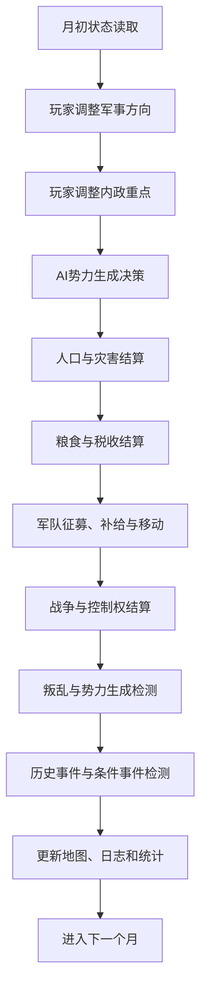
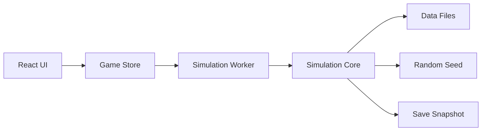

# 《万历：山河崩塌》项目设计方案

> 文档类型：游戏设计文档（GDD）+ 产品需求概要（PRD）  
> 项目形态：单机 Web 历史地图推演游戏  
> 版本：V0.1  
> 时间范围：1573年1月—1662年12月  
> 核心关键词：历史推演、地图涂色、低操作量、月度演算、王朝兴衰、条件事件

---

## 1. 项目概述

### 1.1 项目名称

**中文名：**《万历：山河崩塌》  
**英文暂定名：** *Wanli: Collapse of the Realm*

### 1.2 项目定位

《万历：山河崩塌》是一款以1573年至1662年中国历史为背景的单机 Web 地图推演游戏。

玩家从1573年万历元年开始，选择一个存在于中国大陆及周边地区的政治、军事或部族势力，通过极少量但具有长期影响的决策，参与晚明秩序逐步瓦解、东北势力崛起、农民战争爆发、清军入关及南明覆亡的历史进程。

本项目不追求传统大战略游戏中复杂的武将养成、部队微操、外交谈判、装备制造和城市建设，而是将玩法压缩为两个核心决策维度：

1. **军事进攻方向**
2. **内政重点关注事项**

玩家负责确定方向，游戏系统负责进行月度推演。

### 1.3 核心体验

玩家体验的不是“精确控制每一支军队”，而是：

- 观察一个庞大政权如何受到人口、粮食、财政、腐败和战争的共同影响；
- 在资源不足时决定优先保卫哪里、放弃哪里；
- 面对历史事件作出不同于真实历史的选择；
- 通过有限决策改变势力的发展路径；
- 见证地图颜色在近九十年的时间中不断变化；
- 尝试阻止、延缓或重新塑造“山河崩塌”的历史过程。

### 1.4 设计原则

1. **操作必须少，决策必须重。**
2. **系统复杂度隐藏在后台，前台信息必须易懂。**
3. **历史事件提供压力，但不强制复制历史结果。**
4. **地图控制权是最重要的视觉反馈。**
5. **各势力遵守同一套基础规则，不为玩家提供特殊保护。**
6. **游戏结果由系统演算与玩家选择共同产生。**
7. **优先保证推演合理性，再扩充内容规模。**

---

## 2. 历史范围与叙事主题

### 2.1 时间范围

- **开始时间：**1573年1月，万历元年
- **结束时间：**1662年12月
- **总时长：**90年
- **总月数：**1080个月

游戏以月份为最小时间单位，所有经济、人口、军事、事件和势力变化均按月结算。

### 2.2 历史阶段

| 阶段 | 时间 | 核心主题 |
|---|---:|---|
| 改革余晖 | 1573—1582 | 张居正改革、财政整顿、中央权力恢复 |
| 帝国扩张 | 1583—1600 | 万历三大征、边疆战争、国库消耗 |
| 秩序松动 | 1601—1615 | 财政恶化、党争、行政效率下降 |
| 辽东危机 | 1616—1621 | 后金建立、萨尔浒之战、辽沈失守 |
| 天下动荡 | 1622—1635 | 灾荒、流民、军费压力、地方叛乱 |
| 王朝崩塌 | 1636—1644 | 农民军坐大、清政权形成、北京失守 |
| 多国争衡 | 1644—1651 | 大顺、清、南明、地方军阀并存 |
| 南方余烬 | 1652—1662 | 西南抗清、郑氏势力、永历政权终结 |

### 2.3 叙事主题

项目不以单一王朝视角解释历史，而是重点表现以下问题：

- 一个大帝国为什么会在看似稳定时逐步失去控制力；
- 人口、粮食、税收和军事之间如何相互制约；
- 边疆问题如何转化为中央财政危机；
- 灾害为什么会在治理能力下降时迅速放大；
- 地方武装为什么会从临时叛乱演变为新政权；
- 历史人物和事件是否能够改变结构性危机；
- 玩家能否通过不同决策延缓崩溃或建立新秩序。

---

## 3. 目标用户

### 3.1 核心用户

- 喜欢中国历史、明清史和历史推演的玩家；
- 喜欢《三国志》《信长之野望》《欧陆风云》《天下霸图》等策略游戏的玩家；
- 喜欢地图涂色、势力变化和架空历史的玩家；
- 不希望投入大量时间学习复杂系统的轻度策略玩家；
- 希望通过浏览器直接游玩的用户。

### 3.2 用户体验目标

首次进入游戏的玩家应在5分钟内理解：

- 地图上的颜色代表什么；
- 当前势力的基本状态；
- 如何选择军事方向；
- 如何选择内政重点；
- 如何推进时间；
- 历史事件出现时如何作出选择。

---

## 4. 核心玩法循环

### 4.1 月度循环



### 4.2 玩家操作频率

玩家无需每月重新操作。

军事方向和内政重点将持续生效，直到：

- 玩家主动修改；
- 当前目标已被占领；
- 当前目标不再接壤；
- 势力处于灭亡、流亡或政权继承状态；
- 重大事件要求重新决策。

### 4.3 时间推进速度

建议提供以下速度：

| 速度 | 用途 |
|---|---|
| 暂停 | 查看数据、处理事件 |
| 1个月/秒 | 战争和危机时期 |
| 3个月/秒 | 常规推演 |
| 12个月/秒 | 和平及长期观察 |
| 自动推进至事件 | 快速跳转到下一个重大事件 |

### 4.4 自动暂停条件

- 历史事件或重大条件事件触发；
- 玩家势力首都遭到进攻；
- 玩家势力重要区域失守；
- 财政即将破产；
- 粮食储备低于警戒线；
- 全国性叛乱爆发；
- 新政权建立；
- 玩家势力灭亡或发生继承；
- 达成阶段性胜利或失败条件。

---

## 5. 玩家决策系统

## 5.1 军事进攻方向

玩家每次只能指定一个主要军事方向。

### 5.1.1 可选目标

- 与本势力控制区接壤的敌对战略区；
- 已存在军事通道的远程区域；
- 正在发生叛乱的本方区域；
- 被敌方占领的历史核心区域；
- 防御状态下的本方边疆区域。

### 5.1.2 军事姿态

为避免增加新的决策维度，军事姿态作为军事方向的附属参数：

| 姿态 | 资源投入 | 风险 | 适用情况 |
|---|---:|---:|---|
| 保守 | 低 | 低 | 牵制、防守、资源不足 |
| 均衡 | 中 | 中 | 常规战争 |
| 激进 | 高 | 高 | 决战、抢占战略节点 |

### 5.1.3 系统自动处理内容

玩家指定目标后，系统自动决定：

- 调动哪些区域的军队；
- 投入多少兵力；
- 是否需要先补充粮草；
- 从哪条路线进军；
- 是否等待合适季节；
- 是否转入防御；
- 战败后撤退到哪里；
- 是否继续增援；
- 是否因其他战线危急而中止进攻。

### 5.1.4 进攻目标评分

系统对每个候选区域计算战略价值：

```text
目标评分 =
区域基础价值
+ 人口价值
+ 粮食价值
+ 税收价值
+ 历史核心区加成
+ 敌方虚弱度
+ 当前接壤加成
- 距离成本
- 地形成本
- 补给风险
- 其他战线威胁
```

玩家选择的目标将获得最高战略优先级，但系统仍可在首都或核心区域遭遇重大威胁时临时转入防御。

---

## 5.2 内政重点

玩家任意时间只能选择一个内政重点。

| 内政重点 | 主要效果 | 潜在代价 |
|---|---|---|
| 劝课农桑 | 提高农业恢复、粮食产量 | 商业与军备投入减少 |
| 整顿财政 | 增加税收征收效率 | 民生满意度下降 |
| 整军备战 | 提高征兵、训练和补员 | 消耗国库与粮食 |
| 澄清吏治 | 降低腐败，提高长期行政效率 | 短期税收降低 |
| 休养生息 | 提高人口增长和稳定度 | 军事扩张速度降低 |
| 开放商贸 | 增加商业收入和白银流入 | 对外部贸易波动更敏感 |
| 经略边疆 | 提高边疆控制度和补给能力 | 内地发展速度下降 |
| 赈济灾民 | 降低灾害人口损失和叛乱风险 | 大量消耗粮食与国库 |
| 强化中央 | 提高直属区域控制度 | 地方势力不满上升 |
| 笼络地方 | 降低地方叛乱和割据风险 | 中央税收与控制力下降 |

### 5.2.1 势力差异

相同内政重点对不同势力产生不同效果。例如：

- 大明选择“澄清吏治”收益较高，但受官僚阻力影响；
- 游牧势力选择“整军备战”收益较高；
- 东北部族选择“经略边疆”可转化为部族整合；
- 西南土司选择“笼络地方”可提高联盟稳定；
- 海上势力选择“开放商贸”收益显著。

---

## 6. 地图系统

### 6.1 地图规模

正式版本建议使用 **36—45个战略区**。

地图区域不是现代省份的简单复制，而是综合考虑：

- 明代行政区划；
- 军事通道；
- 地形屏障；
- 历史战争范围；
- 人口与经济分布；
- 游戏可读性；
- 势力扩张节奏。

### 6.2 推荐战略区划分

| 大区 | 战略区示例 |
|---|---|
| 京畿 | 北京、蓟州、宣府、大同 |
| 辽东 | 辽西、辽中、辽东、建州 |
| 山东 | 济南、登莱 |
| 山西 | 太原、河东 |
| 陕西 | 关中、延绥、甘肃、汉中 |
| 河南 | 开封、洛阳、南阳 |
| 南直隶 | 南京、淮扬、苏松、皖南 |
| 浙江 | 浙北、浙南 |
| 福建 | 闽北、闽南 |
| 江西 | 赣北、赣南 |
| 湖广 | 鄂北、江汉、湖南、湘西 |
| 四川 | 川北、成都、川东、川南 |
| 云贵 | 滇中、滇西、贵州、播州 |
| 两广 | 广东、广西 |
| 北方草原 | 河套、土默特、察哈尔、科尔沁 |
| 青藏区域 | 青海、康区、卫藏 |
| 海外关联区 | 朝鲜北部、台湾、澎湖、东南沿海海域 |

### 6.3 区域属性

每个战略区包含：

```yaml
id: liaodong_east
name: 辽东
terrain: 平原
climate: 温带季风
population: 620000
agriculture: 52
commerce: 38
tax_capacity: 45
stability: 72
control: 85
fortification: 60
grain_stock: 420000
garrison: 34000
owner: ming
controller: ming
core_factions:
  - ming
  - jurchen
connections:
  - liaodong_central
  - jianzhou
```

### 6.4 地图视觉规则

- 势力完全控制：使用势力主色；
- 控制度较低：降低颜色饱和度；
- 军事争夺区：显示斜纹或动态边框；
- 叛乱区：叠加火焰标记；
- 缺粮区：叠加空粮仓标记；
- 灾害区：叠加灾害图标；
- 进攻方向：显示箭头；
- 首都：显示特殊城池图标；
- 鼠标悬停：显示简要数据；
- 点击区域：打开详细信息面板。

### 6.5 地图信息层

玩家可切换以下地图模式：

1. 势力控制
2. 人口密度
3. 粮食产量
4. 税收能力
5. 稳定度
6. 军事力量
7. 灾害风险
8. 控制度
9. 历史核心区
10. 交通与补给线

---

## 7. 势力系统

### 7.1 势力定义

游戏中的势力可以是：

- 王朝中央政权；
- 部族联盟；
- 地方土司；
- 农民军；
- 地方军阀；
- 宗室政权；
- 海上政权；
- 临时军事集团。

### 7.2 1573年可选势力

| 势力 | 难度 | 特点 |
|---|---:|---|
| 大明中央 | 中等 | 国力强大、领土广阔、行政负担沉重 |
| 土默特部 | 中等 | 骑兵和贸易较强，人口与粮食有限 |
| 察哈尔部 | 困难 | 军事传统强，但内部整合困难 |
| 建州女真 | 困难 | 初始弱小，拥有较高成长潜力 |
| 海西女真 | 困难 | 人口较多但内部派系分散 |
| 播州杨氏 | 困难 | 山地防御强，扩张空间有限 |
| 云贵土司联盟 | 困难 | 地形有利，但组织度低 |
| 乌思藏地方势力 | 困难 | 防御纵深大，财政和动员能力有限 |

### 7.3 后续可生成势力

- 后金
- 大清
- 大顺
- 大西
- 弘光政权
- 隆武政权
- 鲁王监国政权
- 永历政权
- 郑氏集团
- 奢安势力
- 李自成集团
- 张献忠集团
- 地方军镇或叛乱势力

### 7.4 势力基础属性

```yaml
id: ming
name: 大明
treasury: 8200000
grain_reserve: 12500000
army: 680000
administration: 72
military_organization: 58
legitimacy: 92
corruption: 34
centralization: 68
war_exhaustion: 5
capital: beijing
primary_color: "#C63D32"
secondary_color: "#F2C14E"
```

### 7.5 势力特性

每个势力设置2—4项特性，用于形成差异化。

示例：

#### 大明

- **庞大官僚体系：**行政上限高，但腐败增长速度较快；
- **两京制度：**北京失守后可尝试南迁；
- **边军体系：**边疆初始驻军较多，长期维护成本高；
- **天下正统：**初始合法性高，失去核心区域后下降明显。

#### 建州女真

- **八旗雏形：**连续胜利可提高军事组织度；
- **部族整合：**占领女真核心区可吸收人口和兵力；
- **低成本动员：**征兵成本低，但农业和税收能力较弱；
- **辽东目标：**进攻辽东区域时获得战略加成。

---

## 8. 经济与人口推演

### 8.1 玩家可见核心数据

- 辖区人口
- 月度税收
- 粮食产量
- 粮食储备
- 军队规模
- 国库
- 平均稳定度
- 平均控制度

### 8.2 隐藏数据

- 行政效率
- 腐败
- 商业活跃度
- 灾害恢复能力
- 流民数量
- 地方武装化程度
- 运输损耗
- 官僚阻力
- 战争疲劳
- 合法性
- 区域认同
- 疫病风险

### 8.3 人口变化

```text
月度人口变化 =
自然增长
- 饥荒死亡
- 战争死亡
- 疫病死亡
- 外迁人口
+ 流入人口
```

自然增长受到以下因素影响：

- 地区粮食供应；
- 稳定度；
- 战争状态；
- 灾害影响；
- 内政重点；
- 人口承载上限。

### 8.4 粮食产量

```text
月度粮食产量 =
人口劳动力
× 农业能力
× 季节系数
× 气候系数
× 稳定度系数
× 内政修正
× 灾害修正
```

粮食主要用于：

- 城镇与人口消费；
- 军队维护；
- 战争补给；
- 灾害赈济；
- 储备；
- 事件支出。

### 8.5 税收收入

```text
月度税收 =
人口税基
× 地区税收能力
× 控制度
× 行政效率
× 商业修正
- 腐败损耗
- 战乱损耗
```

### 8.6 财政支出

- 官僚体系维护；
- 常备军维护；
- 战争额外支出；
- 赈灾支出；
- 地方补贴；
- 事件支出；
- 债务利息或临时筹饷成本。

### 8.7 经济恶化链条


---

## 9. 军事系统

### 9.1 设计目标

军事系统应体现：

- 兵力数量不是唯一决定因素；
- 补给、地形和组织度极其重要；
- 大国可以拥有庞大军队，但未必能将军队有效投入前线；
- 连续战争会造成财政和人口崩溃；
- 边疆失守会改变战略格局；
- 农民军和部族军队可以在特定条件下快速增长。

### 9.2 军队属性

- 兵力
- 士气
- 训练度
- 组织度
- 补给水平
- 骑兵比例
- 火器水平
- 将领能力（抽象值）
- 战争疲劳
- 所在区域

### 9.3 军队不作为独立棋子

正式界面不要求玩家逐支移动军队。

系统以“区域驻军”和“战线兵力池”方式管理部队：

- 区域驻军负责维持控制和防御；
- 战线兵力池负责执行军事方向；
- 中央预备队负责增援危急地区；
- 兵力调动通过区域连接和补给线自动完成。

### 9.4 战斗力计算

```text
有效战斗力 =
投入兵力
× 训练度
× 士气
× 组织度
× 补给系数
× 地形修正
× 季节修正
× 指挥修正
× 随机波动
```

### 9.5 战斗阶段

1. 侦察与接敌；
2. 补给检测；
3. 攻防战斗；
4. 损失结算；
5. 士气检测；
6. 撤退或继续；
7. 围城或控制权变化；
8. 战后补给和稳定度变化。

### 9.6 占领与控制

占领一个地区不等于完全控制。

```text
控制度变化 =
驻军规模
+ 行政投入
+ 合法性
+ 地区认同
- 敌对核心影响
- 战争破坏
- 叛乱活动
```

控制度过低时可能出现：

- 税收无法征收；
- 粮食无法调运；
- 叛军出现；
- 地方倒戈；
- 敌方复占；
- 驻军持续损耗。

---

## 10. 稳定、叛乱与势力生成

### 10.1 稳定度影响因素

提高稳定度：

- 粮食充足；
- 税负较低；
- 赈灾有效；
- 长期和平；
- 合法性较高；
- 地方认同较高；
- 驻军秩序良好。

降低稳定度：

- 饥荒；
- 战争；
- 加派税收；
- 腐败；
- 灾害；
- 征兵过度；
- 控制度下降；
- 宗教、族群或地方矛盾事件；
- 敌对势力渗透。

### 10.2 叛乱风险

```text
叛乱风险 =
低稳定度
+ 流民比例
+ 税负
+ 灾害
+ 地方武装化
+ 敌对核心影响
- 驻军压制
- 赈济
- 合法性
```

### 10.3 叛乱发展阶段

1. 民变；
2. 流民聚集；
3. 地方叛军；
4. 跨区域军事集团；
5. 建立政权；
6. 获得核心区域和合法性；
7. 成为正式可选势力。

### 10.4 动态势力生成

动态势力必须满足条件，而不是固定按历史时间生成。

示例：李自成集团生成条件可包含：

- 陕西或河南连续灾害；
- 区域稳定度低于阈值；
- 流民数量超过阈值；
- 明朝财政恶化；
- 当地驻军不足；
- 对应历史时间窗口已开启。

如果玩家有效赈灾、降低税负并维持控制，相关势力可能延迟出现、规模缩小或不出现。

---

## 11. 历史事件系统

### 11.1 事件分类

| 类型 | 说明 |
|---|---|
| 固定时间事件 | 在指定时间窗口内检测 |
| 条件事件 | 满足条件后触发 |
| 势力专属事件 | 仅对特定势力触发 |
| 区域事件 | 与指定区域有关 |
| 连锁事件 | 前置事件选择决定后续 |
| 随机事件 | 增加不确定性 |
| 全局事件 | 影响多个势力 |
| 政权继承事件 | 势力灭亡或转型时触发 |

### 11.2 事件原则

1. 历史事件提供问题，不强制历史结果；
2. 每个选项必须包含明确收益与代价；
3. 选择应影响长期系统，而不是仅改变一项数字；
4. 重大事件应允许产生后续事件链；
5. 事件描述应简洁，但保留历史氛围；
6. 事件结果应受到当前国力和地区状态影响。

### 11.3 重要事件池

#### 改革时期

- 张居正整顿吏治
- 清丈田亩
- 一条鞭法推广
- 考成法阻力
- 张居正去世
- 清算张居正
- 国本之争

#### 万历三大征

- 宁夏之役
- 援朝战争
- 播州之役
- 军费激增
- 边军疲惫

#### 辽东危机

- 建州女真整合
- 努尔哈赤起兵
- 后金建立
- 抚顺失守
- 萨尔浒之战
- 辽沈危机
- 熊廷弼经略辽东
- 宁远之战

#### 明末危机

- 天启政治危机
- 东林党争
- 魏忠贤掌权
- 陕西大旱
- 驿站裁撤
- 流民扩散
- 李自成崛起
- 张献忠崛起
- 松锦之战
- 北京危机

#### 王朝更替

- 李自成称帝
- 北京失守
- 崇祯殉国
- 吴三桂决策
- 清军入关
- 弘光政权建立
- 扬州与南京危机
- 隆武政权建立
- 永历政权建立
- 大西政权转型
- 郑成功经营东南
- 永历政权终结

### 11.4 事件数据示例

```json
{
  "id": "zhang_juzheng_death",
  "name": "首辅之逝",
  "category": "faction",
  "dateWindow": {
    "start": "1582-07",
    "end": "1582-12"
  },
  "conditions": [
    {
      "type": "faction_exists",
      "target": "ming"
    }
  ],
  "targetFaction": "ming",
  "description": "张居正病逝，改革失去最重要的推动者。朝廷中要求清算其政治遗产的声音日益高涨。",
  "options": [
    {
      "id": "maintain_reform",
      "name": "维持新政",
      "effects": {
        "administration": 8,
        "official_opposition": 15,
        "corruption": -5,
        "legitimacy": -3
      },
      "followups": [
        "reformist_resistance"
      ]
    },
    {
      "id": "purge_zhang",
      "name": "清算张居正",
      "effects": {
        "legitimacy": 5,
        "administration": -10,
        "corruption": 8,
        "treasury": 300000
      },
      "followups": [
        "reversal_of_reforms"
      ]
    },
    {
      "id": "limited_adjustment",
      "name": "有限调整",
      "effects": {
        "administration": -3,
        "official_opposition": -4,
        "corruption": 3
      }
    }
  ]
}
```

---

## 12. AI决策系统

### 12.1 设计目标

- AI与玩家使用同一套规则；
- AI不依赖预知未来；
- 不同势力通过权重形成不同风格；
- AI能够识别危机并调整方向；
- AI允许犯错，但不应持续作出明显无效决策。

### 12.2 AI军事决策

```text
候选目标评分 =
地区战略价值
+ 历史诉求
+ 敌方虚弱度
+ 核心区价值
+ 盟友协同
- 补给风险
- 距离
- 地形成本
- 本土威胁
- 财政压力
```

### 12.3 AI内政决策

| 状态 | 优先内政 |
|---|---|
| 粮食不足 | 劝课农桑、赈济灾民 |
| 财政赤字 | 整顿财政、开放商贸 |
| 腐败严重 | 澄清吏治 |
| 战争临近 | 整军备战、经略边疆 |
| 稳定度过低 | 休养生息、笼络地方 |
| 控制度下降 | 强化中央 |
| 长期和平 | 农业、商贸或行政改革 |

### 12.4 AI性格参数

```yaml
aggression: 65
risk_tolerance: 40
economic_focus: 50
centralization_preference: 70
historical_goal_weight: 80
defense_priority: 60
war_endurance: 45
```

---

## 13. 胜利、失败与结算

### 13.1 游戏结束时间

默认在1662年12月进行最终结算。

部分势力也可以通过提前完成专属目标获得阶段性胜利，但玩家可选择继续推演。

### 13.2 通用得分

```text
最终得分 =
控制人口
+ 控制区域
+ 核心区域完成度
+ 国库与粮食
+ 平均稳定度
+ 合法性
+ 专属历史目标
- 战争死亡
- 饥荒死亡
- 长期叛乱
- 财政破产次数
```

### 13.3 势力专属目标

#### 大明

- 保住北京和南京；
- 维持王朝至1662年；
- 阻止全国性农民战争；
- 控制辽东；
- 避免财政崩溃；
- 在北京失守后完成南迁并重建统一。

#### 建州女真/后金/大清

- 统一女真；
- 控制辽东；
- 建立后金；
- 改国号为清；
- 入主北京；
- 控制中原核心区。

#### 蒙古势力

- 统一主要草原区域；
- 控制河套；
- 保持贸易通道；
- 迫使明朝长期支付互市成本；
- 建立稳定的草原联盟。

#### 西南土司

- 保持自治；
- 扩大控制区域；
- 避免被中央改土归流；
- 建立区域联盟；
- 在王朝崩溃期间成为独立政权。

### 13.4 势力灭亡与继承

玩家势力灭亡后，不一定立即结束游戏。

可提供以下选项：

- 继承同一政治传统下的新政权；
- 转入地方残余势力；
- 选择主要对手继续游戏；
- 进入观察者模式；
- 结束并查看历史年表。

示例：

```text
大明北京政权灭亡
→ 选择弘光政权
→ 选择隆武政权
→ 选择永历政权
→ 选择郑氏集团
```

---

## 14. 用户界面设计

### 14.1 主界面布局

```text
┌──────────────────────────────────────────────────────┐
│ 日期｜速度｜国库｜粮食｜人口｜军队｜稳定度｜暂停按钮 │
├─────────────┬──────────────────────────────┬─────────┤
│ 势力概况    │                              │ 区域详情│
│ 军事方向    │          中国地图            │ 数据面板│
│ 内政重点    │                              │ 历史信息│
│ 战争状态    │                              │         │
├─────────────┴──────────────────────────────┴─────────┤
│ 月度日志｜事件记录｜战报｜人口与财政趋势图           │
└──────────────────────────────────────────────────────┘
```

### 14.2 顶部信息栏

显示：

- 当前年月；
- 当前年号；
- 游戏速度；
- 国库；
- 粮食储备；
- 辖区人口；
- 总兵力；
- 平均稳定度；
- 警报信息。

### 14.3 左侧决策栏

- 当前军事方向；
- 军事姿态；
- 当前内政重点；
- 当前战略建议；
- 军事和内政效果摘要；
- 修改按钮。

### 14.4 右侧区域面板

点击地图区域后显示：

- 区域名称；
- 所属势力；
- 实际控制者；
- 人口；
- 粮食；
- 税收；
- 驻军；
- 稳定度；
- 控制度；
- 地形；
- 灾害状态；
- 历史核心归属；
- 相邻区域。

### 14.5 底部日志

日志类型：

- 月度简报；
- 战争报告；
- 经济报告；
- 人口变化；
- 灾害；
- 叛乱；
- 重大事件；
- 势力建立与灭亡；
- 领土变化。

### 14.6 事件弹窗

事件弹窗包含：

- 事件标题；
- 时间与地点；
- 简短历史背景；
- 当前局势说明；
- 2—4个决策选项；
- 每个选项的明确短期效果；
- 部分隐藏长期影响；
- 确认按钮。

---

## 15. 历史年表与回放

### 15.1 自动生成历史

系统记录每个月的关键数据：

- 势力控制区；
- 势力人口；
- 军队规模；
- 国库与粮食；
- 重大事件；
- 战争结果；
- 政权建立与灭亡；
- 玩家选择。

### 15.2 游戏结束报告

游戏结束后生成：

- 势力兴衰折线图；
- 地图控制变化时间轴；
- 人口损失统计；
- 最大规模战争；
- 最长期战争；
- 最繁荣地区；
- 最大灾害；
- 玩家重大决策；
- 与真实历史的差异；
- 自动生成的架空历史总结。

### 15.3 地图回放

允许玩家拖动时间轴，查看任意年份的势力颜色变化。

---

## 16. 新手引导

### 16.1 教程目标

教程不讲解全部公式，只讲解玩家需要理解的内容。

### 16.2 教程流程

1. 选择大明；
2. 查看地图和势力概况；
3. 将军事方向设为辽东；
4. 将内政重点设为澄清吏治；
5. 推进三个月；
6. 查看税收和粮食变化；
7. 处理一个教学事件；
8. 查看战报；
9. 切换地图信息层；
10. 保存游戏。

### 16.3 信息提示原则

- 所有数值变化使用上升、下降箭头；
- 鼠标悬停显示原因；
- 首次出现概念时提供简短解释；
- 警报只提示需要玩家关注的事项；
- 避免同时展示过多隐藏参数。

---

## 17. 技术架构

### 17.1 推荐技术栈

| 模块 | 技术 |
|---|---|
| 前端框架 | React + TypeScript |
| 构建工具 | Vite |
| 状态管理 | Zustand |
| 地图 | 自定义 SVG |
| 图表 | ECharts 或 Recharts |
| 推演核心 | 纯 TypeScript |
| 后台计算 | Web Worker |
| 本地存档 | IndexedDB |
| 数据格式 | JSON / YAML |
| 测试 | Vitest |
| 代码规范 | ESLint + Prettier |

### 17.2 核心原则

推演引擎与UI完全分离。



### 17.3 推荐目录

```text
src/
├─ app/
│  ├─ App.tsx
│  └─ routes.ts
├─ core/
│  ├─ simulation.ts
│  ├─ calendar.ts
│  ├─ economy.ts
│  ├─ population.ts
│  ├─ warfare.ts
│  ├─ control.ts
│  ├─ rebellion.ts
│  ├─ ai.ts
│  ├─ eventEngine.ts
│  ├─ scoring.ts
│  └─ random.ts
├─ data/
│  ├─ regions/
│  ├─ factions/
│  ├─ scenarios/
│  ├─ events/
│  └─ localization/
├─ map/
│  ├─ china-1573.svg
│  ├─ mapConfig.ts
│  └─ mapLayers.ts
├─ store/
│  ├─ gameStore.ts
│  ├─ uiStore.ts
│  └─ settingsStore.ts
├─ workers/
│  └─ simulation.worker.ts
├─ ui/
│  ├─ map/
│  ├─ panels/
│  ├─ dialogs/
│  ├─ charts/
│  └─ common/
├─ save/
│  ├─ saveManager.ts
│  └─ migration.ts
└─ tests/
```

### 17.4 月度推演接口示例

```ts
export interface SimulationInput {
  state: GameState;
  playerDecision: PlayerDecision;
  randomSeed: number;
}

export interface SimulationResult {
  nextState: GameState;
  reports: MonthlyReport[];
  triggeredEvents: TriggeredEvent[];
  alerts: GameAlert[];
}

export function simulateMonth(
  input: SimulationInput
): SimulationResult {
  // 1. 读取决策
  // 2. AI决策
  // 3. 人口与经济结算
  // 4. 军事移动与战斗
  // 5. 控制度与叛乱结算
  // 6. 事件检测
  // 7. 生成下月状态
  throw new Error("Not implemented");
}
```

### 17.5 随机种子

所有随机结果必须基于固定种子。

作用：

- 保证存档可复现；
- 方便测试；
- 方便回放；
- 避免读取存档后通过反复重载改变结果；
- 方便比较不同玩家决策。

---

## 18. 数据设计

### 18.1 核心实体

- `GameState`
- `Faction`
- `Region`
- `ArmyPool`
- `War`
- `Event`
- `Decision`
- `Modifier`
- `MonthlyReport`
- `HistoricalRecord`
- `SaveGame`

### 18.2 GameState示例

```ts
export interface GameState {
  version: string;
  currentDate: string;
  seed: number;
  playerFactionId: string;
  factions: Record<string, FactionState>;
  regions: Record<string, RegionState>;
  wars: WarState[];
  activeModifiers: Modifier[];
  eventFlags: Record<string, boolean>;
  history: HistoricalRecord[];
  gameStatus: "playing" | "paused" | "finished";
}
```

### 18.3 数据驱动原则

以下内容全部通过数据文件配置，不写死在UI代码中：

- 势力；
- 区域；
- 事件；
- 事件选项；
- 特性；
- 历史核心；
- 初始数值；
- 胜利目标；
- AI权重；
- 年号；
- 文本描述；
- 难度修正。

---

## 19. 存档设计

### 19.1 存档类型

- 自动存档；
- 手动存档；
- 重大事件前存档；
- 年度快照；
- 历史回放快照。

### 19.2 存档内容

- 当前完整状态；
- 随机种子；
- 玩家决策；
- 已触发事件；
- 历史记录；
- 游戏设置；
- 数据版本号。

### 19.3 版本迁移

每个存档必须包含版本字段。

当数据结构更新时，通过迁移函数转换旧存档，避免开发期间频繁失效。

---

## 20. 美术与声音方向

### 20.1 视觉风格

推荐风格：

- 明代舆图与现代信息图结合；
- 宣纸、墨线和朱砂色作为基础视觉元素；
- 地图边界清晰，信息层优先于装饰；
- 历史事件使用版画、线描或低饱和插画；
- UI避免过度仿古，保证现代可读性。

### 20.2 势力颜色原则

- 明：朱红
- 建州/后金：深金或赭黄
- 清：暗黄
- 蒙古诸部：蓝、青、灰蓝
- 农民军：黑、深绿、土红
- 南明：浅红或紫红
- 郑氏：海蓝
- 土司势力：棕、绿或橙

颜色必须保证相邻势力可明显区分，并兼顾色弱模式。

### 20.3 音乐

- 主界面：低沉、克制、具有历史感；
- 和平时期：古琴、箫、低频弦乐；
- 战争时期：鼓点和铜管；
- 王朝崩塌阶段：增加压迫感和不稳定节奏；
- 事件音效：圣旨、战报、灾害、政权更替分别使用独立提示音。

---

## 21. MVP范围

### 21.1 MVP目标

验证以下核心问题：

1. 月度自动推演是否有趣；
2. 玩家仅通过两个决策是否能产生明显影响；
3. 地图颜色变化是否具有持续吸引力；
4. 经济、战争和叛乱之间是否形成可理解的因果链；
5. AI是否能够产生基本合理的势力演变。

### 21.2 MVP内容

- 时间：1573—1621年；
- 地图：12—24个战略区；
- 玩家势力：大明、土默特、建州女真；
- AI势力：3—5个；
- 内政重点：6项；
- 军事姿态：3项；
- 历史事件：20—30个；
- 动态叛乱：基础版本；
- 地图涂色；
- 月度日志；
- 存档读取；
- 固定随机种子；
- 简单结束结算。

### 21.3 MVP明确不做

- 武将个人系统；
- 婚姻系统；
- 复杂外交；
- 装备系统；
- 科技树；
- 城市建筑；
- 单支部队微操；
- 海战细节；
- 多人联机；
- 移动端深度适配；
- 3D地图；
- 复杂动画。

---

## 22. 开发阶段

### 第一阶段：推演验证

目标：不用真实地图，先验证系统。

内容：

- 6个虚拟区域；
- 3个势力；
- 人口、粮食、税收、军队、稳定度；
- 两项玩家决策；
- 自动战争；
- 运行240个月；
- 输出日志和折线图。

验收标准：

- 不发生明显数值爆炸；
- 势力能扩张也能衰退；
- 战争会受到补给和经济影响；
- 玩家决策能够改变结果；
- 相同随机种子可以复现。

### 第二阶段：地图原型

内容：

- 接入SVG地图；
- 区域点击；
- 势力涂色；
- 区域详情；
- 军事方向箭头；
- 12个历史区域。

### 第三阶段：历史事件

内容：

- 1573—1600年事件链；
- 事件数据编辑器；
- 事件条件检测；
- 长期修正；
- 事件日志。

### 第四阶段：完整MVP

内容：

- 推进至1621年；
- 建州成长和后金建立；
- 万历三大征；
- 辽东战争；
- 20—30个事件；
- 完整存档和结算。

### 第五阶段：完整历史范围

内容：

- 扩展至1662年；
- 农民战争；
- 明清鼎革；
- 南明继承；
- 郑氏集团；
- 动态政权生成；
- 历史回放。

---

## 23. 测试方案

### 23.1 数值测试

自动运行至少1000局，检查：

- 势力平均寿命；
- 明朝在各阶段的存续率；
- 建州统一率；
- 后金建立率；
- 农民军出现率；
- 地区人口损失；
- 财政破产次数；
- 重大事件触发率；
- 最终统一势力分布。

### 23.2 历史合理性测试

历史合理不等于结果必须一致。

合理性标准：

- 强势势力通常具有可解释的资源来源；
- 弱势势力崛起需要满足条件；
- 大规模战争必须造成经济代价；
- 连续灾荒必须影响人口和稳定；
- 跨越遥远区域的进攻必须受到补给限制；
- 新政权的出现必须有社会和军事基础。

### 23.3 UI测试

- 新玩家5分钟内完成一次月度推进；
- 主要数据无需打开二级菜单即可查看；
- 地图颜色可快速识别；
- 事件选择不会误触；
- 日志能够解释重大数值变化；
- 1080P屏幕下不出现关键信息遮挡。

---

## 24. 风险与控制

### 24.1 最大风险：系统失控

表现：

- 数值快速膨胀；
- 势力滚雪球；
- 一次战争决定全部结果；
- 明朝无论如何都会崩溃；
- 建州无论如何都会崛起。

控制方法：

- 设置人口和军队承载上限；
- 增加占领后的控制成本；
- 增加多战线惩罚；
- 限制远距离补给；
- 引入战争疲劳；
- 采用动态难度但不直接作弊；
- 通过批量模拟调整参数。

### 24.2 历史内容工作量过大

控制方法：

- 首先制作1573—1621年；
- 事件以条件模板复用；
- 人物不做完整角色系统；
- 地区数量控制在45个以内；
- 先实现关键事件链，再补充支线事件。

### 24.3 玩家缺少参与感

控制方法：

- 决策效果必须可见；
- 提供趋势图和原因解释；
- 事件选择影响后续；
- 强化地图变化；
- 提供专属目标；
- 重大危机时增加决策频率；
- 允许查看“如果保持当前政策”的预测。

### 24.4 历史争议与地图表达

控制方法：

- 明确标注游戏表现为历史推演；
- 区分行政归属、实际控制和影响范围；
- 采用可靠历史资料建立区域与事件；
- 避免将历史势力地图用于现代政治表达；
- 商业发布前进行地图和历史内容合规审核。

---

## 25. 后续扩展方向

正式版本稳定后，可考虑：

1. 其他开局年份；
2. 1582年张居正去世剧本；
3. 1618年后金起兵剧本；
4. 1627年崇祯即位剧本；
5. 1644年多势力剧本；
6. 历史人物顾问系统；
7. 简化外交系统；
8. 海上贸易与海权系统；
9. 自定义势力；
10. 事件编辑器；
11. 地图编辑器；
12. Steam与桌面端打包；
13. 社区模组支持；
14. AI生成架空历史年表；
15. 观察者模式和自动推演模式。

---

## 26. 项目成功标准

项目的核心成功标准不是内容数量，而是：

- 玩家只做少量决策，仍然能够明显改变历史；
- 玩家能够理解国家兴衰的因果关系；
- 地图变化具有持续观看价值；
- 每一局都能产生不同但合理的历史；
- 玩家愿意为了尝试另一种政策再次开局；
- 游戏在浏览器中运行流畅；
- 推演引擎可以持续扩展而不依赖UI重构。

---

## 27. 一句话产品定义

> 《万历：山河崩塌》是一款以1573年至1662年中国为舞台、以月度自动演算为基础、由玩家通过军事方向和内政重点改变王朝命运的低操作量历史地图推演游戏。

---

## 28. 当前最优先任务

项目正式开发前，优先完成以下原型：

1. 建立6个虚拟战略区；
2. 建立大明、北方部族、东北部族三个测试势力；
3. 实现人口、粮食、税收、军队和稳定度；
4. 实现军事方向；
5. 实现内政重点；
6. 实现月度结算；
7. 自动运行240个月；
8. 输出地图颜色、势力数据和历史日志；
9. 使用固定随机种子重复测试；
10. 确认推演具有合理的兴衰变化后，再制作真实地图和历史事件。

---

**文档结束**
